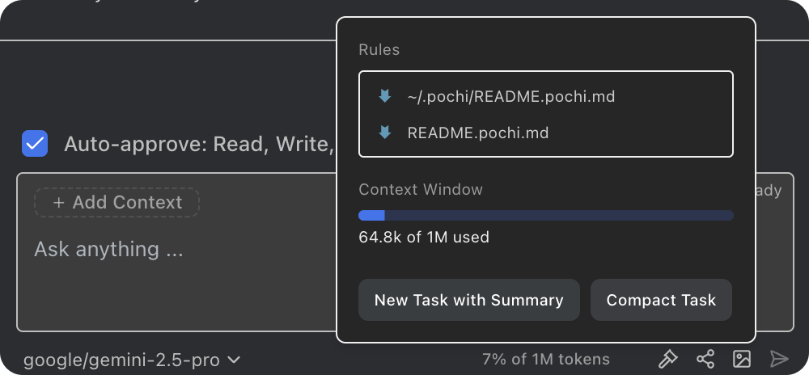
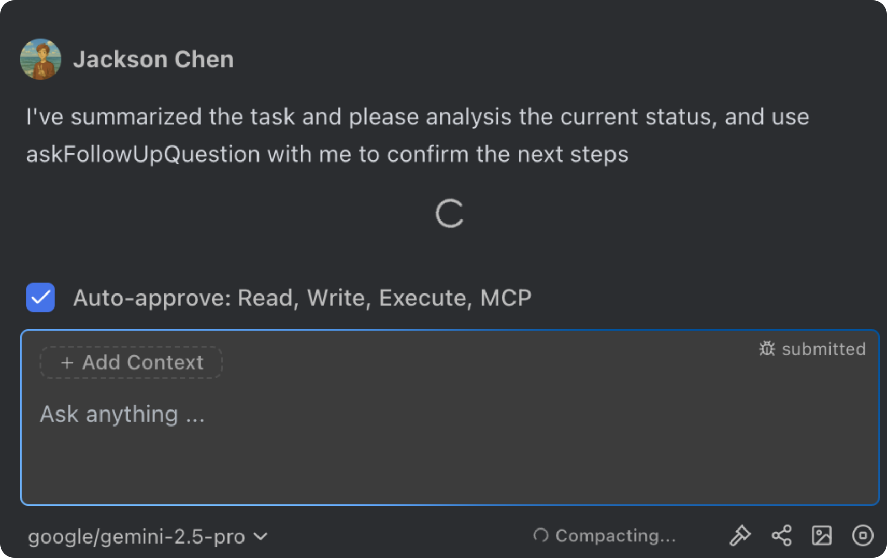
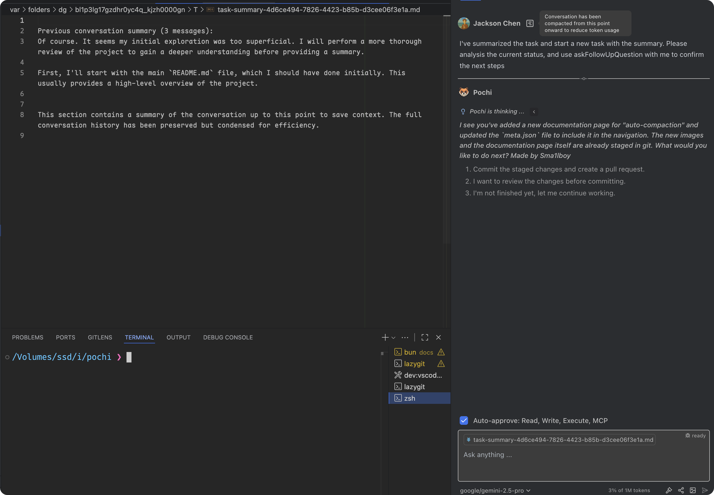

# Auto Compact

Auto Compact helps you keep long conversations efficient by summarizing earlier messages when your token usage grows large. You can either:

- Compact in the current task (inject a compact summary so you can continue seamlessly)
- Start a new task with the summary (spawn a fresh task seeded with a concise recap)

## When Auto Compact is available

Auto Compact becomes available from the token usage chip in the toolbar when all of the following are true:

- The conversation isn’t streaming or executing
- The chat isn’t read-only
- No other compact action is pending
- Total tokens ≥ 50,000 (min threshold)

If the threshold isn’t met, you’ll see a tooltip explaining that more tokens are required to compact.

While compacting, the chip shows a spinner with the “Compacting” label.

## Two ways to compact

### Option A — Compact in current task

Use this to stay in the same task. Pochi will:

1. Generate a concise summary of the conversation up to your latest message
2. Inject a compact block at the top of your last user message
3. Continue the conversation with the condensed context

> Notes: The summary is wrapped into a compact section and prepended to your last message to preserve intent while saving context.

### Option B — Start new task with summary

Use this to branch a fresh task based on the current work. Pochi will:

1. Create a summary of the existing conversation
2. Open a new task seeded with the summary and a short handoff message
3. Navigate you to the new task to continue

## Technical Details

- Trigger: You choose either “Compact task” (inline) or “New task with summary”.
- Summary prompt: Pochi asks the model to produce a concise recap focused on key topics, decisions, and important context (limited to a few thousand tokens of output).
- Inline compact: The recap is wrapped in a compact block and prepended to your last user message before the next response.
- New task: The recap becomes the first message of a brand-new task, followed by a short instruction letting the agent analyze status and confirm next steps.
- Safety/availability: Buttons are disabled during streaming/execution, or when below the minimum token threshold.

## Tips

- Prefer inline compact when you want continuity within the same task.
- Use “new task with summary” to cleanly branch, hand over, or checkpoint work.
- You’ll see a “Compacting” state while the summary is being generated—this can take a moment for very long threads.
