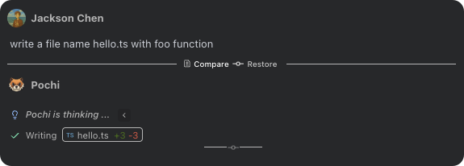
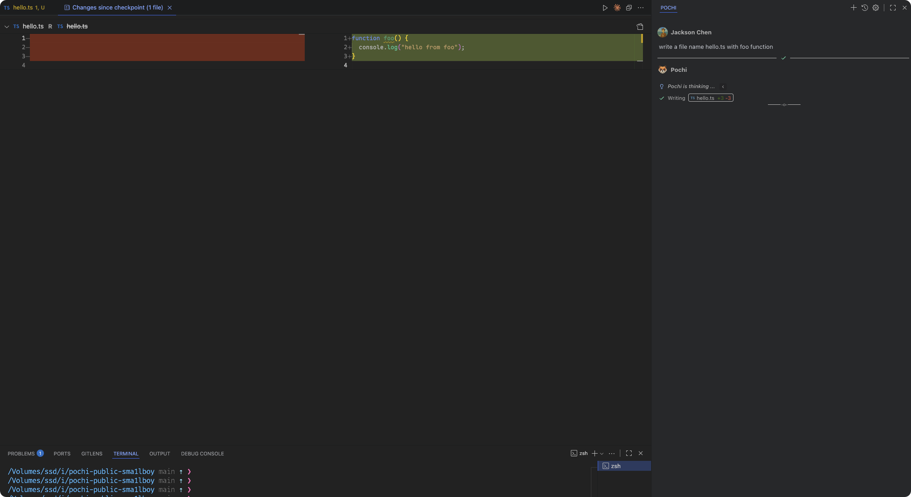
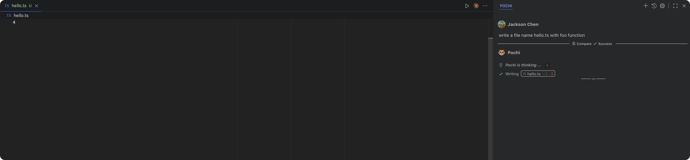

# Checkpoints

Checkpoints automatically save a snapshot of your workspace after key steps in a task. They help you track changes, roll back when needed, and explore different implementations without worrying about breaking your code.

  

## How checkpoints work

Pochi creates a checkpoint after important actions such as file edits or applied fixes. These checkpoints:

- Run alongside your Git workflow without interference
- Preserve the conversation context when restoring (chat and task context remain intact)
- Track file changes using a shadow Git repository (no writes to your real repository)

Example: while developing a feature, the assistant updates multiple files. Each change creates a checkpoint. You can review each modification, and if needed, roll back to any point without impacting your main branch or real Git history.

## Viewing changes and restoring

After each key action, you can:

1. Click Compare to see modified files and diffs
2. Click Restore to open restore options

  

## Restore options

To go back to a previous point:

1. Click Restore next to any step
2. Choose how you want to restore:
   - Restore Workspace and Task (when available): revert both code and task context
   - Restore Task Only (when available): keep code changes, revert task context
   - Restore Workspace Only: revert code while preserving task context (current default)

Note: The current version focuses on “Restore Workspace Only.” Other options will appear as their capabilities are enabled.

  

## Under the hood

In VS Code, Pochi implements checkpoints with a shadow Git that stays separate from your real repository:

- Initializes a bare repository under the extension’s storage directory (scoped per workspace)
- Points the worktree to your workspace, then stages and commits changes into the shadow repo
- Excludes common large/binary/cache/build artifacts (see Exclusions) to keep things fast and stable

This shadow repo is fully independent. Saving or restoring checkpoints does not create commits in your actual Git repository.

## Requirements

- **Git** must be installed (the shadow Git depends on it). If Git isn’t available, the checkpoint feature can’t initialize and will be disabled.

## Smart detection and exclusions

Pochi automatically detects and excludes heavy or redundant files to keep checkpoints lean and fast, including:

- Build artifacts and dependency folders
- Media files and large binaries
- Cache, logs, and temporary files
- Environment configuration files
- Files tracked by Git LFS

With this smart filtering, checkpoints focus on core code changes—making diffs clearer and restores faster.
