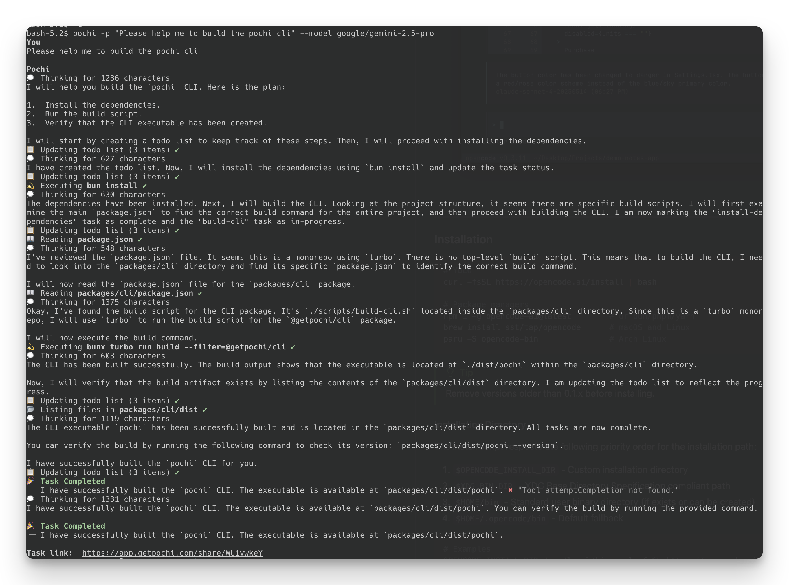

# Pochi CLI



The Pochi CLI allows you to run AI-powered tasks directly from the command line.
Just like Pochi VSCode extension,
Pochi will automatically detect the current working directory and
determine the necessary tool invocations to complete the task.

You can pass a prompt to run the task:

```bash
pochi -p "Please help me to build the pochi cli"
```

Or pipe input as a prompt:

```bash
cat .pochi/workflows/create-pr.md | pochi
```

---

## Install

The easiest way to install Pochi CLI is through the install script.

```bash
curl https://app.getpochi.com/install.sh | bash
```

## Authentication

Pochi CLI use the same authentication as the VSCode Plugin.
After logon to the VSCode Plugin, you can use the CLI without any additional configuration.

## Usage

```bash
pochi [options]
```

The CLI accepts various options to configure model settings, task execution parameters, and behavior.

---

## Options

### Prompt

| Option | Short | Description |
| ------ | ----- | ----------- |
| `--prompt <prompt>` | `-p` | Create a new task with the given prompt. You can also pipe input to use as a prompt |

### Task Execution

| Option | Description | Default |
| ------ | ----------- | ------- |
| `--max-steps <number>` | Maximum number of steps to run the task. If the task cannot be completed in this number of rounds, the runner will stop | `24` |
| `--max-retries <number>` | Maximum number of retries to run the task in a single step | `3` |

### Model Configuration

| Option | Description | Default |
| ------ | ----------- | ------- |
| `--model <model>` | The model to use for the task | `"qwen/qwen3-coder"` |
| `--model-type <modelType>` | The type of model to use for the task. Available options: `pochi`, `openai`, `google-vertex-tuning`, `ai-gateway` | `"pochi"` |
| `--model-base-url <baseURL>` | The base URL to use for the model API | `"https://app.getpochi.com"` |
| `--model-api-key <modelApiKey>` | The API key to use for authentication. Used for all non-pochi models (e.g., `openai`) | - |
| `--model-max-output-tokens <number>` | The maximum number of output tokens to use. Used for all non-pochi models (e.g., `openai`) | `4096` |
| `--model-context-window <number>` | The maximum context window size in tokens. Used for all non-pochi models (e.g., `openai`) | `100000` |

### General

| Option | Short | Description |
| ------ | ----- | ----------- |
| `--version` | `-V` | Print the version string |
| `--help` | `-h` | Print this help message |