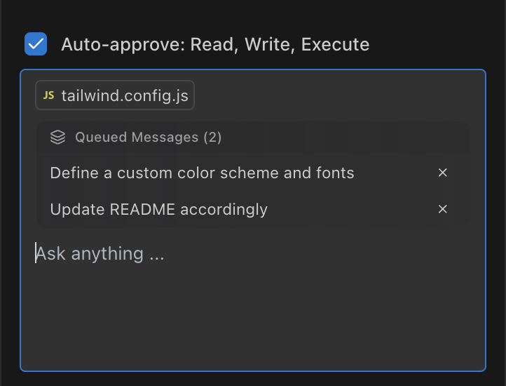
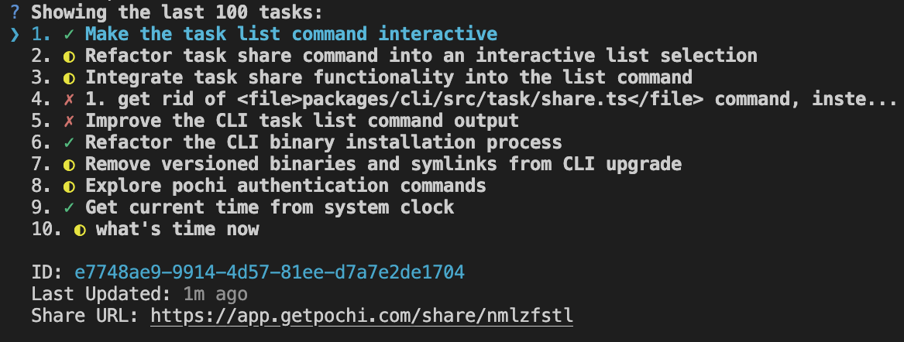
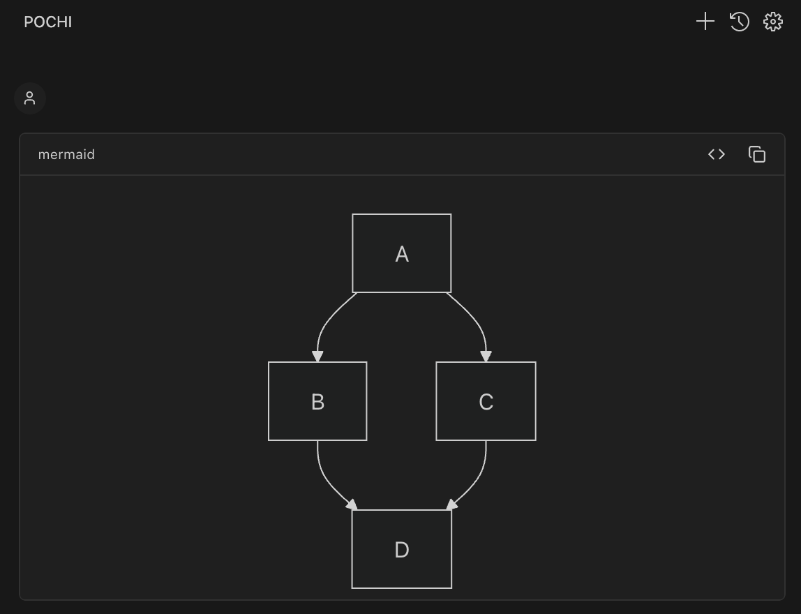
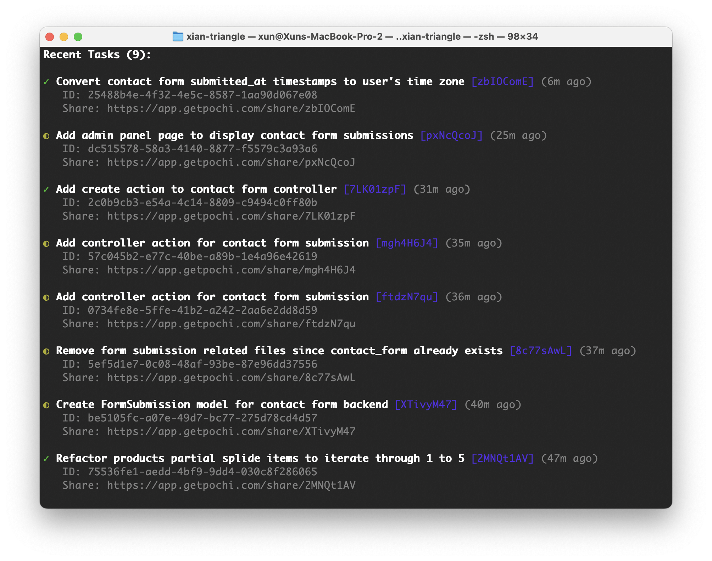

# Developer Updates

Welcome to the Pochi Developer Updates — a **weekly digest** of what's new in the codebase.

Here you will find highlights on features, enhancements, and bug fixes, plus insights into how we're improving the developer experience. Come back often! 👋

---

## Sep 19, 2025

### TL;DR

We are excited to introduce **Queued Messages** — type prompts in advance and stop waiting for Pochi to finish a task! We also launched a new [**Tutorials section**](https://docs.getpochi.com/tutorials/) with guides on **voice-driven development** and **Mermaid graphs**. Have tips or insights? Contribute your own via PRs! Plus, Pochi now supports more file types, and the CLI is friendlier and more interactive. ✨

### Features 🚀

- **[Queued Messages](https://docs.getpochi.com/queued-messages/):** Don't wait around — `⌘/Ctrl + ↵` to line up your next prompt when Pochi is busy. [#286](https://github.com/TabbyML/pochi/pull/286)

- **[Tutorials](https://docs.getpochi.com/tutorials/):** A new documentation hub to help you get more out of Pochi. This week: [voice-driven dev with Hex](https://docs.getpochi.com/tutorials/hex/), and [Mermaid graph communication](https://docs.getpochi.com/tutorials/mermaid-graph/).

### Enhancements ✨

- **Multimedia file support:** Share not just images, but also PDFs and videos with Pochi. [#271](https://github.com/TabbyML/pochi/pull/271)
- **Claude Code login:** The CLI now supports authentication with Claude Code. [#282](https://github.com/TabbyML/pochi/pull/282)
- **Friendlier CLI experience:** Interactively pick auth vendors and navigate through tasks, get clearer help/error messages, and see upgrade notices on startup. [#287](https://github.com/TabbyML/pochi/pull/287), [#294](https://github.com/TabbyML/pochi/pull/294), [#308](https://github.com/TabbyML/pochi/pull/308), [#329](https://github.com/TabbyML/pochi/pull/329), [#357](https://github.com/TabbyML/pochi/pull/357)

- **Docs updates**: Added documentation for [queued messages](https://docs.getpochi.com/queued-messages/) and [tab completion model settings](https://docs.getpochi.com/tab-completion/#tab-completion-model-settings) and improved VS Code docs. [#317](https://github.com/TabbyML/pochi/pull/317), [#321](https://github.com/TabbyML/pochi/pull/321), [#365](https://github.com/TabbyML/pochi/pull/365)

### Bug fixes 🐛

- **VS Code UX tweaks:** Unified drag-and-drop overlays with the prompt editor, fixed tooltip arrows, and ensured model selections are preserved with clear alerts when a model is unavailable. [#350](https://github.com/TabbyML/pochi/pull/350), [#316](https://github.com/TabbyML/pochi/pull/316), [#373](https://github.com/TabbyML/pochi/pull/373)

### New Contributors 🐾

A belated shout-out to [@DESU-CLUB](https://github.com/DESU-CLUB) for their first contribution last week — and another one this week! 🥳

---

## Sep 12, 2025

### TL;DR

This week we brought **custom agents** to life!🐣 Pochi **CLI is on npm**, `newTask` makes it simple to create and manage tasks right from the terminal, and Mermaid diagrams render beautifully inside the app. MCP interactions are smarter too, and the docs and UI keep getting smoother with every update. ✨

### Features 🚀

- **Custom Agents:** Define your own assistants in `.pochi/agents` using markdown. [#176](https://github.com/TabbyML/pochi/pull/176), [#181](https://github.com/TabbyML/pochi/pull/181)
- **`newTask` in CLI:** Spin up tasks directly from the terminal, each with its dedicated agent. [#232](https://github.com/TabbyML/pochi/pull/232)
- **Mermaid diagrams:** Drop Mermaid code blocks into Pochi and see them rendered as nice diagrams. [#255](https://github.com/TabbyML/pochi/pull/255)

### Enhancements ✨

- **Pochi CLI on npm 📦:** `npm install -g pochi` and get it running! [#238](https://github.com/TabbyML/pochi/pull/238)
- **Custom models for completion:** Use your own models for code completion in VS Code. [#251](https://github.com/TabbyML/pochi/pull/251)
- **MCP instructions:** MCP servers can now guide models on tool usage, enabling more complex interactions. [#254](https://github.com/TabbyML/pochi/pull/254)
- **Token auth:** Log in with a token when browser auth doesn't work. [#235](https://github.com/TabbyML/pochi/pull/235), [#236](https://github.com/TabbyML/pochi/pull/236)
- **Diff view focus mode:** Pochi automatically closes a file's regular editor tab when opening its diff view. [#197](https://github.com/TabbyML/pochi/pull/197)
- **More CLI commands:** `pochi mcp list` to inspect configured MCP servers, and `pochi task list` to check task lists. [#231](https://github.com/TabbyML/pochi/pull/231), [#266](https://github.com/TabbyML/pochi/pull/266)

- **VS Code UI polish**: Autocomplete mention list is responsive and tabbable, workflow list is collapsible and better spaced. [#215](https://github.com/TabbyML/pochi/pull/215), [#204](https://github.com/TabbyML/pochi/pull/204), [#230](https://github.com/TabbyML/pochi/pull/230), [#228](https://github.com/TabbyML/pochi/pull/228), [#242](https://github.com/TabbyML/pochi/pull/242)
- **Docs updates:** Added checkpoint feature and updated GitHub integration docs with API key setup. [#203](https://github.com/TabbyML/pochi/pull/203), [#262](https://github.com/TabbyML/pochi/pull/262)

### Bug fixes 🐛

- **Scoped replies:** Pochi only responds when you start a comment with `/pochi`. [#202](https://github.com/TabbyML/pochi/pull/202)

---

## Sep 5, 2025

### TL;DR

We had a massive week — **62 PRs shipped** 🎉!

Pochi can now reply to you right in **GitHub comments & issues**, the interface speaks more languages with new **i18n support**, and we rolled out a sleeker, more powerful **background job system**. On top of that, the **CLI** got smarter, **autocomplete** got friendlier, and the **docs** got a glow-up!

### Features 🚀

- **GitHub Action integration:** Pochi now lives in your PR comments / issues! Ask for help in a PR with `/pochi`. [#76](https://github.com/TabbyML/pochi/pull/76)
- **Internationalization (i18n):** The VS Code extension now supports 🇺🇸 🇨🇳 🇯🇵 🇰🇷. Want your language included? Open a PR! [#90](https://github.com/TabbyML/pochi/pull/90)

### Enhancements ✨

- **CLI upgrades:** The Pochi CLI got a big boost this week!
  - Install via Homebrew 🍺 [#125](https://github.com/TabbyML/pochi/issues/125)
  - Authenticate with `pochi auth`, including support for Gemini login [#167](https://github.com/TabbyML/pochi/pull/167)
  - Trigger workflows directly with `pochi -p "/create-pr"` [#110](https://github.com/TabbyML/pochi/pull/110)
- **Enhanced Background jobs:** Added terminal integration and lifecycle controls. Enhanced the job UI with collapsible detail logs and readable IDs for a clearer experience. [#81](https://github.com/TabbyML/pochi/pull/81), [#97](https://github.com/TabbyML/pochi/pull/97)
- **Autocomplete:** Pochi suggests relevant tools, functions, and variables to help you type prompts faster. [#89](https://github.com/TabbyML/pochi/pull/89)
- **Documentation updates:** Refreshed CLI usage docs, expanded model provider configuration examples, and added Slack integration documentation. [#133](https://github.com/TabbyML/pochi/pull/133), [#141](https://github.com/TabbyML/pochi/pull/141), [#82](https://github.com/TabbyML/pochi/pull/82)

### Bug Fixes 🐛

- **File writing reliability:** The CLI ensures directories exist before writing, so `writeToFile` tool won't fail. [#118](https://github.com/TabbyML/pochi/pull/118)
- **Code completion fix:** Corrected how VS Code calculates the replacement range for suggestions, so completions insert correctly. [#131](https://github.com/TabbyML/pochi/pull/131)

### New Contributors 🐾

[@karim-coder](https://github.com/karim-coder) made their first contribution this week! Welcome aboard! 🎉

---

## Aug 29, 2025

### TL;DR

This week we polished the VS Code extension with some **UX upgrades**, open-sourced the **Pochi CLI**, and did a few rounds of **codebase cleanup** to make contributing easier and friendlier for newcomers. We look forward to your first visit to the repo!

### Enhancements ✨

- **Drag & drop images:** Share visuals with Pochi in the VS Code chat just by dragging them in. [#64](https://github.com/TabbyML/pochi/pull/64)
- **Improved docs:** Updated structure and added guidance on model settings for easier use. [#60](https://github.com/TabbyML/pochi/pull/60), [#63](https://github.com/TabbyML/pochi/pull/63) , [900d162](https://github.com/TabbyML/pochi/commit/900d1629c4e97833e24a4450c438a585dca583d4)
- **Model pricing at your fingertips:** Check model costs directly in settings before choosing one. [#74](https://github.com/TabbyML/pochi/pull/74)

### Bug Fixes 🐛

- **File search now correctly surfaces matching files:** Queries that used to return empty results will now behave as expected. [#79](https://github.com/TabbyML/pochi/pull/79)
