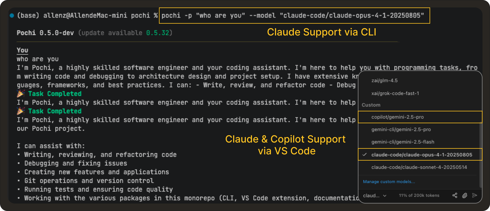

# Weekly Update #5

### TL;DR

This release introduces a manual sub-task execution mode for more control over sensitive workflows. We’ve also added MCP support in the CLI, enabled GitHub Copilot and Claude Pro/Max authentication, and shipped new tutorials and key security and stability improvements. 🙌 

### 🚀 Features

- **Manual Execution Mode for Sub-Tasks:** Sub-tasks created with `newTask` can now be run in a manual, step-by-step mode avoiding large unmoderated changes to your codebases in your sensitive workflows. **[#300](https://github.com/TabbyML/pochi/issues/300)**

  <iframe
    src="https://drive.google.com/file/d/1AwiwI9uIv4Rf_r1rolCLMW38wWVZHP2y/preview"
    style={{
      position: "absolute",
      top: 0,
      left: 0,
      width: "100%",
      height: "100%",
      border: "none",
      borderRadius: "8px",
    }}
    allowFullScreen
    title="Manual Execution for Sub-tasks"
  />

- **MCP support in CLI:** The CLI now supports running your Model Context Protocol (MCP) servers, allowing you to connect your tools, and run MCP-powered workflows directly from the terminal. This update brings the CLI closer to parity with the VS Code extension. **[#100](https://github.com/TabbyML/pochi/issues/100)**

  <iframe
    src="https://drive.google.com/file/d/1V8Ut_XXM9sRdSPHhoGVhMMnJHkxeaYFp/preview"
    style={{
      position: "absolute",
      top: 0,
      left: 0,
      width: "100%",
      height: "100%",
      border: "none",
      borderRadius: "8px",
    }}
    allowFullScreen
    title="MCP Support in CLI"
  />

- **AI Tooling Integrations (GitHub Copilot + Claude):** You can now authenticate and use your GitHub Copilot and existing Claude Pro/Max subscriptions within Pochi across both the CLI and VS Code. Once authenticated, these services provide completions and suggestions directly in your workflows, enhancing the overall AI-assisted development experience. **[#184](https://github.com/TabbyML/pochi/issues/184) , [#61](https://github.com/TabbyML/pochi/issues/61), [#306](https://github.com/TabbyML/pochi/issues/306)** 

  

- **Improved VS Code Configuration Navigation:** VS Code commands like `Pochi: Open MCP Server Settings` now open the relevant config file and jump directly to the specific setting, **[#301](https://github.com/TabbyML/pochi/issues/301)**

### ✨ Enhancements

- **Enhanced Gemini Model Support:** We've improved existing image input capabilities with added PDF and video inputs, providing richer multimodal workflows with Gemini models. **[#219](https://github.com/TabbyML/pochi/issues/219)**

- **Malformed Custom Agents in VSCode Settings:** Previously ignored malformed agent files (e.g., with YAML parsing errors) are now displayed in the settings UI with a clear warning, making it easier to debug and fix broken custom agent configurations. **[#391](https://github.com/TabbyML/pochi/issues/391)**, **[#415](https://github.com/TabbyML/pochi/issues/415)**

### 📖 Resources

- [Connect Pochi to Your Self-Hosted Tabby Server](https://docs.getpochi.com/tutorials/connect-to-tabby-server/)
- [Build a Custom MCP Server to Query Supabase](https://docs.getpochi.com/tutorials/supabase-mcp-server/)
