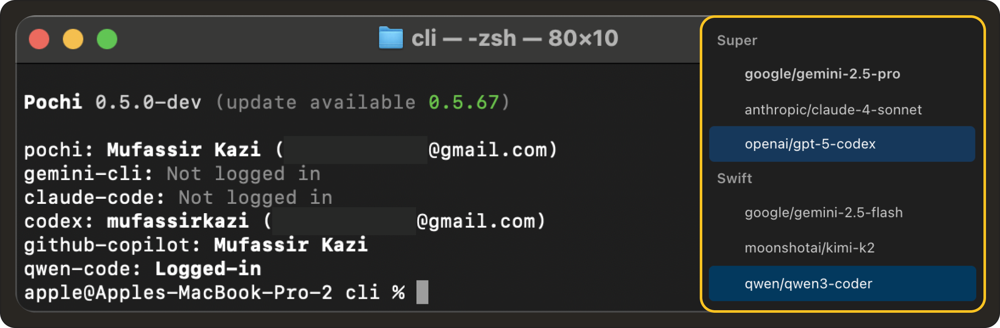

# Weekly Update #6

### TL;DR

Q4 is here, and Pochi’s cooking. 🍳

We’ve rolled out new built-in tools (`webFetch` and `webSearch`) that extend Pochi’s server-side capabilities, added support for new AI vendors (**Codex** and **Qwen Coder**), and released a new tutorial that shows how Pochi can act as your AI teammate in GitHub Actions.

Let’s start! 🧡

### 🚀 Features

- **Built-in Tools:** Pochi now supports server-side tools, allowing it to register and expose capabilities that come bundled directly with the app. The first two built-in tools introduced are `webFetch` and `webSearch`. These let AI agents fetch, read, and process web content directly. **[#447](https://github.com/TabbyML/pochi/issues/447)**

  <iframe
    src="https://drive.google.com/file/d/1cnEtO1wlTyplQnQUvLbwTp6lp77esJHp/preview"
    style={{
      position: "absolute",
      top: 0,
      left: 0,
      width: "100%",
      height: "100%",
      border: "none",
      borderRadius: "8px",
    }}
    allowFullScreen
    title="Built in tools for MCP"
  />

- **New AI Vendor Support:** Pochi  now supports Qwen Coder and Codex, adding new model vendors alongside Claude, Gemini, and Copilot. We've also introduced native compatibility with Anthropic’s API format, enabling faster and more stable integration with Claude models. **[#52](https://github.com/TabbyML/pochi/issues/52)**, **[#304](https://github.com/TabbyML/pochi/issues/304)**, **[#302](https://github.com/TabbyML/pochi/issues/302)** 

  

### ✨ Enhancements

- **Model-Aware Workflows:** You can now define which model a workflow should use directly in its configuration. This gives you more control over which LLM handles each automation, especially useful if your team switches between providers like Claude, Gemini, or Codex. **[#343](https://github.com/TabbyML/pochi/issues/343)**

### 🐛 Bug fixes

- **Assistant Retry Logic:** Fixed an issue where assistant messages without tool calls were treated as new steps instead of retries, causing the retry count logic to behave incorrectly. **[#342](https://github.com/TabbyML/pochi/issues/342)**

- **Diff View in VS Code:** Files open before a diff operation are now reopened after accepting or rejecting changes, preserving your workspace layout. **[#440](https://github.com/TabbyML/pochi/issues/440)**

### 📖 Resources

- We’ve published a new tutorial: **[Build Your Own AI Teammate with Pochi in GitHub Actions](https://docs.getpochi.com/tutorials/pochi-github-actions/)**. Learn how Pochi can review and gatekeep PRs, enforce coding standards, open issues, and even run as a continuous background agent.

