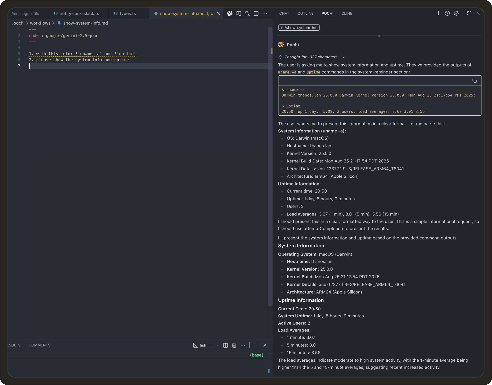

# Weekly Update #8

### TL;DR

We’ve given Pochi new tricks. 

Workflows can now execute Bash commands, `readFile` tool handles multimedia inputs, and markdown rendering is faster and cleaner with `streamdown.ai`.

Let’s get on with it! 


### 🚀 Features


- **Bash Commands in Workflows** You can now execute Bash commands directly inside Pochi workflows using the `!` prefix. This allows workflows to pull live system or repository context, like `git status` or `uname -a`, and feed the results into the model before running your task. <break></break>
For example:
 ```bash
 - With this: !`uname -a` and !`uptime` 
 - Please show the system info and uptime
 ```
 Pochi automatically runs these commands and includes their outputs in the model’s context, making workflows more dynamic and connected to your local environment. **[#541](https://github.com/TabbyML/pochi/issues/541)**

<div class="w-12/15 md:ml-8 *:shadow-xl/30 *:rounded-lg"></div>


### ✨ Enhancements


- **Faster Markdown Rendering with `streamdown.ai`:**  We’ve replaced `react-markdown` with `streamdown.ai` in the VS Code web UI. This upgrade improves performance, adds streaming-based markdown rendering, and ensures better support for rich content (like math, code blocks, and workflows). **[#401](https://github.com/TabbyML/pochi/issues/401)**


- **Extended Multimedia Support in `readFile` Tool:**  The `readFile` tool now supports reading multimedia files, including images, audio, and video, for multimodal models. Pochi automatically detects file types and encodes the content in `base64` for models that can interpret visual and auditory data. **[#539](https://github.com/TabbyML/pochi/issues/539)**, **[#569](https://github.com/TabbyML/pochi/issues/569)**


<div
className="w-12/15 md:ml-8 *:shadow-xl/30 *:rounded-lg"
  style={{
    position: "relative",
    paddingBottom: "53.7%",
    marginBottom: 20,
    height: 0,
    overflow: "hidden",
    maxWidth: "100%",
  }}
>
  <iframe
    src="https://drive.google.com/file/d/1q-ghZRyqMIhuOFA-k5E8xRbYRvdXZdSC/preview"
    style={{
      position: "absolute",
      top: 0,
      left: 0,
      width: "100%",
      height: "100%",
      border: "none",
      borderRadius: "8px",
    }}
    allowFullScreen
    title="`readfile`tool demo"
  />
</div>

- **Added Linux ARM64 Release:** Pochi is now available for Linux ARM64 systems, improving compatibility for developers running on Raspberry Pi or ARM-based environments. **[#543](https://github.com/TabbyML/pochi/issues/543)**
