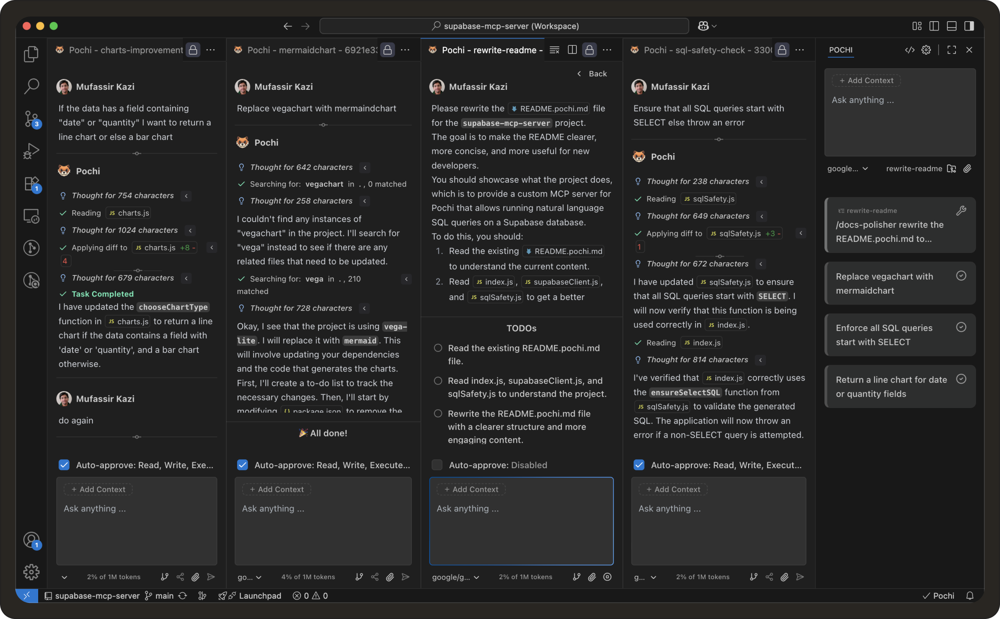

# Weekly Update #10

### Parallel Agents
Teams rarely work on a single task at a time. You might be part-way through a feature when a bug report arrives, someone needs a small refactor reviewed, or a documentation fix is pending. Most tools and workflows force these tasks to share one working state.

So you end up switching branches, stashing and popping changes, resetting your workspace, and trying to hold the original task in your head. This is context switching, and it’s one of the biggest hidden costs in software development.

We released **Parallel Agents** to remove that cost. Each agent runs in its own Git worktree, which isolates the task’s state from the rest of your work.

A great example would be to run the same task with different models to pick the best response. Won’t that be a faster and much better experience - all within the same timeframe? 

This is different from other existing solutions, which operate inside a single editor tab. In those tools, you’re effectively working in one tab at a time: switching tasks means switching the state of the same working directory and the same conversation.

On the other hand, **Parallel Agents** in Pochi keep tasks fully isolated by running each one in its own Git worktree. You can keep multiple tasks active at once and switch between them without stashing or losing context. 

## How to use?

1. You can create a worktree from the Pochi sidebar. Once a worktree exists, starting a task in that worktree opens it as its own tab in Pochi. 
2. When a task finishes, use the diff view to review its changes. If it looks good, create a PR from that worktree. 

## When to use Parallel Agents

**Parallel Agents** are most useful when you want to avoid breaking focus on ongoing work: quick bugfixes during feature development, long-running refactors that you want to keep separate, documentation changes that happen alongside coding, or letting an AI assistant explore broader changes in a sandbox. 

On the other hand, if a change is meant to be reviewed and merged as a single unit, keeping it on one branch remains simpler.

Here is the demo showing the feature in action:

  <iframe
    src="https://drive.google.com/file/d/1JB3viOn2nawUX5JNMdGVHWPVJvBraJTY/preview"
    style={{
      position: "absolute",
      top: 0,
      left: 0,
      width: "100%",
      height: "100%",
      border: "none",
      borderRadius: "8px",
    }}
    allowFullScreen
    title="Parallel Agents Demo"
  />

Read the full documentation **[here](https://docs.getpochi.com/parallel-agents/)**. 

