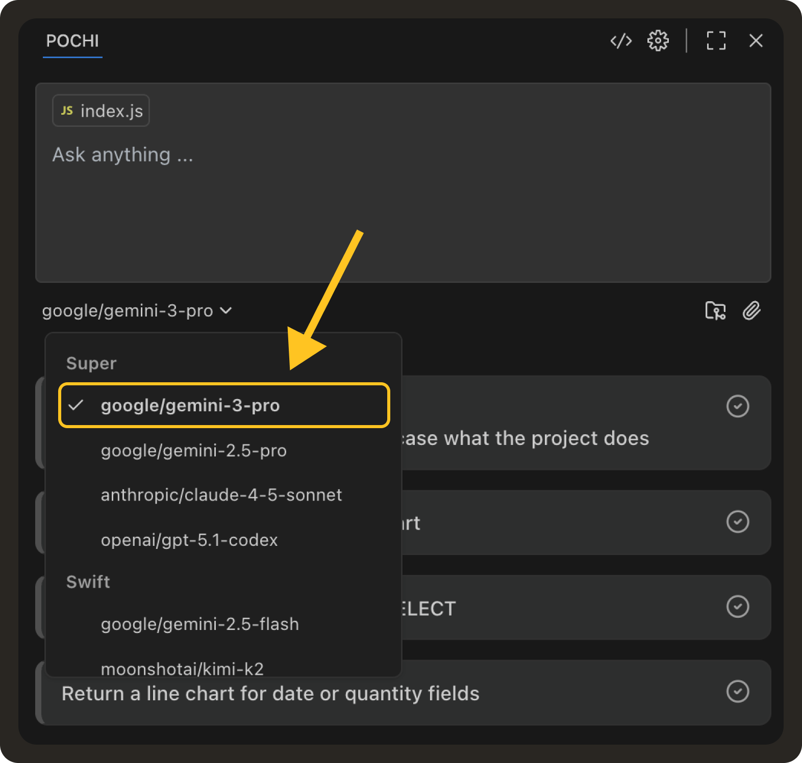

# Weekly Update #11

### TL;DR

This week was a big one.

We shipped Next Edit Suggestions (one of our biggest upgrades so far), along with real-time task notifications and cleaner diff views. Pochi now feels smarter, tighter, and much more intuitive across the codebase.

### 🚀 Features

- **Next Edit Suggestions (NES):** We’ve introduced our internal edit model powering Next Edit Suggestion (NES). It is an upgrade to Tab Completion that predicts the next change your code needs, wherever it lives. It learns from your recent edits, understands how your file is evolving, and auto-surfaces likely follow-up edits.    We’ve published a deep-dive on how we trained and evaluated the edit model, and how it powers Pochi's experience. You can read more **[here](./how-we-created-nes-model.mdx)**.

- **Pop-up Notifications for Task Status Changes:** Pochi now shows real-time notifications when a task completes, fails, or needs your input. Each notification includes a “View Details” button that jumps directly into the task. In the case the task panel is already open, we suppress duplicable notifications to reduce noise.

  <iframe
    src="https://drive.google.com/file/d/1ytoU6d11rd-Sv-jQsqLmOvI_WxKqqwzO/preview"
    style={{
      position: "absolute",
      top: 0,
      left: 0,
      width: "100%",
      height: "100%",
      border: "none",
      borderRadius: "8px",
    }}
    allowFullScreen
    title="Task notifications"
  />

- **Gemini 3 Support:** We’ve added support for Gemini 3 Pro alongside 2.5 Pro. The UI for model selection is updated and ready for you to take over!

### ✨ Enhancements

- **Line Wrap Toggle in Code Blocks:** We added a line wrap toggle to the code block component in the VS Code extension. This way, long lines inside diffs and model edits are now way easier to read, especially when reviewing wide changes across generated code.

  <iframe
    src="https://drive.google.com/file/d/1MYevQHoKri44vn4UCe7zvNGJqkXJNfQ4/preview"
    style={{
      position: "absolute",
      top: 0,
      left: 0,
      width: "100%",
      height: "100%",
      border: "none",
      borderRadius: "8px",
    }}
    allowFullScreen
    title="Line Wrap Toggle in Code Blocks:"
  />

### 🔥 Preview

- We’re actively working on a set of UX upgrades for the VS Code sidebar - things like grouping tasks by worktree, cleaner task headers, and a diff-summary panel that shows all file edits at a glance. More on this in an upcoming update.

