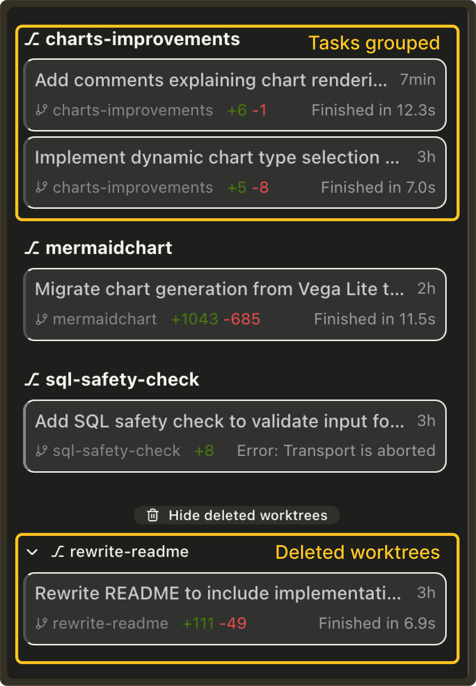
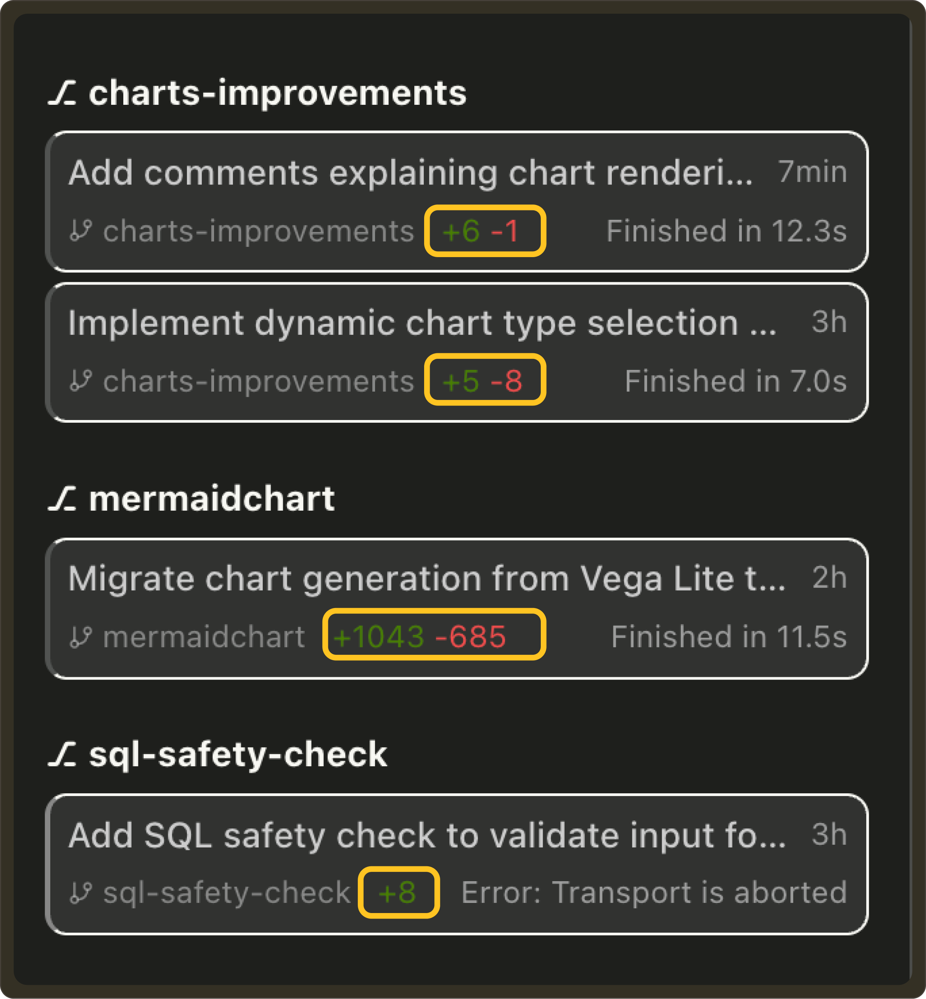

# Weekly Update #12

### TL;DR

This weeks update is packed with improvements to task visibility, worktree workflows, and NES accuracy. We also made foundational changes to how tasks are stored, which sets us up for upcoming GitHub and multi-worktree features.

<Callout type="info" title="Breaking Change: Task list reset in v0.16.0">
  We introduced a breaking change in v0.16.0 that may result in the loss of the task list after upgrading. No action is needed as new tasks will behave normally going forward.
</Callout>

### 🚀 Features

- **Diff Summary Panel for Task Changes:** We added a diff summary panel inside each task, showing all file edits made during execution. You can now review per-file additions/deletions, inspect the total change summary, and undo changes directly from the panel itself. **[#728](https://github.com/TabbyML/pochi/issues/728)** 

  <iframe
    src="https://drive.google.com/file/d/11Z1go6JzvuQ-uOijAyOd8cZ0lmVd4zBx/preview"
    style={{
      position: "absolute",
      top: 0,
      left: 0,
      width: "100%",
      height: "100%",
      border: "none",
      borderRadius: "8px",
    }}
    allowFullScreen
    title="Diff Summary Panel for Task Changes"
  />

### ✨ Enhancements

- **Improved Visibility into Task Execution:** Tasks now display real-time execution details, including active tool calls, subtasks, and streaming progress to make task behavior easier to understand at a glance. This brings much clearer visibility into what Pochi is doing while a task runs. **[#675](https://github.com/TabbyML/pochi/issues/675)** 

  <iframe
    src="https://drive.google.com/file/d/1FV0KxcbzgcPbTKCfa3js9zaZv5PoOCr0/preview"
    style={{
      position: "absolute",
      top: 0,
      left: 0,
      width: "100%",
      height: "100%",
      border: "none",
      borderRadius: "8px",
    }}
    allowFullScreen
    title="Improved Visibility into Task Execution"
  />

- **Tasks grouped by worktree:** Pochi automatically groups tasks by their associated Git worktree with active worktrees at the top and deleted worktrees collapsed into a dedicated section. Each worktree shows its own tasks, status, and metadata which makes it much easier to manage parallel workstreams and multiple agents. **[#676](https://github.com/TabbyML/pochi/issues/676)** 

- **Diff Summary on Task List Item:** Task rows now display git diff summaries (e.g. `+23 -5`) so you can instantly see the size and impact of each task’s changes across multiple worktrees. **[#674](https://github.com/TabbyML/pochi/issues/674)** 

- **Worktree-aware task tabs:** Pochi now opens tasks from the same Git worktree in the same VS Code tab group, and tasks from different worktrees in separate tab groups. This keeps parallel branches visually separated while you work. **[#677](https://github.com/TabbyML/pochi/issues/677)** 

  <iframe
    src="https://drive.google.com/file/d/1Q-i632-wzbT04-HkWukqXGst7QKNn-LA/preview"
    style={{
      position: "absolute",
      top: 0,
      left: 0,
      width: "100%",
      height: "100%",
      border: "none",
      borderRadius: "8px",
    }}
    allowFullScreen
    title="Worktree-aware task tabs"
  />

- **Unread Task Indicators:** We added unread indicators to the task list so you never miss when a background task finishes or fails. Tasks that complete while you’re looking elsewhere now show a small dot until you open them, making it much easier to track updates. **[#673](https://github.com/TabbyML/pochi/issues/673)** 

  <iframe
    src="https://drive.google.com/file/d/1XCqsNtZI-_I7mon0CIyIKpAF8p_BmbEt/preview"
    style={{
      position: "absolute",
      top: 0,
      left: 0,
      width: "100%",
      height: "100%",
      border: "none",
      borderRadius: "8px",
    }}
    allowFullScreen
    title="Unread Task Indicators"
  />

- **Enhanced NES prompting with additional local code context:** NES now includes richer local code context in its prompt, improving accuracy for predictions that depend on nearby functions, variables, or imports. **[#727](https://github.com/TabbyML/pochi/issues/727)** 

### 🔥 Preview

- We’re actively working on GitHub PR creation and status, multi-worktree task execution, and GitHub/Linear issue linking - all designed to make Pochi even more powerful for real engineering workflows.