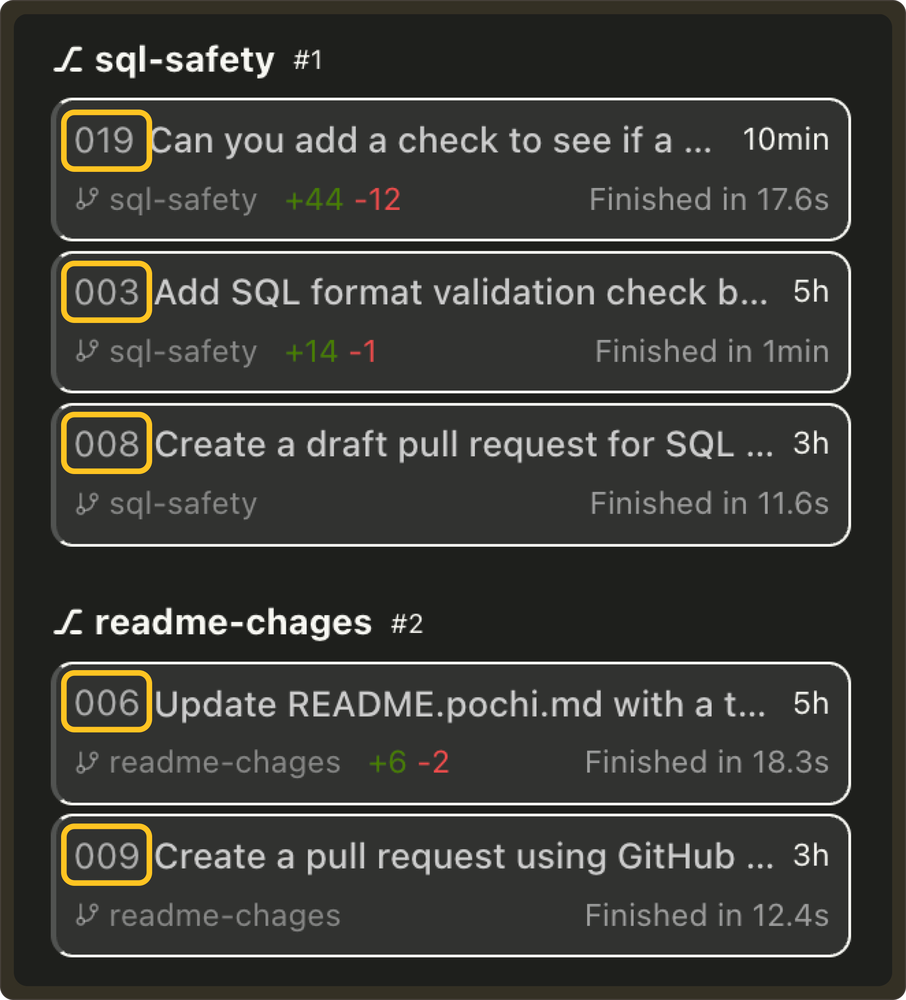

# Weekly Update #13

### TL;DR

This release brings some of our most practical updates yet: GitHub PR creation directly from worktrees, the ability to fork tasks when an agent drifts, clean task resets when context gets too large, and UI improvements that make multi-worktree setups far easier to manage.

A small step closer to a more transparent, predictable coding agent.

### 🚀 Features

- **GitHub PR Workflow:** Pochi now understands Pull Requests per worktree. You can create PRs directly from the sidebar, and each worktree shows its associated PR, status (checks running, ready to merge, failed), and a breakdown of CI/Lint/Test results with quick links. PR state persists across sessions and stays linked to your worktree. **[#747](https://github.com/TabbyML/pochi/issues/747)**

    <video
        controls
        style={{
        width: "100%",
        borderRadius: "8px",
        boxShadow: "0 4px 12px rgba(0, 0, 0, 0.15)",
        }}
    >
        <source src="https://assets.docs.getpochi.com/github-pr.mp4" type="video/mp4" />
        Your browser does not support the video tag.
    </video>

- **Fork a task:** You can now fork any task when things go off-track. If an agent drifts, a tool call fails, or you want to try a different direction, hit Fork to spin up a new task starting from the same point in the conversation. The original stays untouched.  

  <video
    controls
    style={{
      width: "100%",
      borderRadius: "8px",
      boxShadow: "0 4px 12px rgba(0, 0, 0, 0.15)",
    }}
  >
    <source src="https://assets.docs.getpochi.com/forking.mp4" type="video/mp4" />
    Your browser does not support the video tag.
  </video>
  This makes it much easier to debug issues, try alternative fixes, or compare multiple approaches side-by-side. One great use case would be to provide corrective feedback and guide the agent back on track without resetting the whole task. **[#455](https://github.com/TabbyML/pochi/issues/455)** 

- **Create a New Task with Previous Context:** When a task grows beyond ~50k tokens, Pochi now suggests New Task with Summary option. This creates a clean task with a summary of the previous conversation, helping you avoid hitting context limits while keeping all relevant information. **[#779](https://github.com/TabbyML/pochi/issues/779)** 
  
    <video
        controls
        style={{
        width: "100%",
        borderRadius: "8px",
        boxShadow: "0 4px 12px rgba(0, 0, 0, 0.15)",
        }}
    >
        <source src="https://assets.docs.getpochi.com/task-summary.mp4" type="video/mp4" />
        Your browser does not support the video tag.
    </video>

- **Auto Layout:** We added a new “Pochi Layout” toggle that instantly arranges your VS Code workspace into an optimized 3-pane layout: the Pochi task view on the left, code/diffs on the upper right, and terminals in a separate bottom-right tab group. This keeps terminal output isolated, prevents accidental layout shifts, and makes long-running tasks much easier to follow. **[#733](https://github.com/TabbyML/pochi/issues/733)** 

    <video
            controls
            style={{
            width: "100%",
            borderRadius: "8px",
            boxShadow: "0 4px 12px rgba(0, 0, 0, 0.15)",
            }}
    >
            <source src="https://assets.docs.getpochi.com/pochi-auto-layout.mp4" type="video/mp4" />
            Your browser does not support the video tag.
    </video>

### ✨ Enhancements

- **Incremental Task IDs:** Tasks now receive a simple incremental ID (`#001`, `#002`, …) that is shared across all worktrees within the same Git repository. This makes tasks easier to reference while still preserving grouping by worktree in the UI. **[#746](https://github.com/TabbyML/pochi/issues/746)** 
    

- **Optimistic Worktree Deletion:** Deleting a worktree now updates instantly in the UI, making the worktree disappears immediately without waiting for the backend to confirm. This makes task management feel faster and keeps the sidebar in sync with your intent. 
     <video
        controls
        style={{
        width: "100%",
        borderRadius: "8px",
        boxShadow: "0 4px 12px rgba(0, 0, 0, 0.15)",
        }}
    >
        <source src="https://assets.docs.getpochi.com/delete-worktree.mp4" type="video/mp4" />
        Your browser does not support the video tag.
    </video>

### 🔥 Preview

- We’re working on multi-worktree task execution (run tasks in parallel across branches or models) and GitHub/Linear issue linking that lets Pochi automatically attach, track, and close issues as part of your workflow.