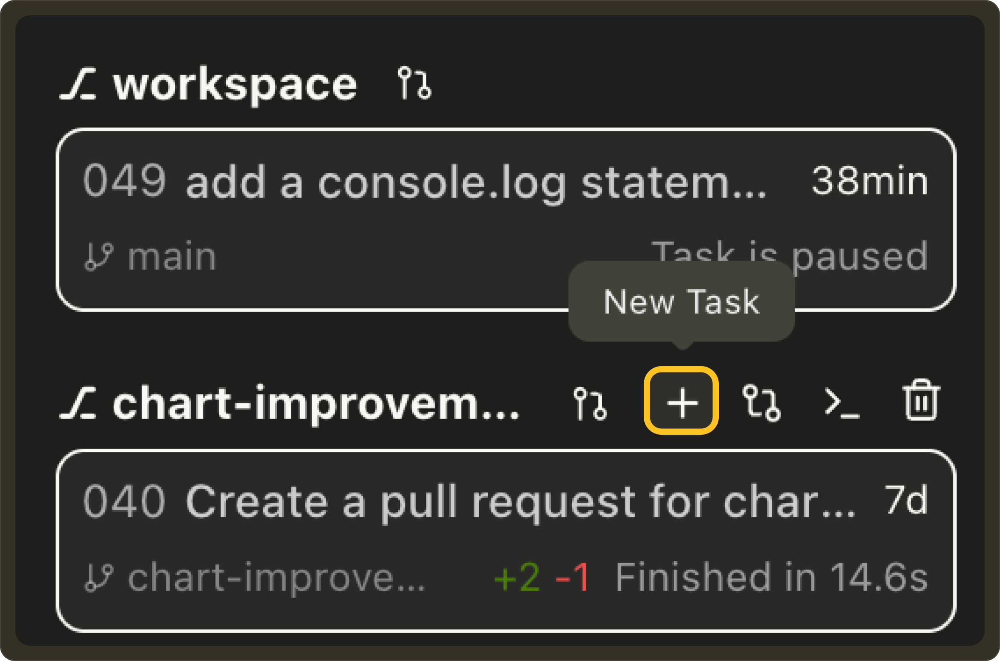

# Weekly Update #15

### TL;DR

This week includes several improvements and bug fixes across the VSCode extension and Web UI. 

A mix of workflow enhancements, UI polish, and reliability fixes landed. Here are the highlights:

### ✨ Enhancements

- **Improved Worktree Selector in VSCode Web UI:** We’ve added support for creating a new worktree with an auto generated name directly from the dropdown; an additional way other than `Cmd` + `Enter` a prompt. We also included tooltips and  renamed `main` worktree to `workspace` in the worktree list UI to better reflect its purpose. **[#896](https://github.com/TabbyML/pochi/issues/896)**, **[#875](https://github.com/TabbyML/pochi/issues/875)**
  <video
        controls
        style={{
        width: "100%",
        borderRadius: "8px",
        boxShadow: "0 4px 12px rgba(0, 0, 0, 0.15)",
        }}
    >
        <source src="https://assets.docs.getpochi.com/improved-worktree-ui-020.mp4" type="video/mp4" />
        Your browser does not support the video tag.
    </video>

- **Open diff directly from a task:** Clicking a task with diffs now opens both the task and its diff panel, making it easier to review changes directly from the task list. **[#849](https://github.com/TabbyML/pochi/issues/849)**
   <video
        controls
        style={{
        width: "100%",
        borderRadius: "8px",
        boxShadow: "0 4px 12px rgba(0, 0, 0, 0.15)",
        }}
    >
        <source src="https://assets.docs.getpochi.com/open-diff-020.mp4" type="video/mp4" />
        Your browser does not support the video tag.
    </video>

- **Quick task creation from the Worktree sidebar:** Added a `+` button next to each worktree to create a new task. **[#877](https://github.com/TabbyML/pochi/issues/877)**
  

- **New keyboard shortcut:** Added a `Ctrl`+ \` keybinding in VSCode to instantly toggle the Pochi layout or open the terminal, improving keyboard-first navigation. This shortcut only exists as an advance configuration at the moment. To enable it, set `enablePochiLayoutKeybinding` in VSCode settings `pochi.advanced` section to `true`. **[#881](https://github.com/TabbyML/pochi/issues/881)**

  ### 🐛 Bug Fixes

- **Improved PR fetching reliability:** Fixed the GitHub PR fetching logic to exclude pull requests from forked repositories, ensuring only relevant PRs from the main repo appear in the Worktree/PR selector. **[#893](https://github.com/TabbyML/pochi/issues/893)**