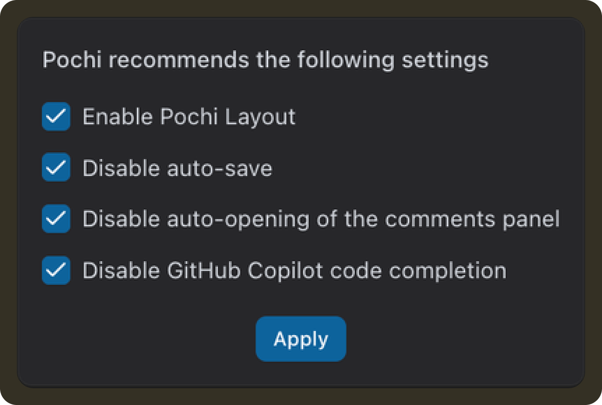
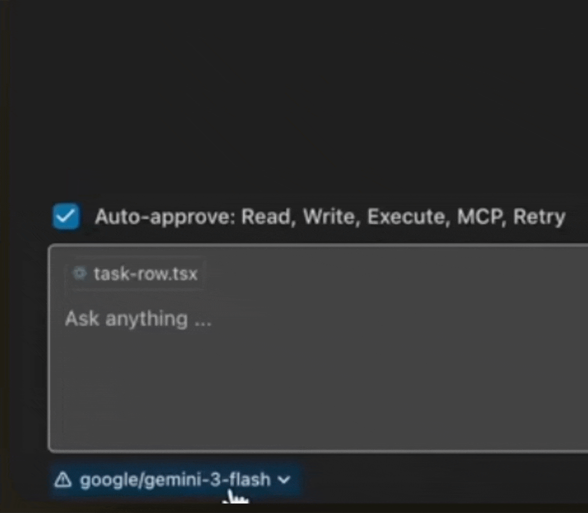

# Weekly Update #18

### TL;DR

Hope your year’s been off to a good start. 

We’re back to shipping, and this release includes updates to how follow-up prompts use your local edits, a clearer Auto Layout setup flow, better recovery when things fail (like model loading and Mermaid diagrams), and a few UI fixes that remove common friction points.

Let’s dive in!

### 🚀 Features

- **User Edits are now included in agent context:** Recent code changes you make are now captured and sent along with your next prompt. These edits are also shown in the chat context and multi-diff view, so you can see exactly what the agent is reacting to. 

  This helps the agent continue from your version of the code without you needing to re-explain what you already changed. **[#983](https://github.com/TabbyML/pochi/issues/983)**

  <video
        controls
        style={{
        width: "100%",
        borderRadius: "8px",
        boxShadow: "0 4px 12px rgba(0, 0, 0, 0.15)",
        }}
    >
        <source src="https://assets.docs.getpochi.com/useredits.mp4" type="video/mp4" />
        Your browser does not support the video tag.
    </video>

### ✨ Enhancements

- **Improved Auto Layout onboarding:** Auto Layout can modify several VS Code settings such as layout, keybindings, auto-save, and conflicting completions. The new onboarding screen explains these changes upfront and allows you to selectively apply them, making it easier to enable Auto Layout with confidence. **[#985](https://github.com/TabbyML/pochi/issues/985)**

 

- **Create worktrees from remote branches:** When creating a new worktree, you can now choose a remote branch (for example, `origin/feature-branch`) as the base instead of being limited to local branches. This makes it easier to start from branches that exist on the remote but aren’t checked out locally. **[#958](https://github.com/TabbyML/pochi/issues/958)**

   <video
        controls
        style={{
        width: "100%",
        borderRadius: "8px",
        boxShadow: "0 4px 12px rgba(0, 0, 0, 0.15)",
        }}
    >
        <source src="https://assets.docs.getpochi.com/select-remote-branches-024.mp4" type="video/mp4" />
        Your browser does not support the video tag.
    </video>

- **Recover from Mermaid rendering errors in chat:** When a Mermaid diagram fails to render, a `Fix error with Pochi` button is now shown so you can ask the agent to correct the diagram instead of being stuck with a broken block. **[#968](https://github.com/TabbyML/pochi/issues/968)**

   <video
        controls
        style={{
        width: "100%",
        borderRadius: "8px",
        boxShadow: "0 4px 12px rgba(0, 0, 0, 0.15)",
        }}
    >
        <source src="https://assets.docs.getpochi.com/mermaid-diagram-fix-with-pochi-024.mp4" type="video/mp4" />
        Your browser does not support the video tag.
    </video>

- **Retry when models fail to load:** If the model list fails to load due to a network or backend issue, you can now retry directly from the UI instead of reloading the entire VS Code window.**[#984](https://github.com/TabbyML/pochi/issues/984)**

 

- **More space for worktree details:** We optimized the worktree list layout so action buttons no longer take up space when not visible, giving more room for worktree names and PR information, particularly on smaller screens.**[#925](https://github.com/TabbyML/pochi/issues/925)**

### 🔥 Preview

- We’re working on a Create Plan flow for new tasks in the sidebar, letting you generate a structured plan first before executing the task. 