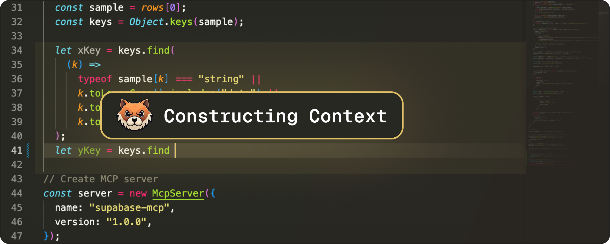
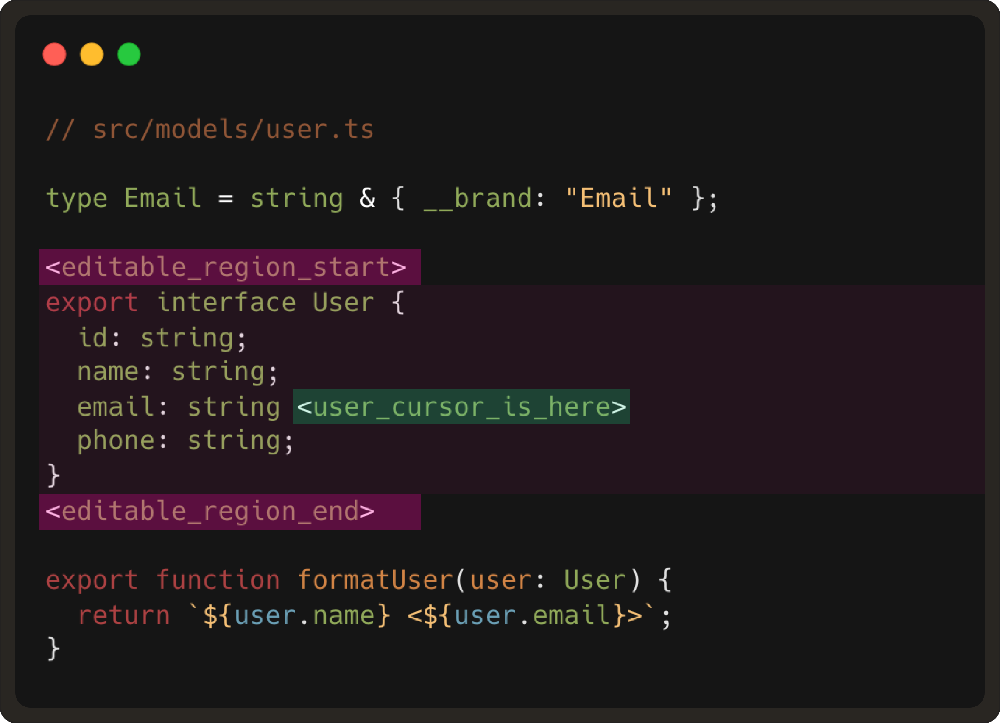
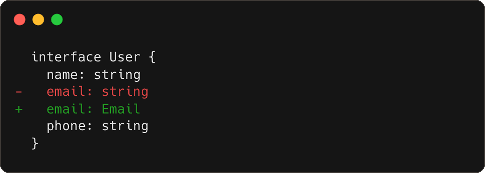
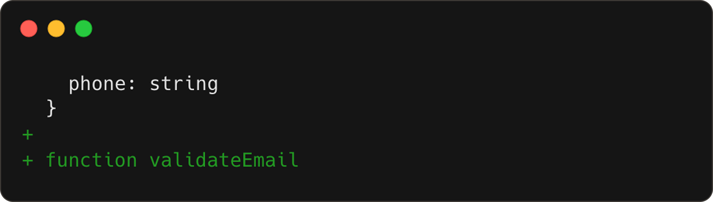
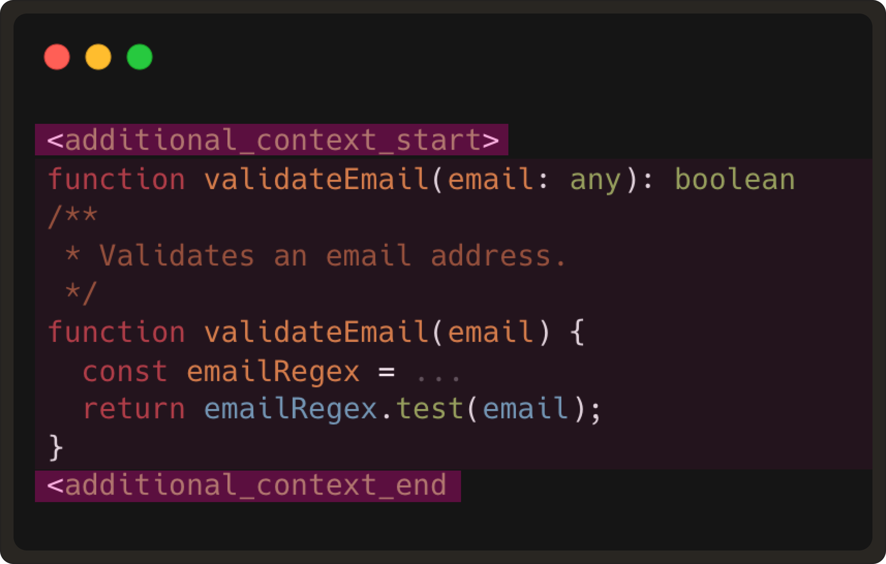
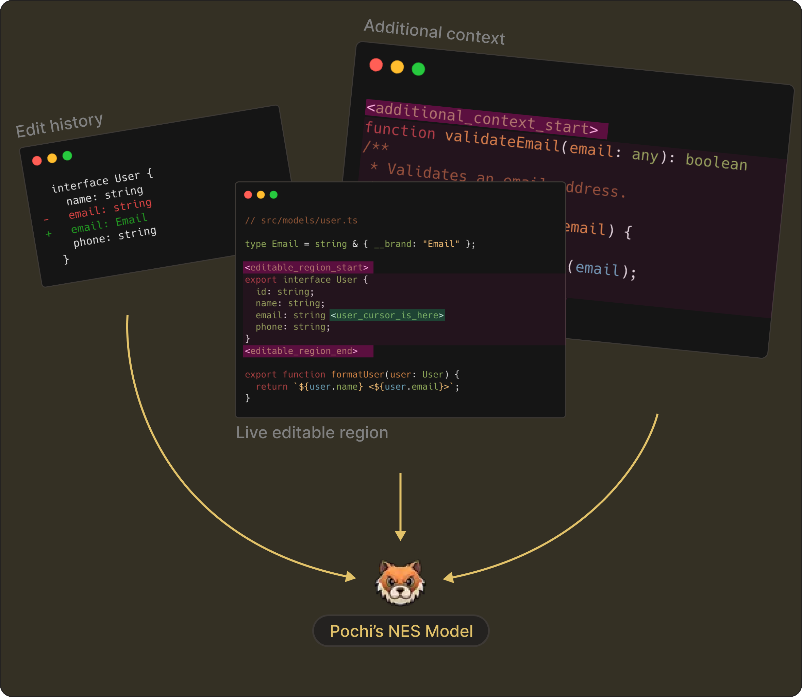

# NES Series (Part 2): Real-Time Context Management in Your Code Editor

In [Part 1](https://docs.getpochi.com/developer-updates/how-we-created-nes-model/), we covered how we trained our **NES model**, including topics such as the special tokens we use, the LoRA-based fine-tuning on Gemini Flash Lite, and how we utilized a judge LLM to evaluate the model.

However, the end experience is far more than just building a good model. To make NES feel “intent-aware” inside your editor, we needed to give the model the right context at the right moment.

In part 2, we’ll talk about that **runtime system**, or to be precise, how Pochi manages, ranks, and streams real-time edit context.  This is the core that helps NES to understand your intent and predict the next meaningful change. 

## Why Context Management Matters
To start, let’s understand what context management is. In our case, it’s the layer between when a user starts typing and when the model is called with a well-formed prompt. During that in-between phase, the system gathers and prepares all the relevant context the LLM needs before we make a model request.  

As to why it matters, imagine simply sending the entire file to the model on every keystroke. Not only will the model become slower and noisier, but you’d get unstable predictions and over 20 model calls per second, rendering the whole experience unusable. 

Instead, as previewed in the first article, we provide NES with three kinds of context:

- **File Context:** text, filepath, cursor position, and the region to be edited
- **Edit History:** record of recent edit steps
- **Additional context from other files (optional):** e.g., functions/type declarations that help understand the current file  

Each of these depends on clever filtering, segmentation, and timing - all of which happen in milliseconds during normal typing, as we’ll learn below.  

## 1. File Context: Finding the “live” region of code
The first question to solve: “Where is the user editing right now?”. This is the foundation of every NES prompt. We answer this by gathering three quick pieces of information from the VS Code API:
- The current file text
- The file path
- The user’s cursor position
Using this information, we compute what is called “the editable region”. This region is generally a small code window around the user’s cursor of ~10 lines. 

### Why ~10 lines?
Because realistically, the next edit will almost always happen very close to where the user is already editing. This small window keeps the latency extremely low and is large enough to capture the structure around the edit.  

And while we observe many models are over-eager and hallucinate changes elsewhere, our model is prevented from rewriting parts of the file the user wasn’t touching. 

An example of the editable region would be:

## 2. Edit history: Following the user’s intent over time
So far, we have learnt where the user is currently editing, but we also need to understand how the code is changing over time. This is the part where edit history becomes important for the edit model to predict the user’s intent.   

Now, while we could use the VS Code API to register a listener for text change events, this ends up triggering an event for almost every keystroke. For example, if a user updates a type from string to email, it ends up producing ~6 events. 

These are not your meaningful edit steps. If we send this to the model, it will think each keystroke is a new “user intent” and will fire too many requests with wildly different predictions.  Instead, we reconstruct real edit steps using an internal change segmentation grouping.

### How we group events into meaningful steps

Since we cannot directly use the listener events, we decided to reduce them to events that represent edit steps. To achieve this, we group raw text-change events into undo-redo scale units.  

Most editors record undo-redo steps on a word scale - for example, when a user inputs a sentence, an undo action will revert the last input word.
In our case, for building edit prediction prompts, we do this on a larger scale. 
- Once we receive information on a user’s cursor position and tracking gets initiated, we create an edit steps list, where each step is an accumulation of several text change events. We found that 5 steps is the sweet spot to build a prompt. Anything more than that adds noise, and if less, loses the intent.
- For each received text change event, we check if it is adjacent to the previous one. If yes, it belongs to the same edit step; otherwise, if it happens in a different part of the file, we consider it as a new edit step.
So continuing our example from earlier, if the user happens to add a `validateEmail` function next, we now have two edit steps in tracking. 

The first edit step:

 
The second edit step:

NES receives these steps wrapped inside `<|edit_history|>` token to learn how the code is evolving. 

### Special Case: Git Checkout Noise
One edge case we uncovered is when users run `git checkout` to switch branches. This triggers massive file changes, none of which represent real user intent. If we were to treat these as edit steps, the model would end up thinking the user rewrote half the codebase. In order to avoid polluting the model direction, we:
- Monitor the git status
- Reset edit history when it changes (`checkout`, `pull`, `stash`)
- Resume tracking after a few seconds

## 3. Additional Context: Bringing in the rest of your project 

Code rarely exists in isolation. If you’re editing a function call, the model may need the definition. Likewise, if you’re modifying a type, the model may need the type declaration. 

To give NES this kind of project-aware understanding, we pull additional snippets using the user’s installed language server. For this, we have two VS Code / LSP APIs:

- We use `vscode.provideDocumentRangeSemanticTokens` to scan the editable region for each token type. Then we can find the tokens of interest, like a function, interface, or type defined in another file.
- Next, we use the VS Code command `vscode.executeDefinitionProvider` to get the target location for the definition code snippets. This is like `Ctrl` / `Cmd` + clicking on a function to see the definition in another file.

These two commands are provided by the language server (LSP), which should be available when the language plugin is installed in VS Code. We then extract the definition snippet and include it in `<|additional_context|>` token as shown below:

This gives the model the same context a developer would mentally reference before typing the next edit.

**Note:** We do realise that some of the functions could be huge or a type might be hundreds of lines, with LSP sometimes returning entire class bodies. Therefore, to throttle/limit semantic snippet extraction, we’ve currently hard-coded a maximum of 2000 characters per snippet for now.  

Meanwhile, in cases where good LSP support is lacking, like plain text, we don’t add any related snippets context to the prompt. Instead, the prompt will still contain the prefix, suffix, and edit records. 

## Putting It All Together
As learned above, every NES request contains the `<|editable_region|>`, `<|edit_history|>` and `<|additional_context|>` tokens.

At the end, each piece is carefully constructed into the model exactly the way it was trained. This symmetry between training and runtime makes NES far more reliable than native autocomplete-style approaches.

## What’s next?

In our next post, we’ll talk about Request Management, the system that ensures the model never gets a chance to be wrong about the user’s current context. 

We all understand real coding experience involves a lot of short, focused typing, moving the cursor to different places, and continuing to edit while a request is still in flight. This means the model requests can become outdated before their response arrives, or worse,  it might produce suggestions for code that no longer exists.  

One of the reasons NES feels fast is because everything that isn’t the latest user intent is thrown away immediately. This cancellation of stale predictions is one of the biggest reasons Pochi’s NES feels so smooth and accurate.  

More on this in our Part 3 post. **[Read more](https://docs.getpochi.com/developer-updates/request-management-in-nes/)**.
