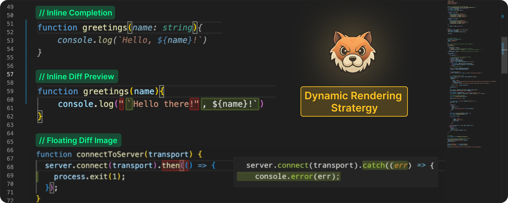
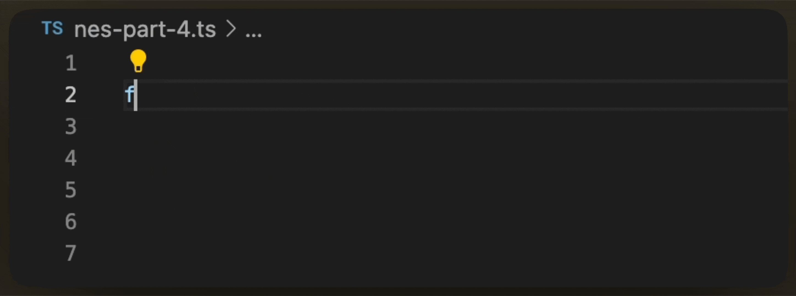
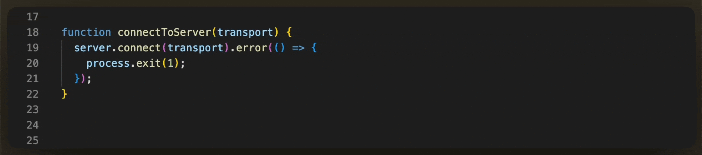

# NES Series (Part 4): Dynamic Rendering Strategies for AI Code Edits

So far in this series, you’ve seen **[how we trained our NES model](https://docs.getpochi.com/developer-updates/how-we-created-nes-model/)**, what that **[model takes as context](https://docs.getpochi.com/developer-updates/context-management-in-your-editor/)** to make a prediction, and how these model **[requests are managed with correct timing](https://docs.getpochi.com/developer-updates/request-management-in-nes/)** under continuous typing.

With this, we’ve reached a point where NES can predict what edit should happen and when it should appear in the editor. 

In Part 4, we'll talk about how there is still one critical decision to make. **Once a suggestion arrives, how should that change be presented inside a live editor?**

Pochi’s NES is built as a VS Code-native feature, not a standalone IDE or a custom fork. This means previews must integrate with VS Code’s public APIs, performance model, and established interaction patterns.

This introduces a core design challenge - to surface enough context for a suggestion to be actionable, **without disrupting the developer's flow.**

Designing a system that honors this is more than a matter of visual polish; it is a complex systems + UX problem. We’ll explore why this balance is so difficult for a native AI agent and the specific rendering strategies NES uses to achieve it.

## The Display Problem

Unlike conventional editor features, NES does not control where the user’s cursor is when a suggestion arrives. The editor is a continuously changing environment and does not function like a static canvas. Sometimes the user's cursor might be exactly where the edit belongs, or it can be twenty lines away, or the suggestion itself can be a huge change spanning multiple lines.

Showing such suggestions naïvely introduces new failure modes that are easy to trigger and hard to ignore. One experiences jumps in cursor position, abrupt viewport scrolls, or rendering large changes directly in the editing flow. In practice, these behaviors are often more disruptive than not showing a suggestion at all.

This brings us to the most fundamental design question: **How do we show an edit without stealing the developer’s attention?**

Answering that question requires understanding the VS Code interaction model.

VS Code does not provide a built-in API for previewing LLM-generated edits. Instead, the editor offers different primitives for different kinds of locations and edits. These primitives are optimized for various interaction patterns, each with their own affordances and limitations. Some work well for cursor-local edits, while others are better suited for changes elsewhere in the file. 

Understanding this difference is key. Pochi's NES does not render suggestions in a single, fixed way. Instead, NES relies on these primitives to create a balance between visibility and disruption. 

## Dynamic Rendering Strategy

Rather than forcing all suggestions into a single representation, we designed a Dynamic Rendering Strategy offering the optimal visual experiences in different editing scenarios:  

- Suggestions that target **the current cursor position** are rendered inline, flowing naturally into the user's typing behavior. 
- Suggestions that apply **off-cursor** are previewed via an inline diff decoration, avoiding jumps in the viewport.
- For **large, multi-line block inserts**, a floating preview is used to provide sufficient context without disrupting the user's current focus.

This way, each path is deliberately scoped to the situations where it performs best, aligning it with the least disruptive representation for a given edit. 

Let’s take a walk-through of these rendering strategies in detail and examine when each one is used, starting with the least disruptive case.

### Inline Completion

When an edit is positioned right at the cursor, the least disruptive option is to stay out of the way. In such cases, we render the edit inline, making it blend directly into the user's typing flow.

To achieve this, we use VS Code's inline completion API. This approach works especially well for small, localized changes like autoclosing brackets, replacing a few characters, or edits that are directly made under the cursor. 

### Inline Diff Preview

Because NES predicts the next meaningful edit across the file (not just at the cursor), many suggestions naturally apply outside the user’s current editing position. For example, while you are typing inside a function, NES may suggest updating a related import, adjusting a type definition, or fixing a reference several lines away.

In these cases, the cost of getting the presentation wrong is high. The user is forced to jump across the file, break context and interrupt their flow.

To avoid that, we render the suggestion as an inline diff decoration. The text to be replaced is highlighted in red, while the new content is shown in green at the insertion point. This way, the user gets a clear preview of the change without moving the cursor.

This works particularly well for changes involving single-line updates or even multiple lines where each line is being changed independently. 

### Floating Diff Image 

Because NES has the ability to propose structural edits, such as inserting a new helper function, refactoring a block of logic, or adding a multi-line configuration, it frequently produces multi-line suggestions that cannot be represented as simple, inline changes.

In these cases, the suggestion is no longer tied to the cursor’s immediate context, and the standard inline rendering stratergies do not suffice.

At this point, the decision falls under either pulling the user away from where they’re working or bringing the preview to them. Since preserving developer flow is a core design principle for NES, we consistently choose the latter.

In order to make the suggestion appear near the edit target without moving the cursor, we generate a floating diff preview and render it as an image. The color schema of the suggestion will also stay consistent with the other solutions we discussed previously - red for deleted text, and green for inserted ones. 

VS Code allows extensions to attach image-based decorations. With careful layout and positioning, these decorations can be floated near the edit target and used as a diff preview. However, the editor does not render code into images, which means the preview has to be generated by the extension itself.

This required a small rendering pipeline:

- **Theme matching:** Every VS Code theme is an extension with a standard JSON format. We parse the active theme, extract its token colour map, and match it to the user’s active settings so the preview matches the theme in the editor. 

- **Syntax highlighting:** VSCode includes a bundled `TextMate` runtime. We load the grammar for the current filetype, generate syntax scopes, and apply the same colouring rules that VS Code uses. This ensures that the rendered code maintains the same appearance as the code in the editor.

- **Image rendering:** Here we use `canvaskit-wasm` to render the tokenized code into an image. To draw the code properly, we took the editor’s current `fontSize` and `lineHeight`, drew each tokenized segment at the correct coordinates, then applied diff highlights (additions in green and removals in red). The final image is then surfaced using the decoration API.

This approach allows multi-line edit suggestions to appear near their target location while preserving cursor position and avoiding viewport jumps.

## Conclusion

Different kinds of edit suggestions need different presentation strategies, with the editor API playing a decisive role in shaping the final experience. 

Rendering an NES suggestion ended up being less about displaying text and more about maintaining the reader’s attention. Because no matter what, once attention is broken, even the best suggestion gets ignored.

Each rendering path is designed to stay as close as possible to the developer’s flow while working within the editor’s interaction model.

At this point in our journey, NES can decide what to suggest (the model), when to surface it (request management), and how to show it without disruption (rendering paths). Combined, these layers define how AI-generated edit results become truly helpful in a real IDE.