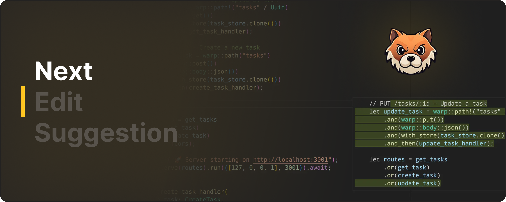
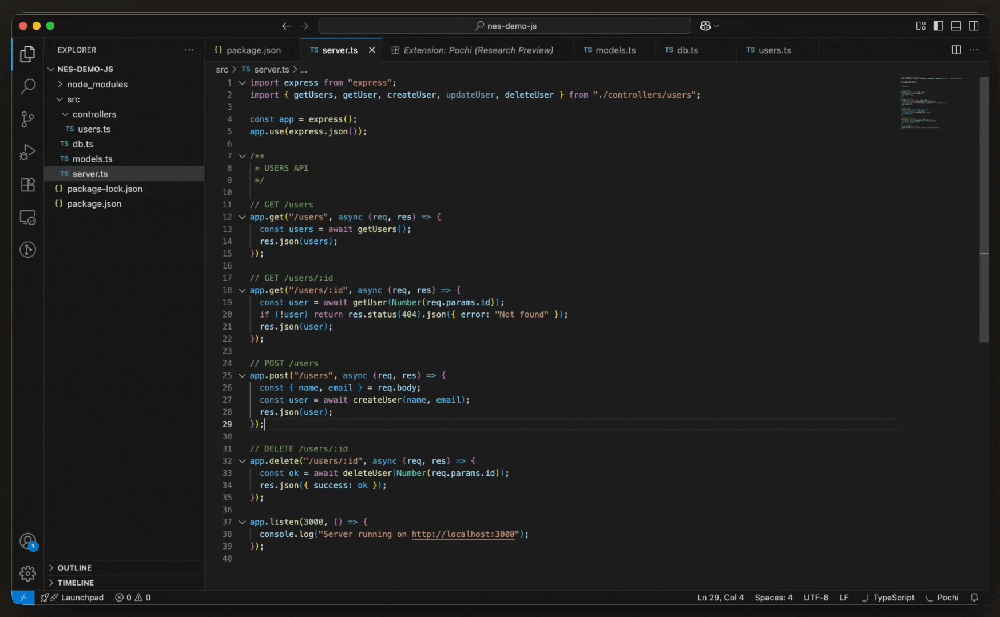
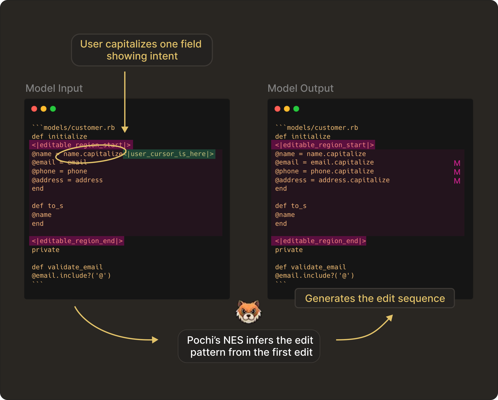
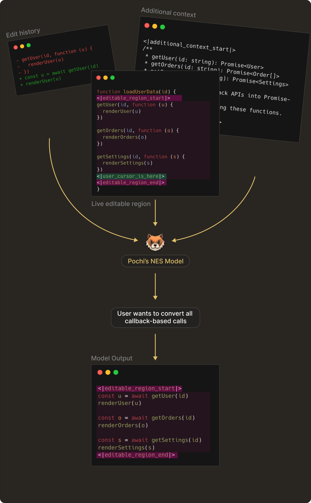

# NES Series (Part 1): The Edit Model Behind Tab Completion

<Callout title="Note">
   This is a four-part series on how we trained and built our NES model at Pochi, covering everything from the edit model behind tab completion to real-time context management, request lifecycles, and dynamic rendering for AI code edits.

   Read the full series:

   – [Part 1: The Edit Model Behind Tab Completion](https://docs.getpochi.com/developer-updates/how-we-created-nes-model/)

   – [Part 2: Real-Time Context Management in Your Code Editor](https://docs.getpochi.com/developer-updates/context-management-in-your-editor/)

   – [Part 3: The Request Management Lifecycle Under Continuous Typing](https://docs.getpochi.com/developer-updates/request-management-in-nes/)

   – [Part 4: Dynamic Rendering Strategies for AI Code Edits](https://docs.getpochi.com/developer-updates/dynamic-rendering-stratergies-for-ai-edits/)

</Callout>

In this post, we’re introducing our internal edit model, the foundation behind Next Edit Suggestion (NES). It’s an upgrade to Tab completion, designed to predict the next change your code needs, wherever it lives.

Technically this is much harder to achieve, since NES considers the entire file plus your recent edit history and predicts how your code is likely to evolve: where the next change should happen, and what that change should be. 

Other editors have explored versions of next-edit prediction, but models have evolved a lot, and so has our understanding of how people actually write code.

As an open-source team, we want to share this work transparently. This is the first post in our "Next Edit Suggestion" series, where we walk you through how we trained the underlying model to how it powers real-time editing inside the extension.

## How We Train the Edit Model

When we decided to build NES, one of the first pressing questions on our mind was: What kind of data actually teaches a model to make good edits?

It turned out that real developer intent is surprisingly hard to capture. As anyone who’s peeked at real commits knows, developer edits are messy. Pull requests bundle unrelated changes, commit histories jump around, and the sequences of edits often skip the small, incremental steps engineers actually take when exploring or fixing code.

### The Training Process

To train an edit model, we format each example using special edit tokens. These tokens tell the model: 

- What part of the file is editable
- The user’s cursor position
- What the user has edited so far
- What the next edit should be inside that region only

Unlike chat-style models that generate free-form text, NES is trained to predict the next code edit inside the editable region.

Below is an example of how NES predicts the next edit:

In the image above, the developer makes the first edit allowing the model to capture the intent of the user. The `editable_region` markers define everything between them as the editable zone. The `user_cursor_is_here` token shows the model where the user is currently editing. 

NES infers the transformation pattern (capitalization in this case) and applies it consistently as the next edit sequence. 

To support this training format, we used **[CommitPackFT](https://huggingface.co/datasets/bigcode/commitpackft)** and **[Zeta](https://huggingface.co/datasets/zed-industries/zeta)** as data sources. We normalized this unified dataset into the same Zeta-derived edit-markup format as described above and applied filtering to remove non-sequential edits using a small in-context model (GPT-4.1 mini).

## Choosing the Base Model for NES 

With the training format and dataset finalized, the next major decision was choosing what base model to fine-tune. Initially, we considered both open-source and managed models, but ultimately chose Gemini 2.5 Flash Lite for two main reasons:

- **Easy serving:** Running an OSS model would require us to manage its inference and scalability in production. For a feature as latency-sensitive as Next Edit, these operational pieces matter as much as the model weights themselves. Using a managed model helped us avoid all these operational overheads. 

- **Simple supervised-fine-tuning:** We fine-tuned NES using **[Google’s Gemini Supervised Fine-Tuning (SFT) API](https://docs.cloud.google.com/vertex-ai/generative-ai/docs/models/gemini-use-supervised-tuning)**, with no training loop to maintain, no GPU provisioning, and at the same price as the regular Gemini inference API. Under the hood, Flash Lite uses LoRA (Low-Rank Adaptation), which means we update only a small set of parameters rather than the full model. This keeps NES lightweight and preserves the base model’s broader coding ability. 

Overall, in practice, using Flash Lite gave us model quality comparable to strong open-source baselines, with the obvious advantage of far lower operational costs. We can  , keeping the model stable across versions. 

### Why this matters for you

Using Flash Lite directly improves the user experience in the editor. As a user, you can expect faster responses and likely lower compute cost (which can translate into cheaper product). 

And since fine-tuning is lightweight, we can roll out frequent improvements, providing a more robust service with less risk of downtime, scaling issues, or version drift; meaning greater reliability for everyone.

## How we evaluated the model

We evaluated our edit model using a single metric: LLM-as-a-Judge, powered by **Gemini 2.5 Pro**. This judge model evaluates whether a predicted edit is semantically correct, logically consistent with recent edits, and appropriate for the given context. This is unlike token-level comparisons and makes it far closer to how a human engineer would judge an edit.

In practice, this gave us an evaluation process that is scalable, automated, and far more sensitive to intent than simple string matching. It allowed us to run large evaluation suites continuously as we retrain and improve the model.

## Enhancing Context at Inference

Training and evaluation only define what the model knows in theory. To make Next Edit Suggestions feel alive inside the editor, the model needs to understand what you are doing right now. So at inference time, we give the model more than just the current file snapshot. We also send:

1. Your recent edit history
Wrapped in `<|edit_history|>`, this gives the model a short story of your current flow: what changed, in what order, and what direction the code seems to be moving.

2. Additional semantic context
Added via `<|additional_context|>`, this might include type signatures, documentation, or relevant parts of the broader codebase. It’s the kind of stuff you would mentally reference before making the next edit.

Here’s a small example image showing the full inference-time context with the edit history, additional context, and the live editable region which the NES model receives:

NES combines these inputs to infer the user’s intent from earlier edits and predict the next edit inside the editable region only.

In this post, we’ve focused on how the model is trained and evaluated. In the **[next post](https://docs.getpochi.com/developer-updates/context-management-in-your-editor/)**, we’ll go deeper into how these dynamic contexts are constructed, ranked, and streamed into the model to drive real-time, context-aware edit predictions.