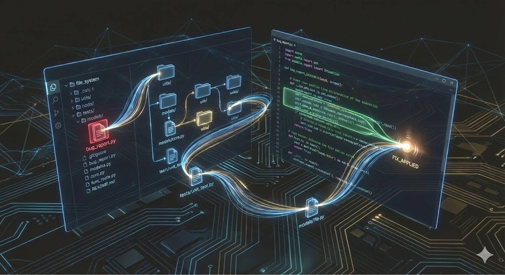
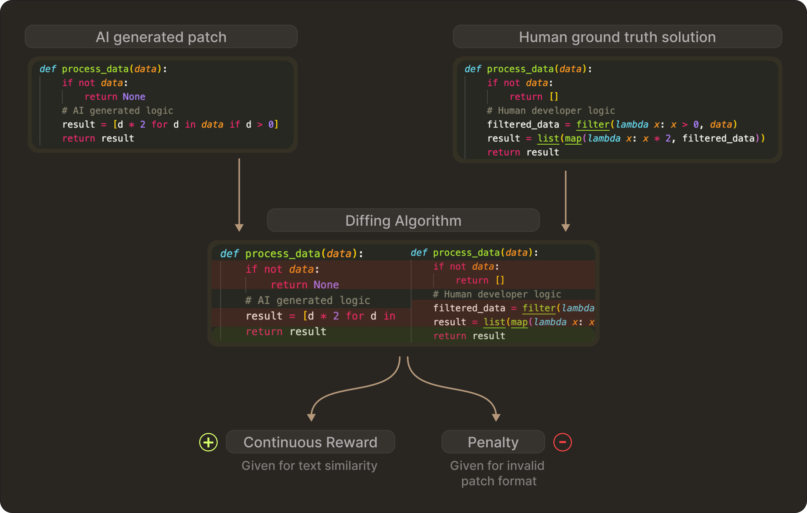
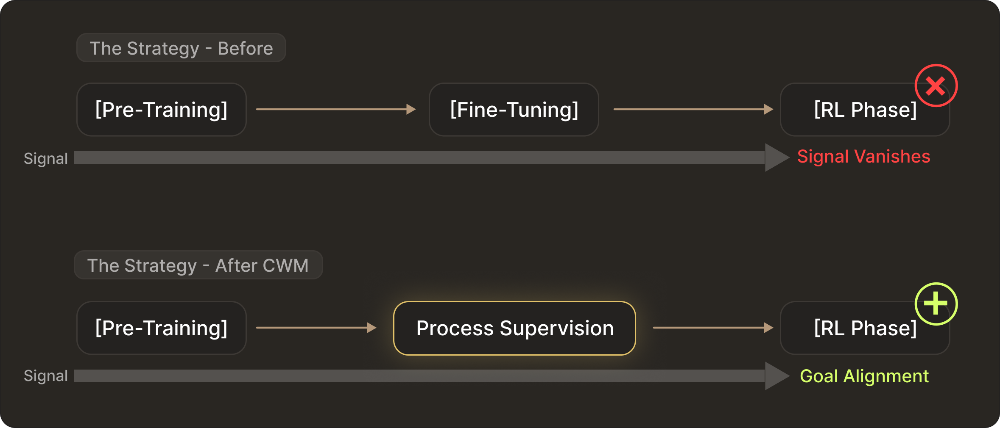

# Closing the Loop: How Reinforcement Learning is Changing AI Coding

### TL;DR

Using SFT teaches models how to write code, but it is RL that is necessary to teach them what works. On the other hand, introducing RL in software engineering brings its own specific challenges:  data availability, signal sparsity, and state tracking. In this post, we’ll break down how recent works address these challenges. 

So far, the focus of RL driven improvements had been based on competitive coding. For example, in LeetCode-style tasks, the model works in a closed loop. It generally receives a clear problem statement and in turn, it generates a single, self-contained solution. 

This means there are no dependencies involved, no files systems to navigate, and no legacy code that can break. It is exactly like solving a logic puzzle in isolation rather than understanding the engineering implications on the overall codebase. 

However, the field of Software Engineering (SWE) in real-world is fundamentally different. It is a stateful, multi-turn interactive problem. A day-to-day involves much more than just writing the correct functions. You often need to navigate a file system, check up on dependency graphs, run the proper tests, and interpret logs in case of errors. This implies, an agent effectively needs to maintain coherence across a long horizon of interactions.

Which is why RL is an ideal candidate for SWE since agent actions produce verifiable results. At the same time, it also introduces challenges that are not present in single-turn tasks. For example,

- **Data Availability:** We cannot easily simulate millions of environmental interactions like we can with math problems.
- **Signal Sparsity:** Often, success signals appear at the very end of a long sequence of edits.
- **State Tracking:** Along with the static text of the code, the model must understand the dynamic state of the runtime environment

Recent works from Meta and Moonshot AI surfaced how the industry is pivoting from general reasoning RL to domain-specific SWE-RL to address these challenges.

## The Data Problem

In order to learn trial and error, the standard RL requires an agent to interact with an environment. For coding, this means running a test suite or compiling code. As compared to verifying math proof, this simulation will be prohibitively slow and expensive in a real-world setting. Here, the engineering challenges arises to figure out how to bootstrap the entire learning process without being dependent on costly online simulation. 

Meta proved that you can bypass the online bottleneck by using the massive offline history of Github. In its recent work on **SWE-RL** they talked through this approach instead of setting up a live sandbox for every training step. 

But offline data lacks a reward signal. For every historical Pull Request, you cannot easily go back in time and execute tests. SWE-RL solves this by creating a process proxy reward. They calculate the fine grained text similarity  between the generated patch and the actual developer ground truth solution instead of just checking if the code runs. 

Depending on how closely the generated format matches the human solution, the model receives a continuous reward. On the other hand, if the model generates an invalid patch format, it receives a penalty. This demonstrates that even before touching a compiler, you can teach a model complex engineering behaviours like navigating file structures and adhering to project conventions using static history. 

## The Signal Sparsity Problem

Next, we have the credit assignment problem while facing online training within executable environments. That means it is difficult to indentify which step really contributed to the final success of the model and which step should get the reward. This reflects on software engineering as any agent can fail after 50 steps of editing and testing. Standard RL struggles to identify which specific step caused the failure. 

The **Kimi-Dev** paper addresses this through task decomposition. It treats software engineering as a composition of atomic skills: the BugFixer (editing logic) and the TestWriter (verifying logic) instead of training an end-to-end agent to solve the issue immediately. 

Their solution starts with Agentless RL. They train the model specifically on these short horizon atomic tasks using outcome based rewards. They look for signals on whether the patch passed the test or did the test reproduce the bug. And since the tasks are scoped down, the feedback signal becomes dense and clear. 

Kimi-Dev shows that with minimal additional data, a model having these pre-trained capabilities can be adapted to a complex multi-turn agent framework. This suggests that the most efficient path to autonomous agents is rigorous skill acquisition’s followed by workflow adaptation rather than brute force end to end training.

## The State Problem: Building a Code World Model

Coming to the final challenge, which is also arguably the most profound. Engineers generally do not just read code as text but also think about the execution loops in their mind. This involves tracking how variables change in memory and how functions interact between files. Meanwhile, since current code LLMs lack this internal compiler engine, they just merely predict the next token based on statistical likelihood. 

Meta **Code World Model** addresses this by fundamentally changing the training curriculum. They realized that waiting until the RL phase to teach execution dynamics is too late. The rewards are too sparse and the gradient vanishes on hard problems.

Instead, in the mid-training stage, they inject process supervision directly. To teach the physics of code, they constructed two massive datasets: 

- **Python Execution Traces:** With over 120 million examples, the model is trained to predict not just the next line of code, but also the exact state of runtime variables (the values in memory) after every single line.

- **ForagerAgent Trajectories:** Agents with 3 million trajectories that interact with a Docker environment to solve tasks. 

This forces the model to internalise a Code World Model. By the time the model enters the final RL stage it is no longer starting from scratch. It already understands if I write X then variable Y changes to Z.

Consequently, the RL stage becomes a process of Goal Alignment. It uses sparse result rewards like passing tests simply to guide a model.  It already understands execution physics to select the specific path that satisfies the verification requirement.

## Takeaway: Moving Toward Verifiable Agents

This progression from **SWE-RL (offline proxy rewards)** to **Kimi-Dev (decomposed skill learning)** and **CWM (execution-trace world models)** outlines a clear engineering roadmap for the next generation of code models and agentic RL frameworks.

We are seeing a shift from generic reasoning to specialized engineering. Future models will be more than just smart. They will be grounded in repository history, capable of self-verification through test writing, and possess an explicit internal model of runtime state.

At TabbyML we view these developments as the foundation for **Verifiable Engineering**. The future value of AI in software development lies in building agents that understand and respect the state of your system.

Related Papers:

1. [SWE-RL: Advancing LLM Reasoning via Reinforcement Learning on Open Software Evolution](https://arxiv.org/abs/2502.18449)
2. [Kimi-Dev: Agentless Training as Skill Prior for SWE-Agents](https://arxiv.org/abs/2509.23045)
3. [CWM: An Open-Weights LLM for Research on Code Generation with World Models](https://arxiv.org/abs/2510.02387)
