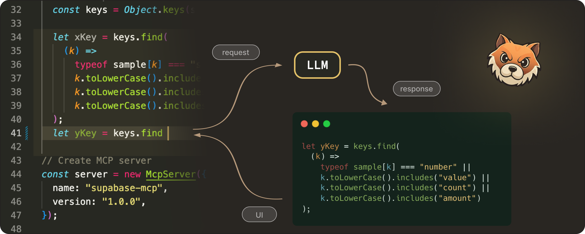
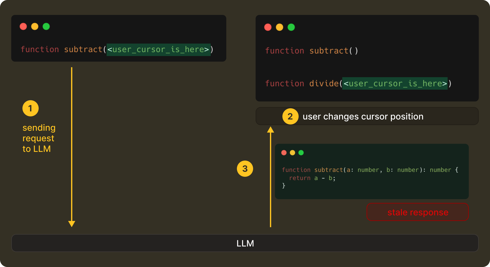
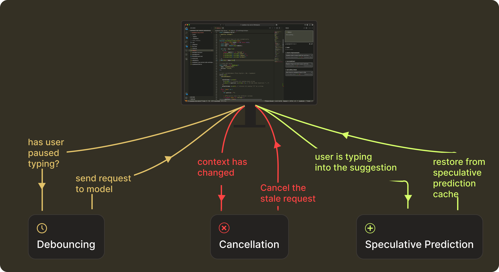
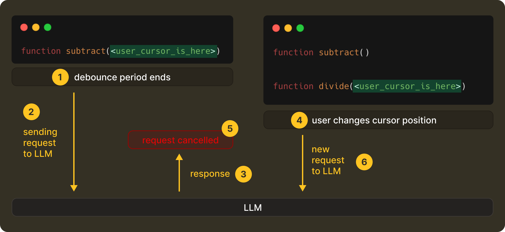
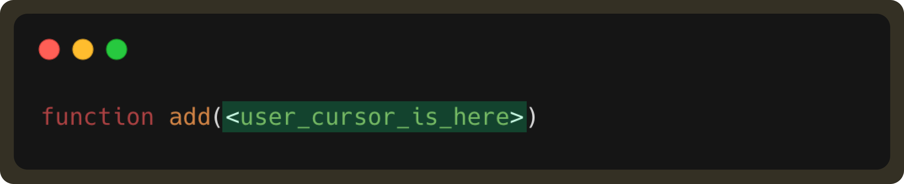
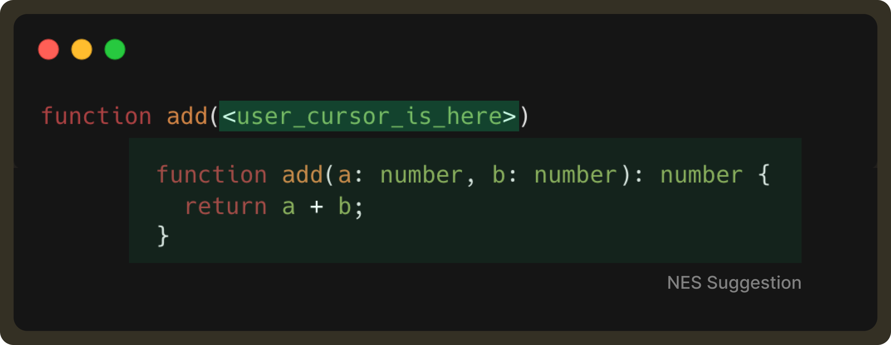
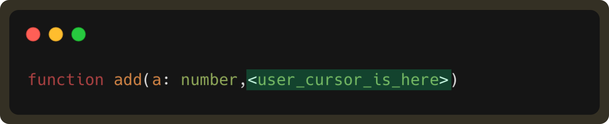

# NES Series (Part 3): The Request Management Lifecycle Under Continuous Typing

In [Part 1](https://docs.getpochi.com/developer-updates/how-we-created-nes-model/), we talked about how we trained our NES model to predict the next meaningful edit you’re likely to make in your code.

In [Part 2](https://docs.getpochi.com/developer-updates/context-management-in-your-editor/), we then covered what the model takes as context to make this edit. This included deep dives into editable regions, user’s edit history, and using the overall project context. 

Together, these two pieces (model + context) form the core intelligence foundation of the NES system. But incorporating them into an end-to-end real-time engineering system requires more thinking about real developer coding behaviour.

A code editor is a continuously changing space. Developers type, pause, delete, move the cursor, undo, redo, and essentially keep editing, often faster than any model can respond. Even a fast model call involves network latency, debouncing delays, server-side scheduling, and decoding / streaming time.

If not careful, a request that was correct when it was sent can return a response that arrives a few hundred milliseconds too late. Which means now you end up with edit suggestions for code that no longer exists. This is something that’s termed “haunted” for being technically right but not at the right place.

This means, in practice, a correct edit shown at the wrong moment is perceived as wrong by the user. So even with proper context and a good model, it is equally important to have the correct timing. Then only can the product actually feel useful without being distracting.

But getting timing right is challenging, due to the ever evolving nature of the user’s editing state. To make NES feel real-time and helpful, we had to reason about what happens before a request is sent, while it’s in-flight, and after the model responds. This is what we call request management.

Let’s look at it in more detail.

## The NES Request Management Lifecycle

Request Management of a NES prediction happens in three stages:
- **Before the request:** waiting until the user actually pauses 
- **While the request is in-flight:** discard anything that becomes outdated 
- **After the model responds:** keep the suggestion alive if the user continues along the same trajectory 

These map to what we technically implement as **debouncing**, **cancellation**, and **speculative-prediction caching**. 

This structure helps bring the intelligent results (what we get with context + model) to users reliably, even as they type continuously. NES continues to run this loop as you type. 
Let’s take a closer look at how we handle timing at each stage.

### Debouncing: Requesting the Model at the Right Moment
The first question we had to tackle was, “When is the right time to send a request?” When a developer is typing continuously, a request on every keystroke has little value and is wasteful. At the same time, waiting too long would make the system feel unresponsive and slow. We had to find that sweet spot that lies in detecting the exact moment the user actually paused typing. 

Most systems solve this with a fixed interval, (say, 100ms), but real-world typing isn’t this predictable. Instead, we decided to adapt the debounce interval based on how the user is behaving right at that moment. 

To achieve this, we made NES pay attention to a handful of lightweight signals. 

For example, typing a `.` often means the developer is about to pause to access a method of an object,  so we get the signal to shorten the debounce delay. Whereas, if the user is continuously typing through a variable name, we stretch the delay a bit to avoid jumping in too early. And if the model’s recent response times have been slower due to network conditions, we account for that too, so suggestions land at the exact moment the user expects them.

This way, the result is a debounce time window that changes with the user’s rhythm. It is short when the user has paused, and long when they’re in flow, all while making sure it never exceeds 1 second. 

### Cancellation: Correctness Over Completion
Once a request is finally sent, the editor doesn’t stop moving. A user can continue typing, move the cursor, or undo and redo steps before the model has even started responding. When that happens, the original request becomes stale instantly.

In such a case, we cancel the original request from the client-side, and in turn, the server propagates the cancellation, with any late responses being discarded without ever getting them rendered to the UI. 

This is a deliberate design decision that optimises and enforces correctness in a live, ever-evolving editing system. We would prefer that NES show nothing rather than something misleading. 

If you’re interested in how this works end-to-end, including streaming behaviour, we’ve written more about it [here](https://www.tabbyml.com/blog/stream-laziness-in-tabby).

### Speculative Prediction: Staying One Step Ahead of the User

Traditional caching is straightforward. If nothing has changed, just reuse the previous response. In the case of NES, this helps to avoid duplicate requests. And to think about it, throwing work away all the time would be expensive if we didn’t balance it out elsewhere.

But we go a step further. When the model returns an edit suggestion, we don’t just cache it for the exact context that produced it, but also speculate on the next few contexts the user is likely to enter. 

Now, if the user continues typing along the same trajectory, NES doesn't need to call the model again and can continue serving the speculated suggestion. We call this speculative prediction. 

A speculated prediction remains valid as long as the user is essentially still typing into the suggestion and the surrounding context hasn't changed. 

It’ll be better to illustrate this with the help of an example. Suppose a user types: 

NES sends a request and gets the following suggestion:

If the user then continues to type, resulting in:

This user edit is part of the received suggestion. Therefore, the suggestion should still be displayed (unless the user has explicitly rejected it by pressing `esc`). 

By retrieving this result from the forward prediction cache, we can display the suggestion faster and reduce LLM request usage.

Of course, if the user is not satisfied with the cached suggestion, they still have the option to send a new request to get multiple choices. In essence, forward caching helps accelerate the common path, improving the overall experience.
## Conclusion
By the time a suggestion appears in NES, a lot has already happened. Debouncing decides when is the right time to make a request, cancellation makes sure outdated intent never surfaces in the UI, and speculative prediction lets us reuse good existing predictions when the user naturally moves through them. 

While you’d find these techniques are familiar in distributed systems, applying them inside a code editor was a challenge of its own. The primary driving factor wasn’t about throughput or load but about every evolving human intent under motion. 

### What’s next?
So far, we’ve focused on how NES decides what to suggest and when those suggestions should appear. With request management in place, we now have a system that ensures LLM-powered edits reach the user only when they’re truly helpful.

But now that brings us to the next stage of the process: How should these edits be presented?

NES suggestions aren’t always a single line near the cursor. Sometimes the relevant edit is several lines or even several files away. Presenting enough information for a quick action without breaking the developer’s flow is a surprisingly deep design and engineering challenge.

This is especially tricky inside a code editor like VS Code, where rendering options are limited. In such cases, how do we preview multi-line edits precisely? How do we make them feel lightweight, immediate, and skimmable, without being modal or disruptive?

In [Part 4](https://docs.getpochi.com/developer-updates/dynamic-rendering-stratergies-for-ai-edits/), we’ll dive into how we approached these constraints and built a rendering system that enables richer previews and lower-latency interactions for code edits.