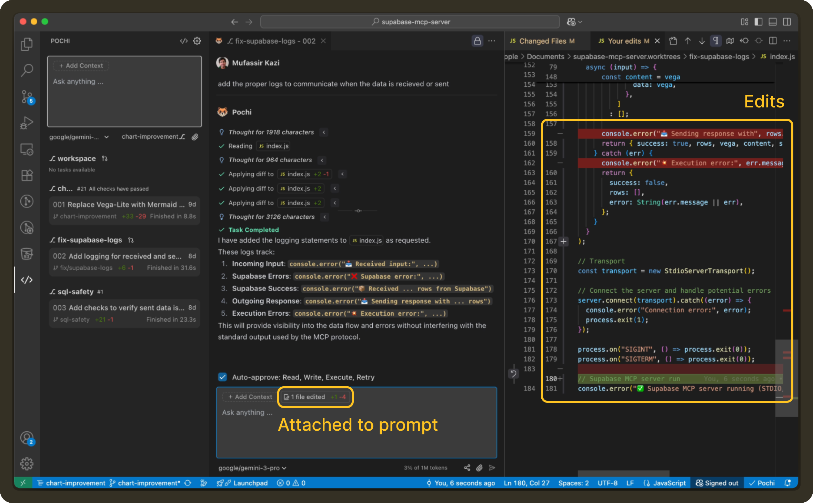
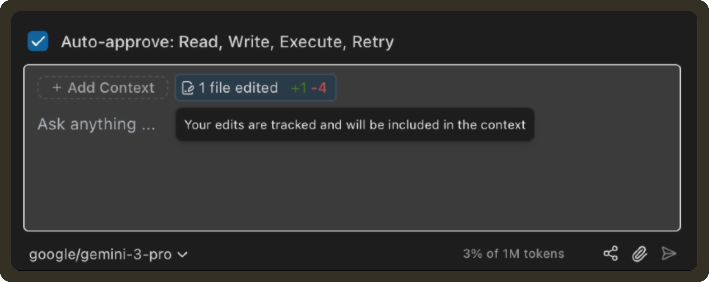
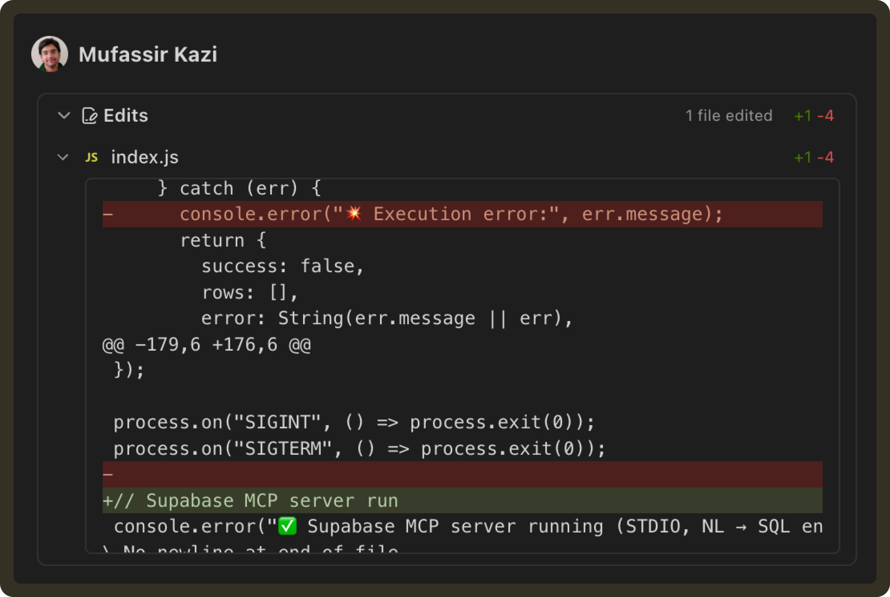

# Edits

Edits account for changes you make locally while iterating on the code. If you fix something yourself, tweak a variable, or partially rewrite a block before asking for help, Pochi captures those recent edits and includes them as part of the review context.

Instead of only seeing the final file state, the agent receives the exact diffs you introduced, which helps it reason about what changed, where it changed, and what you were likely trying to adjust.

This gives the agent a clearer signal of your current intent and what should be addressed next.

<video
        controls
        style={{
        width: "100%",
        borderRadius: "8px",
        boxShadow: "0 4px 12px rgba(0, 0, 0, 0.15)",
        }}
    >
        <source src="https://assets.docs.getpochi.com/useredits.mp4" type="video/mp4" />
        Your browser does not support the video tag.
    </video>

## How to Use Edits

### 1. Make your changes 

You can open the diff from the last response and make direct changes to the written code. 



All local changes you make gets reflected in the chatbox UI.




### 2. Send Edits as a Batch

Once you’re done making changes, submit your next prompt as usual.

For example:

```bash
Please review the edits
```

or with extra guidance:

```bash
Use these edits to understand the new functions we need to add
```

Pochi will include your recent edits together with your message and use them as structured context for the next step.



This lets the agent build directly on top of what you already adjusted, without you needing to re-explain those changes in chat.