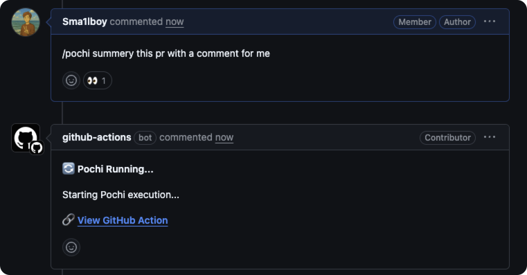
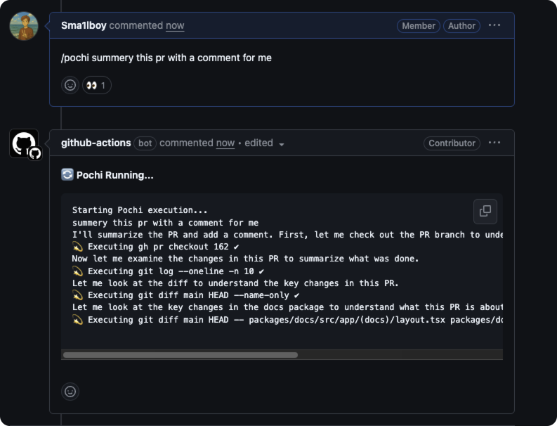

# GitHub

Use Pochi’s AI assistant directly in your GitHub repository by commenting on pull requests to perform code reviews, explain changes, and suggest improvements.

<Callout type="info" title="How it works">
  This integration runs inside a GitHub Actions runner. It temporarily installs
  the pochi CLI and executes tasks in the context of your repository. Progress
  is continuously updated under the triggering comment, and a final result
  (✅/❌) is posted when finished.
</Callout>

## Setup

Create a workflow file `.github/workflows/pochi.yml` in your repository:

```yaml
name: pochi

on:
  issue_comment:
    types: [created]

jobs:
  pochi:
    if: startsWith(github.event.comment.body, '/pochi')
    runs-on: ubuntu-latest
    permissions:
      contents: write
      issues: write
      pull-requests: write
    steps:
      - name: Checkout repository
        uses: actions/checkout@v4
        with:
          fetch-depth: 1

      - name: Run pochi
        uses: tabbyml/pochi/packages/github-action@main
        env:
          # Required: Pochi session token (get it from app.getpochi.com and add as a repository secret)
          POCHI_TOKEN: ${{ secrets.POCHI_TOKEN }}
          # Optional: custom model (defaults to CLI's default model if not set)
          # See the Models page for model options and configuration
          # POCHI_MODEL: google/gemini-2.5-pro
```

Notes:

- Triggered by `issue_comment` (created) and runs only if the comment body starts with `/pochi`
- Requires write permissions to read changes, post comments, and add reactions to PRs
- Provide `POCHI_TOKEN` via env; optionally set `POCHI_MODEL` to customize the model
- By default, the action uses GitHub's built-in `GITHUB_TOKEN` (github-actions bot). You can customize this by setting a custom `GITHUB_TOKEN` environment variable with your own Personal Access Token (PAT)

## Usage

Comment on a PR with `/pochi` followed by your request, e.g. `/pochi review this code`, `/pochi explain the changes in this PR`, `/pochi suggest improvements`.



Once triggered:

- Pochi reacts to your comment with 👀 to indicate it’s running
- A progress comment is updated every 15 seconds
- When finished, it posts the final result and reacts with 🚀 (success) or −1 (failure)




Permission requirement: Only users with write/admin permission can trigger execution. Otherwise, an error will be posted as a comment.

## Advanced configuration

### Use a custom GitHub token (optional)

By default, the action uses the GitHub-provided `GITHUB_TOKEN`. For cross-repo or higher-privileged operations, you can override it with a PAT:

```yaml
- name: Run pochi
  uses: tabbyml/pochi/packages/github-action@main
  env:
    GITHUB_TOKEN: ${{ secrets.CUSTOM_GITHUB_TOKEN }} # Your PAT
    POCHI_TOKEN: ${{ secrets.POCHI_TOKEN }}
```

### Permissions

Ensure the workflow includes these permissions:

```yaml
permissions:
  contents: write # Read repo contents and commit changes if needed
  issues: write # Comment on issues/PRs
  pull-requests: write # Access PR information and status
```
