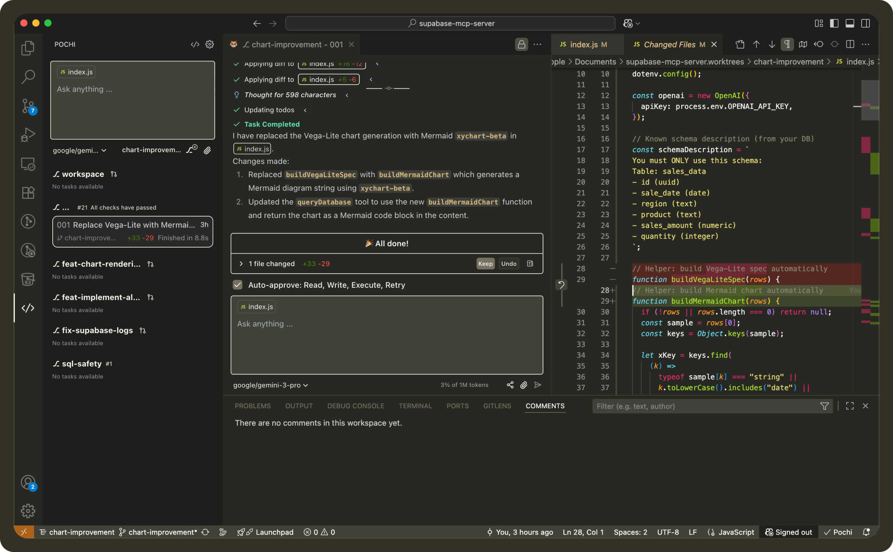
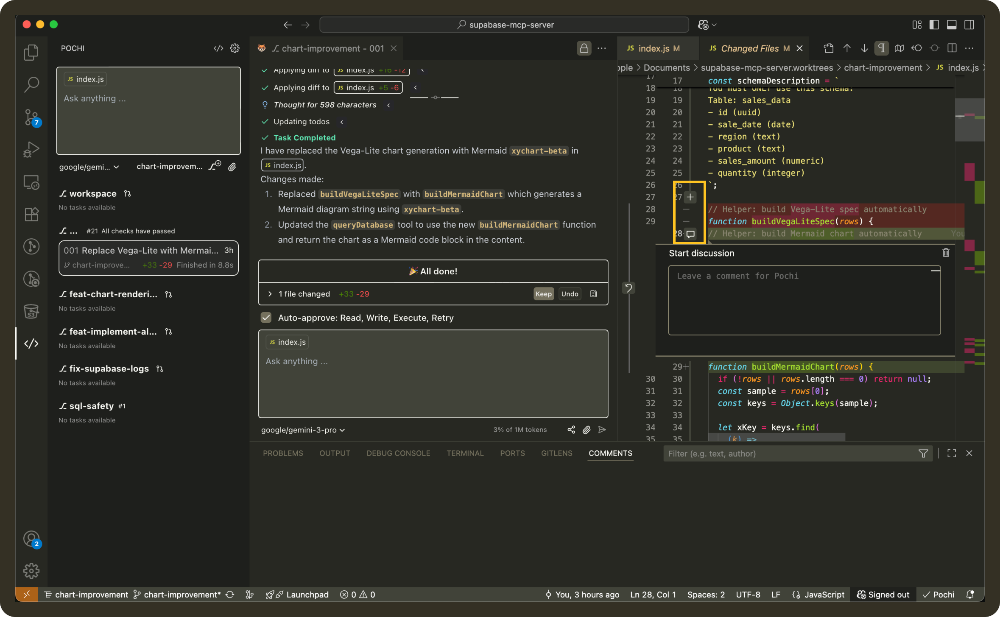
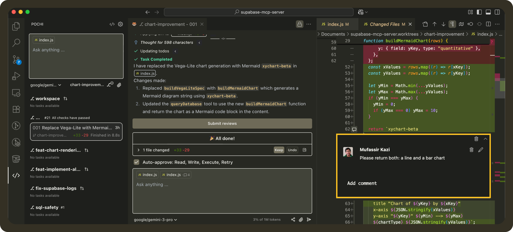
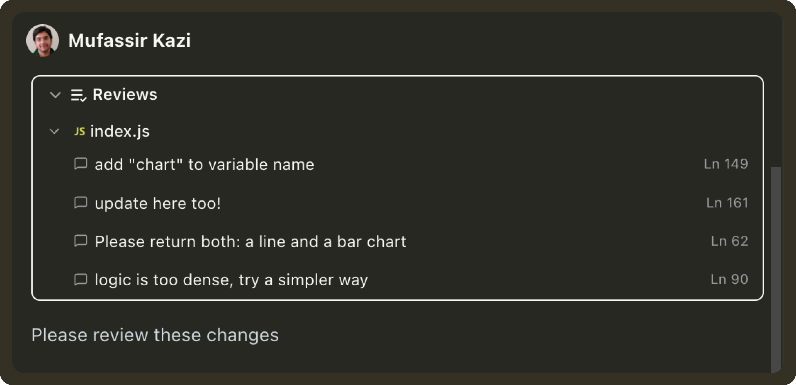

# Inline Comments

Inline Comments let you leave feedback directly on the code generated by Pochi inside VS Code. Instead of re-explaining issues in chat, you can comment on specific lines in the diff, batch those comments, and send them back to Pochi for the right contextual fixes.

This feature is not your regular PR review system. It’s actual conversations with the LLM, attached to the code they refer to. 

<video
        controls
        style={{
        width: "100%",
        borderRadius: "8px",
        boxShadow: "0 4px 12px rgba(0, 0, 0, 0.15)",
        }}
    >
        <source src="https://assets.docs.getpochi.com/inline-comments.mp4" type="video/mp4" />
        Your browser does not support the video tag.
    </video>


## How to Use Inline Comments

### 1. Run a Prompt
Generate code or request changes like normal.

```bash
Please use Mermaid Chart instead of Vega Lite
```

### 2. Open the Diff
Once Pochi applies changes, open the diff view in VS Code:


In the diff, hover over a code line and click `+` to add a comment
  


### 3. Leave Feedback
Type your comment directly on the line where the issue exists.




### 4. Add Multiple Comments
Leave comments across the file as needed. Each comment is automatically linked to its exact line + file path.


### 5. Send Comments as a Batch

Once you’re done adding comments, submit them just like you would a review.

Click `Submit Reviews` to Pochi to send all line-level comments as a batch.


This works the same way as submitting a review with empty messages, where the comments themselves are the request.



If you want to add extra instructions or context, you can type an additional message in the chat box before submitting.

For example:

```bash
Please review my inline comments
```

or with extra guidance:

```bash
Apply these comments and also rename the handler for consistency
```

Pochi will process every line comment with context and update the code accordingly.