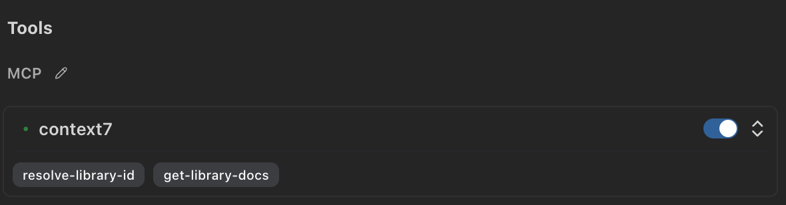

# MCP (Model Context Protocol)

The **Model Context Protocol (MCP)** revolutionizes how Pochi interacts with external services, databases, and APIs. Think of MCP as a universal adapter that connects Pochi to virtually any data source or tool, dramatically expanding what your AI assistant can accomplish.

## Configure

Use the VSCode command `Pochi: Open MCP Server Settings` to open the settings.

```json
{
  "pochi.mcpServers": {
    "context7": {
      "command": "npx",
      "args": ["@upstash/context7-mcp"]
    }
  }
}
```

After saving the configuration, you will see the MCP server appear in the **Tools** section of Pochi's settings page.



You can use the toggle switch to enable or disable the MCP server entirely. You can also click on the tool badge to toggle individual tools within the MCP server.

## Examples

### Local MCP Servers (Stdio Transport)

```json
{
  "filesystem": {
    "command": "npx",
    "args": [
      "-y",
      "@modelcontextprotocol/server-filesystem",
      "/path/to/allowed/files"
    ],
    "env": {
      "HOME": "/Users/yourname"
    }
  }
}
```

### Remote MCP Servers (HTTP Transport)

#### Custom API Server

```json
{
  "my-api": {
    "url": "https://api.mycompany.com/mcp",
    "headers": {
      "Authorization": "Bearer your-api-token",
      "X-API-Version": "v1"
    }
  }
}
```

#### SSE (Server-Sent Events) Server

```json
{
  "realtime-data": {
    "url": "https://data.example.com/mcp/sse",
    "headers": {
      "Authorization": "Bearer your-token"
    }
  }
}
```
