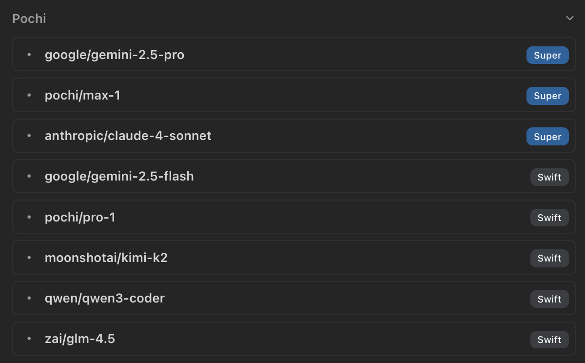
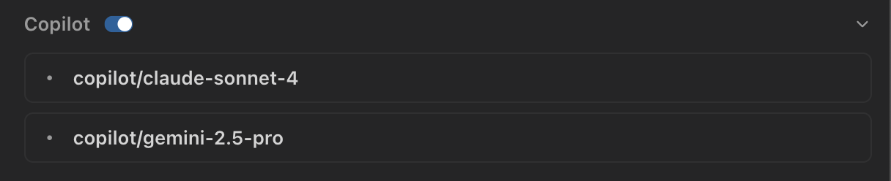

# Models

Pochi leverages the AI SDK to support various LLM providers and can run local models.

## Pochi Models

After signing in, you gain access to the Pochi models shown below. Pochi uses a usage-based pricing strategy with no additional charges. For detailed pricing information, visit https://app.getpochi.com/pricing.



## GitHub Copilot Models

For Microsoft VS Code distributions, you can utilize your enabled Copilot models within Pochi.



## OpenAI Compatible Models

Pochi allows you to configure any LLM provider that offers an OpenAI-compatible API by setting up the appropriate API keys. To configure custom models, use the VS Code command `Pochi: Open Custom Model Settings` to open the settings configuration file.

```json
{
  "providers": {
    "groq": {
      "apiKey": "your_api_key",
      "baseUrl": "https://api.groq.com/openai/v1",
      "models": [
        {
          "id": "moonshotai/kimi-k2-instruct",
          "contextWindow": 131072,
          "maxTokens": 8000
        }
      ]
    }
  }
}
```

After saving the configuration, the model will be available in the toolbar's model selector.
