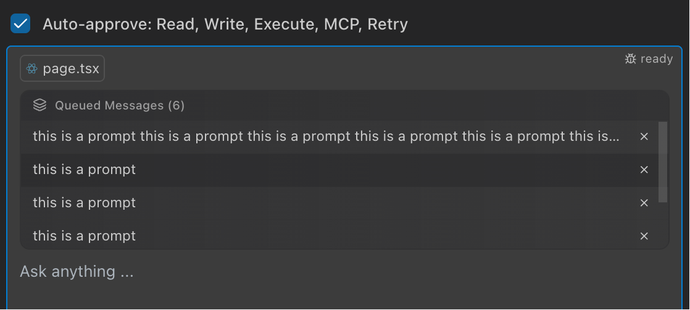

# Queued Messages

The Queued Messages feature allows you to add multiple messages to a queue, which are then combined into a single prompt for execution. This lets you build up a complex request in pieces, which is especially useful while Pochi is busy.

When Pochi is busy, you don't have to wait to give it your next instruction. Here’s what happens:

1.  **Queue with a Shortcut**: Type your prompt and press `Cmd+Enter` (`Ctrl+Enter` on Windows/Linux). Your message will be added directly to the queue.
2.  **See What's in Line**: The "Queued Messages" panel appears, showing you a list of all the tasks waiting to be executed.
3.  **Combined for Execution**: Once Pochi is ready, it will take all the messages from the queue, merge them into a single prompt, and then execute it.
4.  **Remove with a Click**: If you decide you don't need a task done anymore, just click the `X` next to it to remove it from the queue.
