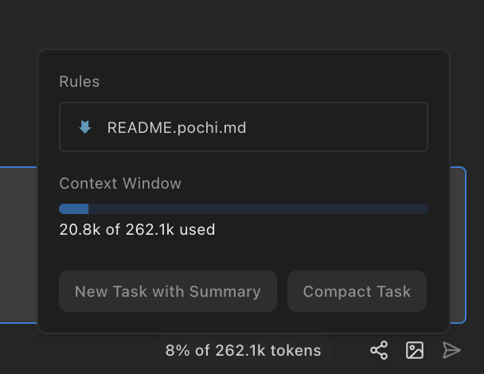

# Rules

You can provide custom instructions to Pochi by creating an `README.pochi.md` file. This is similar to CLAUDE.md or Cursor’s rules.


<Callout title="AGENTS.md support">
  Pochi also supports [AGENTS.md](https://agents.md) as an alternative to `README.pochi.md`. Both files serve the same purpose and are treated identically by Pochi.
</Callout>

### Example

Below example is the `README.pochi.md` file for Pochi itself.

``````markdown
Pochi is an project developed using following technologies:
1. always use kebab-case for filenames.
2. always use camelCase for variables, functions.
3. use PascalCase for classes, interfaces, types.

# Testing for non packages/vscode
We use vitest framework.
our test use vitest framework.
test command: `bun run test`
coverage test command: `bun run test -- --coverage`

## Testing for packages/vscode
We use mocha framework, when creating test, do not use mocks for filesystem, just use vscode.workspace.fs to create files and folders, and only use mocha primitives for testing. use sinon for mocks.

(assuming cwd is packages/vscode)
test command: `bun run test`
coverage test command: `bun run test:coverage`

When encountering issues like `TypeError: Descriptor for property readFile is non-configurable and non-writable`, please use `proxyquire` to mock the module.

# Misc
1. use `bun check` to format / linting the code, use `bun fix` to automatically apply the fix.
2. use `bun tsc` to check the types.
3. For packages/code it uses `ink` for react terminal ui.
4. Prefer `@/lib` over `../lib` for imports.
5. For global variable in typescript, prefer using PascalCase, e.g `GlobalVariableName`, instead of `GLOBAL_VARIABLE_NAME`.
6. For biome related warning / errors, prefer using `bun fix` in the root directory to fix the issues.
``````

## Locations

Pochi looks for rules in two locations:

### Workspace

Pochi first checks for a `README.pochi.md` (or `AGENTS.md`) file in your current workspace root directory. This is where you define project-specific rules that apply only to your current project.

### Global

Pochi also reads global rules defined in `~/.pochi/README.pochi.md`. These rules apply to all projects and are suitable for any personal rules that Pochi should follow.

You can view current active rules in toolbar's token usage popover

<p align="center">

</p>

