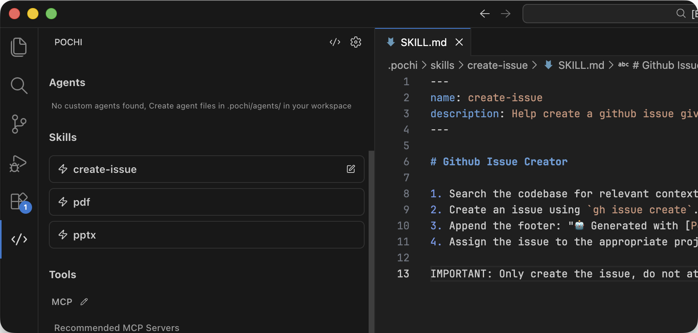
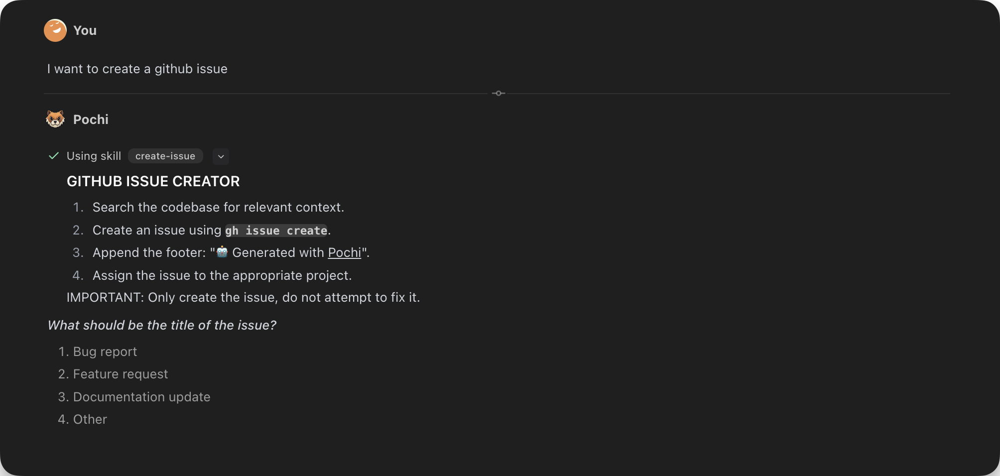
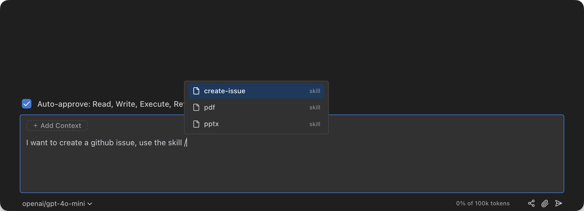

Skills are reusable instruction sets that extend Pochi's capabilities. They allow you to standardize workflows, provide domain-specific knowledge, or integrate with external tools.

## Install Skills

You can discover and install skills from the community [skills.sh](https://skills.sh/) registry using the CLI:

```bash
npx skills add <skill-source> --agent pochi

# Example: Install a specific skill from a collection
npx skills add vercel-labs/agent-skills --skill pr-review --agent pochi
```

This command automatically detects Pochi and installs the skill to `.pochi/skills` in your project.

## Create Skills

To create a custom skill, place a `SKILL.md` file in a subdirectory of `.pochi/skills/`.

**File path:** `.pochi/skills/<skill-name>/SKILL.md`

### Example

Here is an example `SKILL.md` for creating GitHub issues:

```markdown
---
name: create-issue
description: Help create a github issue given the request
---

# Github Issue Creator

1. Search the codebase for relevant context.
2. Create an issue using `gh issue create`.
3. Append the footer: "🤖 Generated with [Pochi](https://getpochi.com)".
4. Assign the issue to the appropriate project.

IMPORTANT: Only create the issue, do not attempt to fix it.
```

### Frontmatter

Each skill must start with YAML frontmatter containing at least a `name` and `description`.

| Field         | Description                                     |
| ------------- | ----------------------------------------------- |
| `name`        | Unique identifier (lowercase, hyphens allowed). |
| `description` | Brief explanation of what the skill does.       |

## Discovery

Pochi automatically discovers skills in:

- **Project**: `.pochi/skills/` (shared with your team)
- **Global**: `~/.pochi/skills/` (available across all projects)

## Using Skills

### Viewing Available Skills

You can view all available skills in your settings panel. This gives you an overview of all installed skills. You can also click the edit button on the right side of each skill to open and modify the corresponding skill file.



### Activating Skills

There are two ways to activate skills in Pochi:

#### Automatic Discovery

Pochi can automatically discover and invoke relevant skills based on your prompt. When you describe what you want to do, Pochi will analyze your request and suggest appropriate skills to use.



#### Slash Commands

You can explicitly specify which skill to use by typing a slash command followed by the skill name. This gives you direct control over which skill gets activated.


