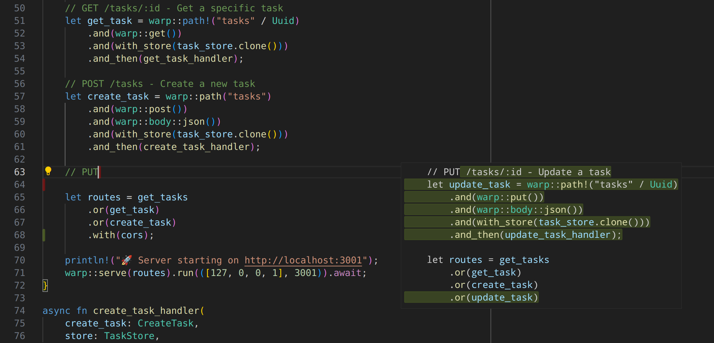
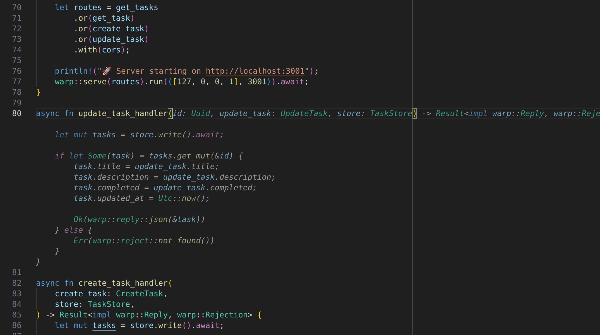
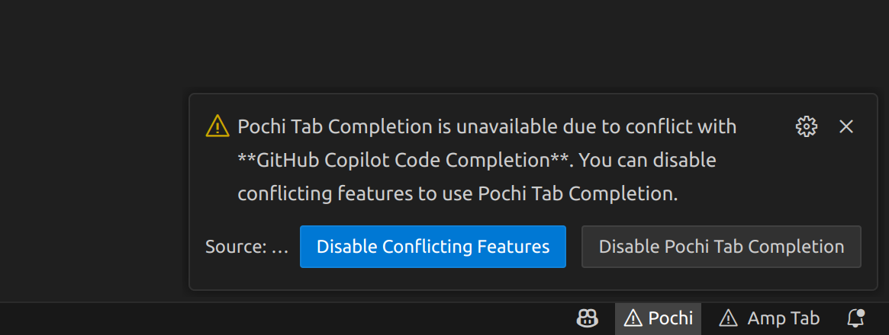

# Tab Completion

**Tab Completion** is Pochi's in-editor inline code completion feature that provides AI-powered suggestions as you type, helping you write code faster and more efficiently.

Pochi uses a state-of-the-art model that adapts to your coding patterns in real time,
drawing on recent edits, diagnostics, and surrounding context to generate helpful,
relevant completions right in your editor.

The suggestion can be rendered as a diff preview, showing exactly what changes will be made to your code.

Alternatively, suggestions can appear as ghost text inline with your code.

### Multi-Language Support
Works across popular programming languages including:
- JavaScript/TypeScript
- Python
- Java
- C/C++
- Go
- Rust
- And many more

## Using Tab Completion

Just start typing. Pochi will surface suggestions automatically. The more you use it, the more it understands your codebase, thus suggesting better edits.

### Keyboard Shortcuts
| Key | Action |
|-----|--------|
| `Tab` | Accept the current suggestion |
| `Escape` | Dismiss the suggestion |
| `Alt + ]` | Next suggestion (if multiple available) |
| `Alt + [` | Previous suggestion (if multiple available) |

## Status Bar Item

The status bar item shows the status of Pochi Tab Completion. It indicates whether the feature is enabled, disabled, or if any errors have occurred.

### Disable/Enable

You can click the status bar item to toggle Pochi Tab Completion on and off.

### Feature Conflicts

Pochi's Tab Completion feature may conflict with other extensions that provide code completions, such as GitHub Copilot. If you encounter issues, you can disable conflicting features to use Pochi Tab Completion.

## Tab Completion Model

Pochi uses its own hosted, state-of-the-art tab completion model optimized for speed and accuracy. 

We are actively working on allowing you to customize Tab Completion providers in VS Code settings. In future versions, you'll be able to use different models, including those running on your local machine.

---

**Need help?** Join our [Discord](http://getpochi.com/discord) for assistance with Tab Completion features.
