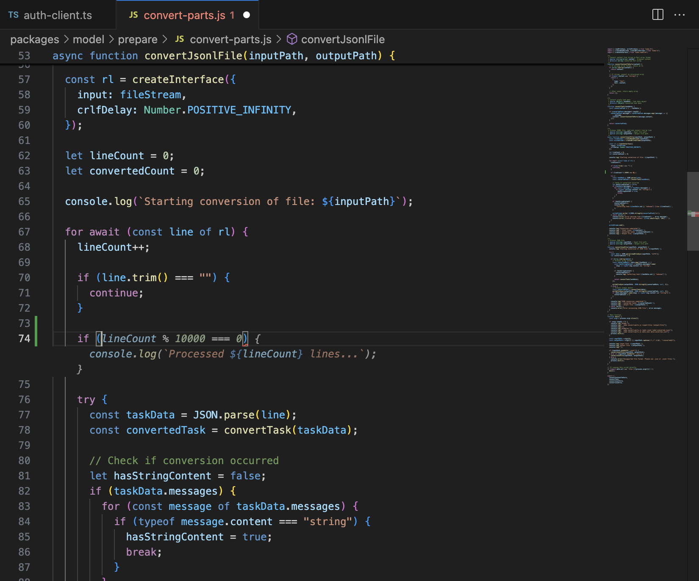

# Tab Completion

**Tab Completion** is Pochi's in-editor inline code completion feature that provides AI-powered suggestions as you type, helping you write code faster and more efficiently.

Pochi uses a state-of-the-art model that adapts to your coding patterns in real time,
drawing on recent edits, diagnostics, and surrounding context to generate helpful,
relevant completions right in your editor.

<p align="center">

</p>

### Multi-Language Support
Works across popular programming languages including:
- JavaScript/TypeScript
- Python
- Java
- C/C++
- Go
- Rust
- And many more


## Using Tab Completion

### Basic Usage
1. Start typing your code
2. Pochi will show inline suggestions in gray text
3. Press `Tab` to accept the suggestion
4. Press `Escape` to dismiss the suggestion

### Keyboard Shortcuts
| Key | Action |
|-----|--------|
| `Tab` | Accept the current suggestion |
| `Escape` | Dismiss the suggestion |
| `Ctrl/Cmd + →` | Accept word by word |
| `Alt + ]` | Next suggestion (if multiple available) |
| `Alt + [` | Previous suggestion (if multiple available) |


## Tab Completion Model Settings

You can customize the code completion provider in your VS Code settings, allowing you to switch between different models, including those running on your local machine.

By default, Pochi uses its own hosted code completion model. Alternatively, you can configure Pochi to use any OpenAI-compatible server that provides a Fill-in-the-Middle (FIM) completion model.

Here is an example configuration for a local OpenAI-compatible server running `qwen3-coder-30b-a3b` on port 8000:

```json
  "pochi.advanced": {
    "inlineCompletion": {
      "provider": {
        "type": "openai",
        "baseURL": "http://127.0.0.1:8000/v1",
        "apiKey": "",
        "model": "qwen3-coder-30b-a3b",
        "promptTemplate": "<|fim_prefix|>{{prefix}}<|fim_suffix|>{{suffix}}<|fim_middle|>"
      }
    }
  },
```

- **baseURL**: The base URL of the OpenAI-compatible server.
- **apiKey**: The API key for the server. If not set, Pochi will use the `POCHI_CODE_COMPLETION_OPENAI_API_KEY` environment variable. This can be left empty if the server does not require an API key.
- **model**: The name of the FIM completion model to use.
- **promptTemplate**: The prompt template for FIM completion. It must include `{{prefix}}` and `{{suffix}}` placeholders.

---

**Need help?** Join our [Discord](http://getpochi.com/discord) for assistance with Tab Completion features.
