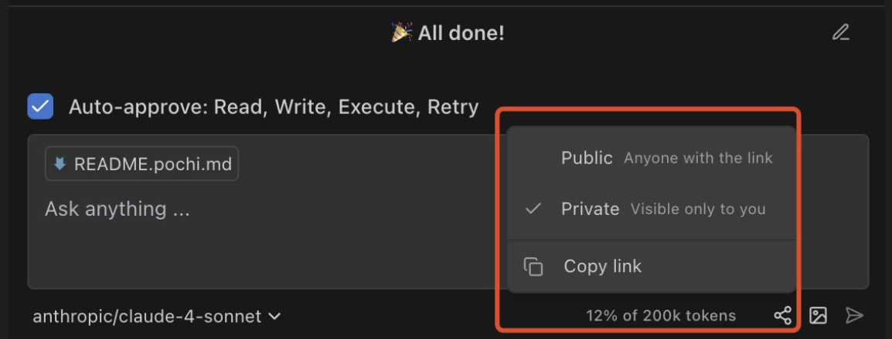
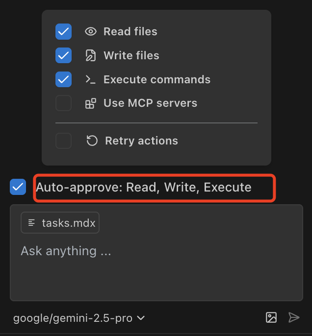

# Toolbar
### Share
The **Share** feature in Pochi's toolbar allows you to share your current development context with team members.

<Callout type="info" title="Public Access">
  Shared conversations are publicly accessible to anyone with the link. Do not share sensitive information or private code.
</Callout>

### Auto-Approve

By default, all permissions in Pochi are enabled. You can customize these permissions at any time using the Auto-Approve settings.

- **Read**: Read the file content Pochi decides to look up for analyzing or completing tasks.
- **Write**: Creates new files, edits existing code, generates boilerplate, and writes documentation.
- **Execute**: Manages dependencies, runs builds, tests, and perform system operations.
- **Use MCP**: Interacts with databases, APIs, and other external services to expand its capabilities with MCP server.
- **Retry**: Automatically retries failed commands, code changes, and installations.
