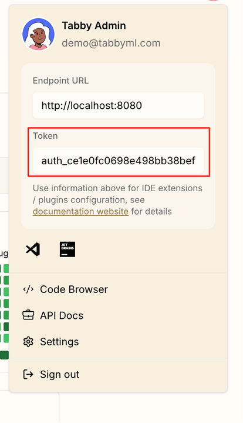

# Connect to Tabby Server for Enhanced Enterprise Experience

This tutorial will guide you through the process of connecting Pochi to your self-hosted Tabby server. By connecting Pochi to your self-hosted Tabby server, you can take advantage of several benefits, including centralized account management, self-hosted tracking, and the ability to use your own custom models.

## Prerequisites

Before you start, make sure you have a running Tabby server instance. If you don't have one, you can follow the instructions on the [Tabby website](https://tabby.tabbyml.com/) to set one up.

## Configuration

Pochi uses a configuration file to connect to different model providers. To connect to Tabby, you'll need to add a new provider configuration to your `~/.pochi/config.json` file.

Here's a sample configuration for connecting to a Tabby server:

```jsonc
{
    "kind": "openai",
    "id": "tabby",
    "baseURL": "https://demo.tabbyml.com/v1",
    "apiKey": "YOUR_AUTH_TOKEN",
    "models": [
        {
            "id": "default",
            // This flag is important for Tabby to work properly with Pochi
            "useToolCallMiddleware": true
        }
    ]
}
```

### Parameters

You'll need to change the following parameters in the configuration:

-   `baseURL`: Change this to the URL of your Tabby server instance.
-   `apiKey`: Change this to your own auth token from the Tabby UI. You can find your token in the "Token" section of the Tabby admin panel, as shown in the screenshot below.

<div align="center">



</div>

## Conclusion

Once you have updated the configuration file, Pochi will be able to connect to your Tabby server and use the models you have configured.
