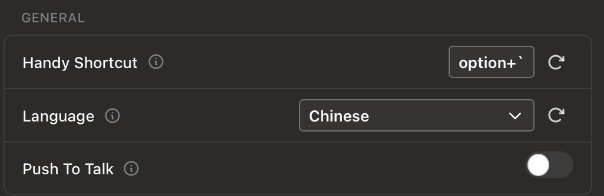
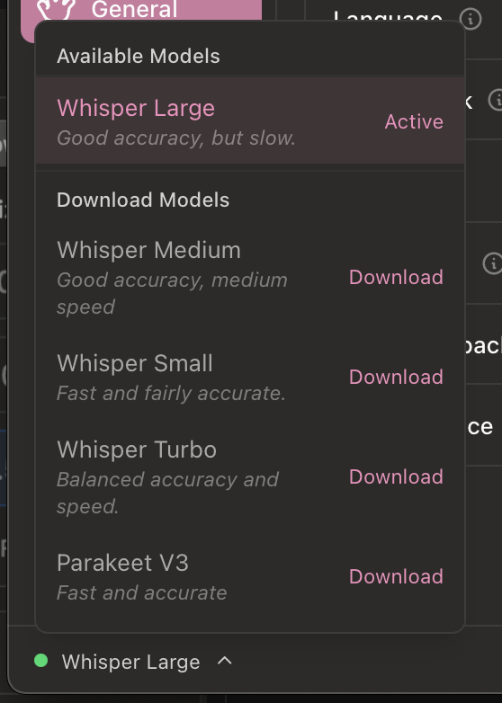

# Voice-Driven Development with Hex and Pochi

This tutorial guides you through setting up an efficient, voice-driven development workflow by combining two powerful tools: **[Hex](https://github.com/kitlangton/Hex)** for local voice transcription and **[Pochi](https://github.com/TabbyML/pochi)** as your AI coding assistant.

This setup allows you to speak commands, have them transcribed into text by Hex, and then have Pochi execute those commands, creating a seamless, hands-free coding experience.

### What You Will Learn
- How to install and configure Hex for voice-to-text transcription.
- How to integrate Hex with Pochi to create a voice-driven development workflow.
- Tips for optimizing your setup for accuracy and efficiency.

### Prerequisites
- **Pochi**: You should have Pochi installed and running in your editor.
- **Apple Silicon Mac**: Hex is currently available only for Macs with Apple Silicon.

### How It Works

- **Hex** listens to your voice and converts it into text using its own built-in transcription models.
- **Pochi** takes the text generated by Hex as a command and processes it using its configured AI model.

> **For a Fully Private Workflow**
> This tutorial focuses on the voice input aspect. For complete privacy and offline use, you can configure Pochi to use a local Large Language Model (LLM). See Pochi's documentation on [model configuration](../../models) for more details.

---

## Step 1: Install and Configure Hex

Hex is an open-source macOS app that records your voice via a hotkey and pastes the transcribed text into any application.

1.  **Download Hex**: Get the latest version from the [official releases page](https://hex-updates.s3.us-east-1.amazonaws.com/hex-latest.dmg).

2.  **Install and Grant Permissions**:
    *   Open the downloaded `.dmg` file and drag Hex into your `Applications` folder.
    *   On first launch, macOS will ask for **Microphone** and **Accessibility** permissions. You must grant these so Hex can record your voice and paste the text into Pochi's chat window.

3.  **Configure Hex Settings**:
    Once installed, open Hex's preferences to fine-tune its behavior.

    **A. Set Your Hotkey**
    This is the key you'll press to activate Hex. Choose a key or combination that doesn't conflict with other apps. The `Ignore below` slider helps prevent accidental triggers from very short key presses.

    

    Hex also supports two recording modes:
    - **Press-and-hold**: Start recording when you press the hotkey, and stop when you release it.
    - **Double-tap**: Double-tap the hotkey to lock recording, then tap it again to stop.

    **B. Select Your Transcription Model**
    Hex uses local models based on [WhisperKit](https://github.com/argmaxinc/WhisperKit) to ensure privacy and speed. You can choose a model that balances accuracy and performance for your needs.

    

    - **Model Size**: Larger models (like `Large` at 1.5GB) offer higher accuracy but are slower and consume more resources. The `Small` model is faster but may be less accurate. A good starting point is the `Large` model if you prioritize accuracy.
    - **Output Language**: You can select the language for your transcription, which is useful if you prefer to give commands in a language other than English.

> **Note**: The first time you select a model, Hex will download and compile it. A process called `ANECompilerService` may cause high CPU usage during this one-time optimization step. This is normal.

## Step 2: The Voice Coding Workflow in Action

With Hex installed, let's try the workflow.

1.  **Open Pochi**: Launch Pochi's chat interface in your code editor.
2.  **Activate Hex**: Click inside Pochi's input box, then use the hotkey you configured for Hex. When Hex is actively listening, it will display a recording indicator on your screen.

    

3.  **Speak Your Command**: Clearly state the task you want Pochi to perform. For example:
    > Write a TypeScript function that takes an array of strings and returns the longest one.
4.  **Transcription**: When you stop recording, Hex transcribes your speech and pastes the text into Pochi's input box.
5.  **Execution**: Pochi takes this text and sends it to its configured AI model for processing. The generated code or response appears in the chat.

## Tips and Troubleshooting

- **Inaccurate Transcription?**
  In Hex settings, try selecting a larger transcription model for better accuracy.

- **Need Help with Hex?**
  For questions or feedback specifically about Hex, join their [Discord community](https://discord.gg/5UzVCqWmav).

## Conclusion

By combining Hex and Pochi, you've created a fast and efficient voice-powered programming environment. This setup gives you a modern, hands-free way to translate your ideas into code.

