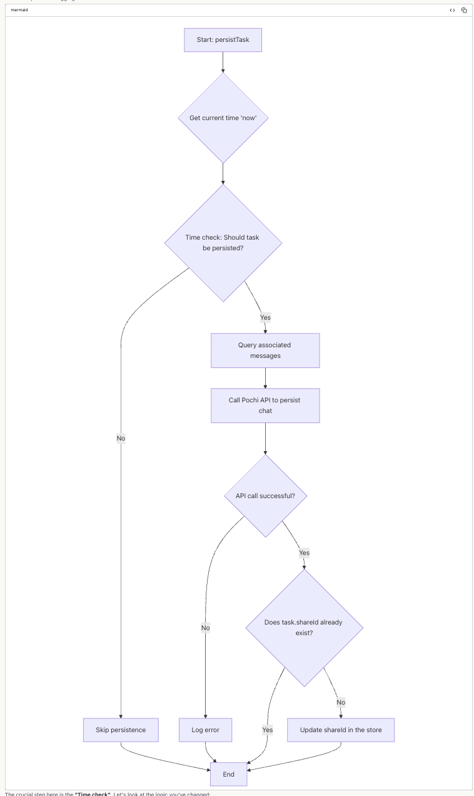

# Visualizing the Dialogue: How Pochi Uses Mermaid Graphs to Communicate

When Pochi tackles a large-scale code change, a monologue of text and code is not an effective way to collaborate. To have a clear dialogue with you, Pochi translates its plans into **Mermaid graphs**.

Think of these diagrams as Pochi's whiteboard, where it sketches out its ideas for you to review. It's a communication tool designed to turn a complex plan into a simple, visual conversation. This allows you to understand, approve, and guide Pochi's approach before it writes a single line of code.

## A Visual Conversation for Complex Tasks

Pochi automatically generates Mermaid graphs when it needs to discuss its plan for complex tasks, such as:

- **Architectural Changes**: Showing how the overall structure of your application will be modified.
- **Complex Refactoring**: Breaking down a large function or class into smaller pieces.
- **New Feature Implementation**: Visualizing how a new feature will interact with existing components.

## Example: Pochi Proposes a Complex Refactor

When preparing for a significant refactoring, Pochi uses a diagram to discuss the proposed architecture with you. In this example, Pochi was asked to refactor a component for Server-Side Rendering (SSR). It first analyzed the code, then generated the following diagram to explain its findings and get your feedback.

This diagram provides a clear overview of the system, which was then used to formulate a refactoring plan. The analysis highlighted several key areas:

### Core Components:
- **ToolInvocationPart**: The main entry point that routes tools to the correct renderer.
- **Tools Registry**: A static mapping of tool names to their corresponding React components.
- **McpToolCall**: A specialized renderer for tools using the Model Context Protocol (MCP).
- **Shared UI Components**: A library of reusable components like containers, icons, and badges.

### SSR Challenges Identified:

The diagram helped identify three major challenges for implementing SSR:

1.  **Client-Side State Dependencies**: Heavy reliance on React hooks (`useState`, `useCallback`) and context providers for managing the tool lifecycle, which are not available on the server.
2.  **Browser/Environment Dependencies**: Components with direct dependencies on browser-specific features like `XTerm.js`, VS Code APIs, and file system interactions.
3.  **Dynamic Component Resolution**: The architecture relies on a runtime tool registry and conditional rendering based on the tool's execution state, which is difficult to resolve on the server.

By visualizing the architecture, Pochi enabled the user to quickly understand the problem and approve the proposed strategy.

## Example: Pochi Clarifies Business Logic with a Flowchart

For changes to business logic, a code diff can be hard to follow. Pochi uses flowcharts to walk you through the new logic step-by-step. When asked to modify a task persistence feature, Pochi generated this flowchart to explain the new process.

This visual explanation makes it much easier to verify the correctness of the new logic:

1.  **Time Check**: The process starts with a throttling mechanism to prevent spamming the API.
2.  **API Call**: If the check passes, it queries messages and calls the persistence API.
3.  **Error Handling**: It includes a clear path for what happens if the API call fails.
4.  **State Update**: It shows how the local state is updated with a `shareId` upon success.

This turns a code review into a collaborative check of the logic, ensuring you and Pochi are on the same page.

## Conclusion: Your Dialogue with Pochi

Mermaid graphs are more than just diagrams; they are the bridge for communication between you and Pochi. They transform a potential monologue of code into a clear, interactive dialogue about the best path forward.

When you see Pochi generate a Mermaid graph, it's an invitation to collaborate. Take a moment to review it—your feedback is crucial for guiding the AI and ensuring the final result meets your exact expectations.

And remember, this is a two-way conversation. If you ever feel that Pochi's plan is unclear, you can proactively ask it to generate a Mermaid graph. Just say, "Can you explain that with a Mermaid diagram?" This puts you in control, allowing you to request visual clarity whenever you need it.
