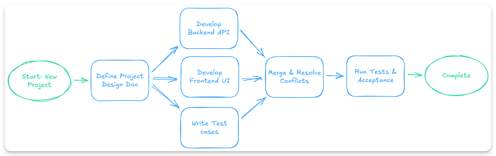
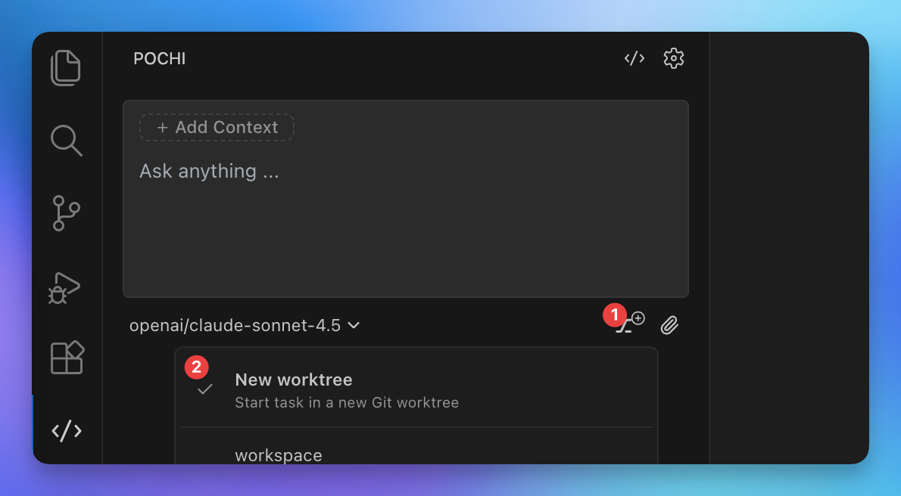
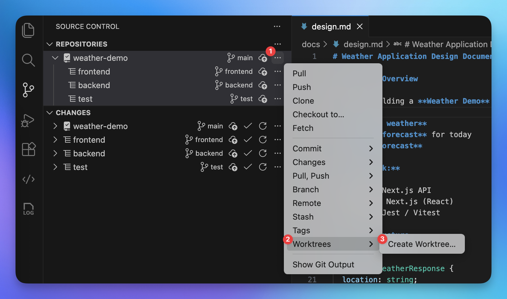
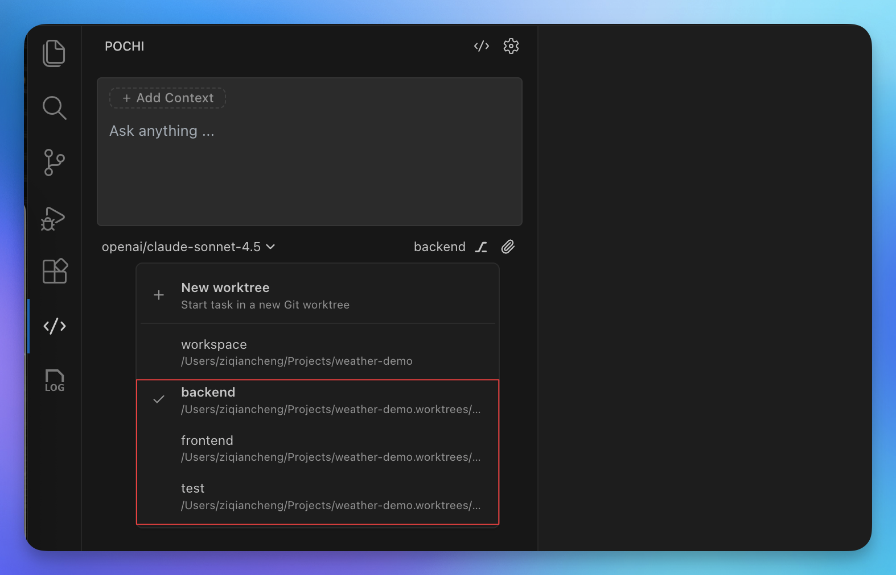
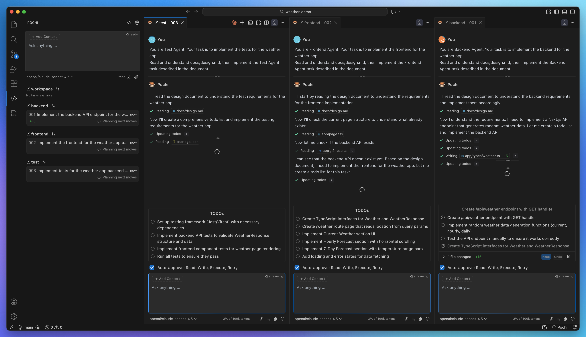
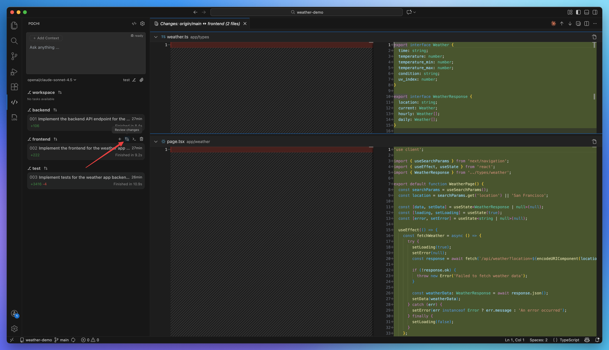
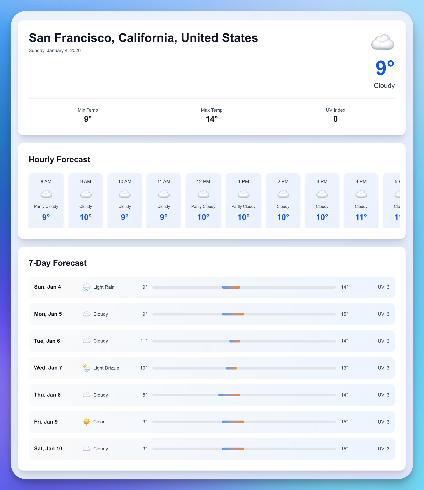

# Practical Guide to Building Parallel Agents Workflow

## Why Use Parallel Agents?

When working with AI agents, you'll hit a bottleneck: **sequential execution is slow**.

A single AI agent completes task A → waits → then task B → waits → then task C. Three 15-minute tasks executed sequentially would take 45 minutes in total. In software development, for example, one agent builds the backend API → then the frontend → then writes tests.

**In practice, teams often work in parallel.** Different specialists work in parallel, coordinating through shared specifications.

**That's what Pochi's Parallel Agents solve.** Run multiple agents concurrently—each in its own isolated workspace, all working with shared context and background. Complete multiple tasks simultaneously.

## What You Will Learn

- Creating Git worktrees for isolated development
- Running parallel agents on concurrent tasks
- Best practices for developing a new project from scratch

We'll build a weather demo application to show these concepts in practice.

## Prerequisites

- **[Install Pochi](../index.mdx#installation)** and ensure it is running in Visual Studio Code.
- Node.js (version 18+) and npm installed
- Git installed and configured on your system

## How It Works

Pochi's Parallel Agents run multiple AI agents concurrently, each in its own Git worktree with an isolated branch. Agents work independently on different tasks while sharing the same repository context, allowing you to complete multiple components simultaneously without conflicts.

Learn more in the [Parallel Agents documentation](../parallel-agents.mdx).

## Getting Started: Building a Weather Demo with Parallel Agents

In this hands-on tutorial, we'll build a complete weather application using Pochi's Parallel Agents feature. You'll see how to coordinate multiple agents working in parallel on frontend, backend, and testing tasks - demonstrating the power of concurrent development.

The development workflow for this project looks like this:



### Step 1: Set Up the Environment and Initialize the Project

First, we'll create a new [Next.js](https://nextjs.org/) project using `create-next-app`, which will automatically set up the project structure and initialize a Git repository for our parallel development workflow.

#### Create the Project Directory

```bash
npx create-next-app@latest weather-demo
cd weather-demo
```

### Step 2: Write a Design Document

A well-structured design document is crucial when working with parallel agents. It serves as the single source of truth that all agents will reference to understand the project requirements, architecture, and their specific responsibilities.

#### Create the Design Document

Create a file `docs/design.md` with the following content:

````markdown
# Weather Application Design Document

## Project Overview

You are building a **Weather Demo** tool that provides:

- **Current weather**
- **Hourly forecast** for today
- **7-day forecast**

**Tech Stack:**

- Backend: Next.js API
- Frontend: Next.js (React)
- Testing: Jest / Vitest

## Data Structure

```ts
interface WeatherResponse {
  location: string;
  timezone: string;
  current: Weather;
  hourly: Weather[];
  daily: Weather[];
}

interface Weather {
  time: string;
  temperature: number;
  temperature_min: number;
  temperature_max: number;
  condition: string;
  uv_index: number;
}
```

## Agent Tasks

### Backend Agent - Backend API

- **Endpoint:** `GET /api/weather`

- **Query Parameters:**
  - `location` (required) - City name (e.g., "San Francisco", "London", "Tokyo")

- **Responsibilities:**
  - Use [**Open-Meteo Geocoding API**](https://open-meteo.com/en/docs/geocoding-api) to convert city name to latitude and longitude coordinates.
  - Query weather data from [**Open-Meteo Weather API**](https://open-meteo.com/en/docs) using the obtained coordinates.
  - Use `timezone=auto` parameter to automatically get the location's timezone from Open-Meteo.
  - Convert the Open-Meteo response into the `WeatherResponse` format as defined above.
  - Return 404 error if the city name is not found.

### Frontend Agent - Frontend Rendering

- **Route Requirement:**
  - The page should be accessed using:
    ```
    /weather?location=CityName
    ```
  - If no `location` parameter is provided, default to **San Francisco**.
  - The frontend should **read `location` from the query string** and pass it to `/api/weather`.

- **Responsibilities:**
  - Read the `location` query parameter from the URL.
  - If no location parameter exists, use "San Francisco" as the default.
  - Fetch weather data from the backend using the location parameter.
  - Use the timezone information from the API response to display times correctly in the location's local time.
  - Render current weather, hourly forecast, and 7-day forecast sections.

- **UI / UX Requirements**
  - Layout should be **clean, modern, and visually appealing**
  - The page has three sections:
      - Current Weather  
          - Show: city, current temp, min/max temp, condition, UV index
      - Hourly Forecast  
          - Horizontal list
          - Each item: time, condition, temperature
      - 7-Day Forecast  
          - Vertical list
          - Each item: date, condition, temperature range
          - Show the range with a bar

  - Suggested styling goals:
      - Clear section titles
      - Cards or panels to group information
      - Consistent spacing & alignment
      - Responsive layout (desktop & mobile look good)
      - You may use Tailwind

### Test Agent - Testing

- **Responsibilities:**
  - Validate **backend API response**:
    - Structure matches `WeatherResponse`
    - All required fields are present
    - Types are correct
  - Test **frontend rendering**:
    - Current weather section renders correctly
    - Hourly list renders 24 rows
    - Daily list renders 7 items
    - Location name is displayed
````

#### Commit the Design Document

```bash
git add docs/design.md
git commit -m "docs: add design document for weather application"
```

This design document provides clear specifications that each parallel agent can reference when working on their respective tasks. It defines a weather application that fetches real data from **[Open-Meteo API](https://open-meteo.com/)** (including geocoding and weather forecasts), specifying data structures, API contracts, and UI requirements for independent parallel implementation.

### Step 3: Create Git Worktrees for Parallel Tasks

Now we'll create three separate worktrees, each with its own branch, for the three parallel development tasks: frontend, backend, and test.


#### Method 1: Using Pochi Sidebar

You can create worktrees from the Pochi sidebar using **"New worktree"** mode. Simply start chatting with a prompt, and Pochi will automatically create a new worktree and launch the agent task:



#### Method 2: Using VSCode Source Control

You can create worktrees directly from VSCode's built-in Source Control panel:




#### Method 3: Using Command Line

If you prefer the command line, you can create worktrees using Git commands:

```bash
# Create backend worktree
git worktree add -b backend ../weather-demo.worktrees/backend

# Create frontend worktree
git worktree add -b frontend ../weather-demo.worktrees/frontend

# Create test worktree
git worktree add -b test ../weather-demo.worktrees/test
```

### Step 4: Create Parallel Agent Tasks

Now comes the powerful part - creating parallel agent tasks in Pochi. Each agent will work independently in its own worktree, reading the design document and implementing its assigned component.

You can find all your worktrees in the Pochi sidebar. When you start a chat, it will automatically create a task for the currently selected worktree. You can also choose different models for each agent based on the complexity of their tasks.




#### Create Backend Agent Task

1. In Pochi sidebar, select the `backend` worktree
2. In the chat, enter the prompt:

```
You are Backend Agent. Your task is to implement the backend for the weather app.
Read and understand docs/design.md, then implement the Backend Agent task described in the document.
```

#### Create Frontend Agent Task

1. In Pochi sidebar, select the `frontend` worktree
2. In the chat, enter the prompt:

```
You are Frontend Agent. Your task is to implement the frontend for the weather app.
Read and understand docs/design.md, then implement the Frontend Agent task described in the document.
```

#### Create Test Agent Task

1. In Pochi sidebar, select the `test` worktree
2. In the chat, enter the prompt:

```
You are Test Agent. Your task is to implement the tests for the weather app.
Read and understand docs/design.md, then implement the Test Agent task described in the document.
```

#### Monitor Agent Progress

Once all three tasks are created and running:

1. View all active tasks in the Pochi sidebar
2. Click on any task to see its progress and output
3. Each agent will work independently, reading the design document and implementing its component
4. You can interact with any agent by sending follow-up messages or clarifications

The agents will work in parallel, and you can watch their progress in real-time from the Pochi interface.



### Step 5: Merge Worktrees and Run Tests

Once all agents have completed their tasks, it's time to integrate all the work and verify that everything works together.

#### Review Each Worktree

Before merging, review the work in each worktree:

1. Click **"Open worktree in terminal"** to commit any uncommitted changes
2. Click **"Review changes"** to inspect the code and view the diff against the main branch
3. Review the implementation for code quality and completeness
4. Test the component individually if needed before merging



#### Merge All Changes

Merge all three worktree branches into the main branch:

```bash
# Switch to main branch
git checkout main

# Merge all branches
git merge backend
git merge frontend
git merge test

# Verify status and resolve any conflicts if they arise
git status
```

If conflicts occur during merging, resolve them by editing the conflicting files, then continue:

```bash
git add .
git commit -m "chore: resolve merge conflicts"
```

#### Run the Application and Tests

Install dependencies and start the application:

```bash
# Install dependencies
npm install

# Terminal 1: Start the development server
npm run dev

# Terminal 2: Run tests
npm test

# Optional: Run tests with coverage
npm test -- --coverage
```

All tests should pass, showing that the agents coordinated their work effectively.

#### Verify Integration

1. Open the application in your browser (typically `http://localhost:3000/weather?location=San%20Francisco`)
2. Verify that weather data is fetched and displayed correctly
3. Test switching locations by changing the URL parameter (e.g., `?location=New%20York`)
4. Check responsive design by resizing the browser window

If everything works as expected, you've successfully built a complete application using parallel agents.

Here's what mine looks like - pretty cool, right? And the best part: the code generated by the agents worked on the first try and passed all tests! The entire process took about 5 minutes—without parallel agents, a single agent would have needed around 15 minutes to complete all three tasks sequentially.



## Tips and Troubleshooting

### Agent Coordination

- **Consistent Design Document**: Ensure your design document is detailed and clear. All agents reference this document, so ambiguity can lead to inconsistent implementations.
- **API Contracts**: Clearly define API contracts (endpoints, request/response formats) in the design document so frontend and backend agents align perfectly.
- **Version Control**: Commit the design document before creating worktrees so all agents have access to the latest specifications.

### When to Use Parallel Agents (and When Not To)

**Good fit for parallel agents:**
- **Different roles, parallel completion** - Frontend, backend, tests working simultaneously
- **Independent tasks** - Querying multiple websites and aggregating results
- **Batch processing** - Generating test reports, review reports for multiple modules

**Not a good fit:**
- **Strong dependencies** - Requirements doc → design doc → implementation must be sequential
- **Complex reasoning with continuous context** - Mathematical proofs, chain-of-thought problems
- **High conflict resolution cost** - Multiple agents heavily modifying the same files

### Common Issues

**Issue**: Agent can't access design document
- **Solution**: Ensure the design document is committed to the main branch before creating worktrees.

**Issue**: API integration fails between frontend and backend
- **Solution**: Verify API endpoint URLs and response formats match the design document specifications.

**Issue**: Worktree conflicts during merge
- **Solution**: Review the design document for any ambiguous specifications. Update and have agents revise their implementations if needed.

## Conclusion

Congratulations! You've successfully used Pochi's Parallel Agents to build a complete weather application with frontend, backend, and tests developed concurrently. This tutorial demonstrated how parallel agents can dramatically accelerate development by allowing multiple components to be built simultaneously.

### Key Takeaways

- **Git Worktrees**: Leveraging Git worktrees provides isolation while maintaining connection to the same repository.
- **Parallel Agent Development**: Multiple agents working in isolated worktrees enable true parallel development without conflicts.
- **Design Documents**: A clear, comprehensive design document is essential for coordinating multiple agents.
