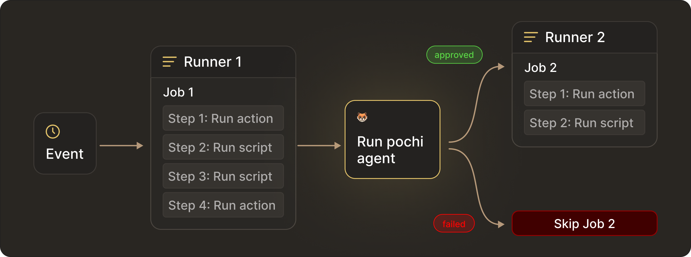
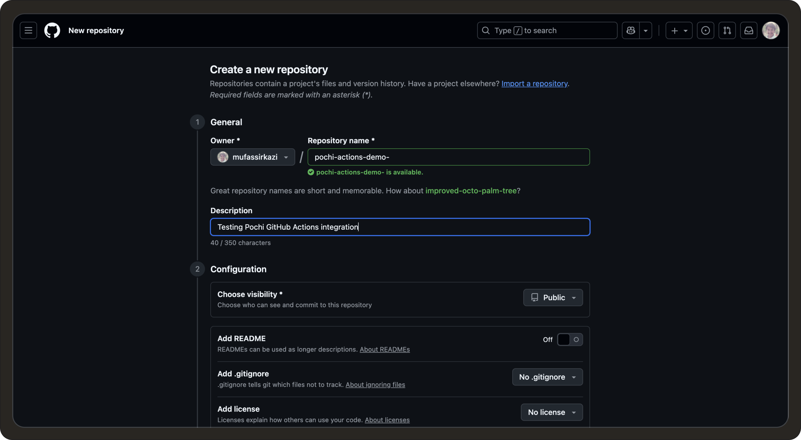
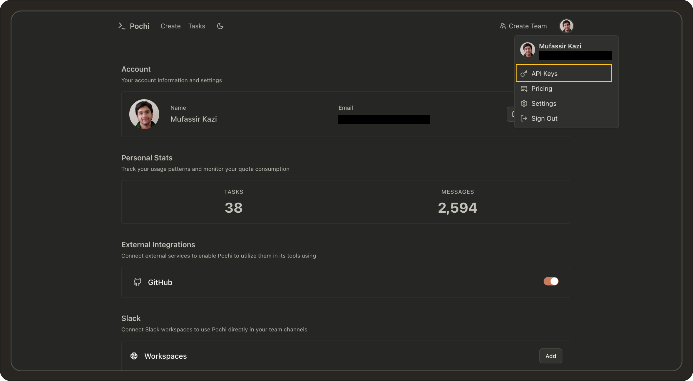
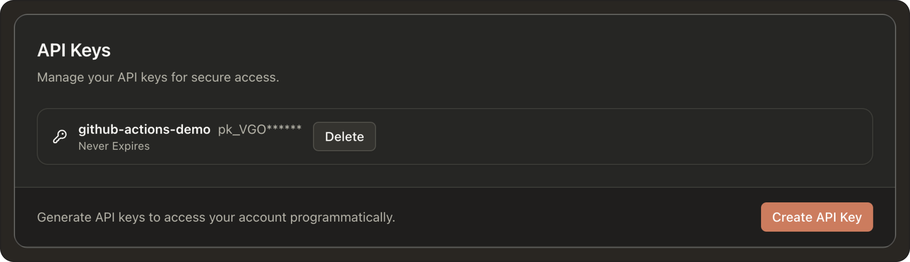
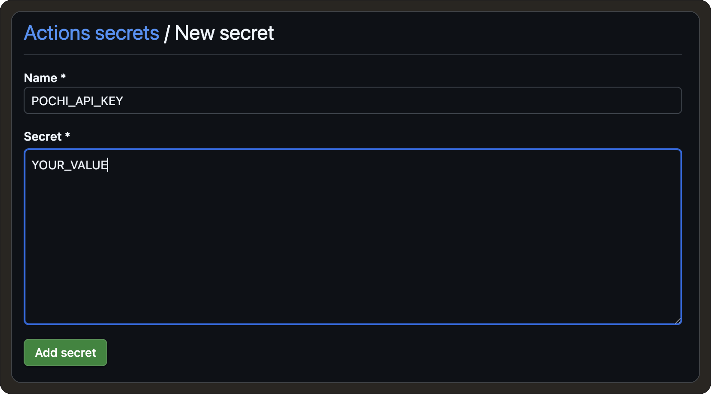
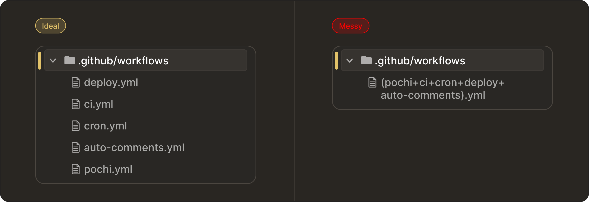

# Build Your Own AI Teammate with Pochi in GitHub Actions

In this tutorial, we’ll learn how you can go beyond the basics of GitHub Actions and extend your workflows with Pochi, an AI agent that can make your everyday automations more powerful. 

This means, instead of being limited to tests and deployments, we’ll use Pochi to review pull requests, gatekeep PRs, enforce coding standards, draft changelogs, open issues, and even run as a continuous background agent.



Throughout the tutorial, each use case builds on the last, so you’ll see Pochi evolve from a simple reviewer into a full-fledged agent that embeds intelligence inside your development workflow.

## Automating Your Code Reviews and CI/CD Pipelines with Pochi

### Create your Demo Repo 

Let’s begin by connecting Pochi to your GitHub repository so it can review pull requests when you ask it to. To do that, you’ll need to go to **[Github](https://www.github.com)** and log in with your account. On the top right you need to click the ‘+ button’ and select ‘New repository’.

You’ll need to fill in:
* Repository name: `pochi-actions-demo`
* Description: `Testing Pochi GitHub Actions integration`
* Choose `Public` (so you get unlimited Actions minutes).
* Check Add a `README` file (makes life easier).



Finally, click `Create repository`. You now have an empty repository with a README file.


### Get Your Pochi API key

Next we need to get your Pochi API key. Head over to **[app.getpochi.com](app.getpochi.com)** and log in. In the top-right corner, you need to click your profile menu and then ‘API keys’. 



Click on ‘New API key’ and give it a name like `github-actions-demo`. 


Copy the key and store it securely, it will only be shown once.




Now, in order for GitHub Actions to access Pochi securely, you need to add the API key in the repository. Head over to your GitHub repository → Settings tabs → Secrets and Variables → Actions → New repository secret.



Here you can create a secret called `POCHI_API_KEY` and paste your key value. Now we’re all set up!


## Use Case 1: Pochi as Your Code Reviewer

We’ll create our first Pochi review in GitHub Actions. To get started, go to your repository, click the 'Add file' button  and 'Create new file'. 

Set the file path to `.github/workflows/pochi.yml`.


Now paste in this YAML:

```yaml
name: Pochi PR Assistant

on:
  issue_comment:
    types: [created]

jobs:
  pochi:
    if: startsWith(github.event.comment.body, '/pochi')
    runs-on: ubuntu-latest
    permissions:
      contents: write
      issues: write
      pull-requests: write
    steps:
      - name: Checkout
        uses: actions/checkout@v4
        with:
          fetch-depth: 1

      - name: Run Pochi
        uses: tabbyml/pochi/packages/github-action@main
        env:
          POCHI_API_KEY: ${{ secrets.POCHI_API_KEY }}
```

Scroll down and commit the changes directly to `main` branch.  At this point, your Pochi GitHub Action is ready to run.


To test this out, we’ll create a sample pull request. To make it feel more realistic and production-like, let’s set up something meaningful to analyze.

For Use Case 1, since Pochi will be reviewing our code, we’ll create a small full-stack Node.js + TypeScript + React snippet with a few intentional mistakes (bad naming, missing error handling, inconsistent types). This way, Pochi’s review will surface meaningful feedback.


Head over to your repo main page and add a file `src/server.ts` which will be our Express backend. Paste in the following:

```javascript
import express from "express";

const app = express();
app.use(express.json());

let users: { id: number; name: string }[] = [
  { id: 1, name: "Alice" },
  { id: 2, name: "Bob" },
];

// Bad: endpoint mixes concerns, no validation, no error handling
app.post("/addUser", (req, res) => {
  const { id, name } = req.body;
  users.push({ id, name }); // No duplicate check!
  res.send("ok");
});

// Bad: synchronous filter instead of proper DB, missing 404 handling
app.get("/getUser/:id", (req, res) => {
  const user = users.filter((u) => u.id == parseInt(req.params.id))[0];
  res.json(user);
});

app.listen(3000, () => {
  console.log("Server started on port 3000");
});
```

On the React frontend side, you can create a `src/components/UserList.tsx` file. Paste in the following:

```javascript
import React, { useEffect, useState } from "react";

type User = {
  id: number;
  name: string;
};

export default function UserList() {
  const [users, setUsers] = useState<User[]>([]);

  // Bad: hardcoded API URL, no error handling, no loading state
  useEffect(() => {
    fetch("http://localhost:3000/getUser/1")
      .then((res) => res.json())
      .then((data) => setUsers([data]));
  }, []);

  return (
    <div>
      <h2>Users</h2>
      <ul>
        {users.map((u) => (
          <li key={u.id}>{u.name}</li>
        ))}
      </ul>
    </div>
  );
}
```


After committing your changes, create a new branch, for example, `feat/test`. Click `Propose changes`, and GitHub will prompt you to open a pull request from your branch. Open the pull request.


Here, you simply need to put a comment starting with `/pochi` to see your workflow in action:

```
/pochi review this code

```

<div
  style={{
    position: "relative",
    paddingBottom: "53.7%",
    marginBottom: 20,
    height: 0,
    overflow: "hidden",
    maxWidth: "100%",
  }}
>
  <iframe
    src="https://drive.google.com/file/d/1DC71yPU5ZzhnA2Au7_ZArgvNHgEET3tn/preview"
    style={{
      position: "absolute",
      top: 0,
      left: 0,
      width: "100%",
      height: "100%",
      border: "none",
      borderRadius: "8px",
    }}
    allowFullScreen
    title="Pochi review code"
  />
</div>

You can see Pochi comments on things like no input validation / error handling in backend, data management issues and more. This is exactly the kind of review we wanted in the first place. 


Now that we got Pochi to review the code and point out the flaws, wouldn't it be useful if Pochi could also apply suggestions automatically, fix the code, and commit it? You can easily do that by again commenting directly in the PR: 

```
/pochi apply fixes and show the full updated code

```

<div
  style={{
    position: "relative",
    paddingBottom: "53.7%",
    marginBottom: 20,
    height: 0,
    overflow: "hidden",
    maxWidth: "100%",
  }}
>
  <iframe
    src="https://drive.google.com/file/d/1_ZHh30s2XSOQEF-YQaoTYwRrNCHQ2WEc/preview"
    style={{
      position: "absolute",
      top: 0,
      left: 0,
      width: "100%",
      height: "100%",
      border: "none",
      borderRadius: "8px",
    }}
    allowFullScreen
    title="Pochi fix code"
  />
</div>


## Use Case 2: Automate Reviews Based on Events

So far, we’ve seen Pochi respond when you type `/pochi` either on an issue or a pull request. That’s great, but we can go further. Now, we’ll make Pochi respond automatically to repository events like when a PR is opened or when you push commits to `main`. 


Based on what we’ve seen so far, we'll need to add another workflow and test by opening a PR. The event of opening the PR should trigger the workflow since we’re doing event based triggers and we don’t need to type `/pochi` for this use case. 

But there are two things we need to address: why we need a separate workflow file, and what custom GitHub tokens (PATs) are.

### Why a separate workflow file?

Your original `.github/workflows/pochi.yml` is the engine that runs Pochi when it sees `/pochi` comments. Now we’ll be creating a new `.github/workflows/pochi-auto-comments.yml` which will be just a trigger that posts those comments automatically. Keeping them separate makes it easier to read / debug later especially if you’re working in teams. 

In production repositories, teams often split workflows. For example: `deploy.yml` for deployments, `ci.yml` for tests, and `pochi.yml` for the AI assistant engine. This helps to tweak automation triggers without touching the core runner. Further, this also helps with modularity. Suppose later you want two flavours of auto-comments (e.g one for PRs and one for weekly crosn). Having them as separate workflows means you can enable / disable independently. 



That being said, you can always merge them into your existing `pochi.yml` file. However, combining everything into one file can become messy. Since GitHub Actions doesn’t support dynamic inline comment bodies well, the multi-file approach is cleaner and aligns better with common team practices.

### Custom GitHub Tokens (PAT)

When you create the new `.github/workflows/pochi-auto-comments.yml` workflow, the bot will automatically post a `/pochi summarize this PR` comment on your pull request. However, Pochi won’t respond to it. This is because GitHub has built-in protections: comments made by `github-actions[bot]` (the default Actions identity) do not trigger new workflows. This is done to prevent infinite workflow loops. 

The solution is to use Personal Access Token (PAT) so the auto-comments come from your account instead of `github-actions[bot]`, mimicking as if you commented yourself like we did in Use Case 1. GitHub treats these PAT-authored comments as real user events which trigger workflows normally.


### Set Up the PAT

Now to setup your custom GitHub token, head over to to GitHub → Settings → Developer Settings → Personal Access Tokens → Tokens (classic). Here you need to click on Generate new token (classic). 

When generating the token, check the following scopes:
    * `repo` → needed to comment on PRs/issues in your repos.
    * `workflow` → needed if you later chain workflows.

Click on Generate and copy the token. 

<div
  style={{
    position: "relative",
    paddingBottom: "53.7%",
    marginBottom: 20,
    height: 0,
    overflow: "hidden",
    maxWidth: "100%",
  }}
>
  <iframe
    src="https://drive.google.com/file/d/16qhfQOnlCT_UVppU-jhYRe96BvLEquYS/preview"
    style={{
      position: "absolute",
      top: 0,
      left: 0,
      width: "100%",
      height: "100%",
      border: "none",
      borderRadius: "8px",
    }}
    allowFullScreen
    title="Pochi fix code"
  />
</div>


Then, in your repository, go to Settings → Secrets → Actions → New repository secret. Name the secret `CUSTOM_GITHUB_TOKEN` and paste your PAT as the value.


### Add Auto-Comment Workflow


Now we’ll create the `auto-comments.yml` file.  Click the 'Add file' button  and 'Create new file'. 
Set the file path to: `.github/workflows/pochi-auto-comments.yml`:

Now paste in this YAML:

```yaml
name: Pochi Auto-Comments

on:
  pull_request:
    types: [opened]
  push:
    branches: [main]
  issues:
    types: [opened]

permissions:
  issues: write
  pull-requests: write
  contents: write

jobs:
  pr_auto_summary:
    if: github.event_name == 'pull_request'
    runs-on: ubuntu-latest
    steps:
      - name: Auto-comment for PR summary
        uses: actions/github-script@v7
        with:
          github-token: ${{ secrets.CUSTOM_GITHUB_TOKEN }}
          script: |
            await github.rest.issues.createComment({
              owner: context.repo.owner,
              repo: context.repo.repo,
              issue_number: context.payload.pull_request.number,
              body: "/pochi summarize this PR. Provide a high-level overview, key changes, risks, and what to test. (auto-triggered)"
            });

  push_commit_summary:
    if: github.event_name == 'push'
    runs-on: ubuntu-latest
    steps:
      - name: Auto-comment for Commit Summary
        uses: actions/github-script@v7
        with:
          github-token: ${{ secrets.CUSTOM_GITHUB_TOKEN }}
          script: |
            const commits = context.payload.commits.map(c => `- ${c.message}`).join("\n");
            await github.rest.issues.createComment({
              owner: context.repo.owner,
              repo: context.repo.repo,
              issue_number: 1, // optional: always-open tracking issue
              body: `/pochi summarize these commits:\n\n${commits}`
            });

```


The `pochi.yml` workflow (from Use Case 1) still listens for `/pochi` comments. Now, `pochi-auto-comments.yml` automatically posts those comments in response to events. To test this out, we’ll make two tiny changes so the PR summary looks legit.

Navigate to your `src/server.ts` and edit the code by adding the following to your existing routes:

```javascript
app.get("/health", (_req, res) => {
  res.status(200).json({ ok: true });
});
```

We’ll also make a tiny UI change on the frontend side. In your `src/components/UserList.tsx` file change the heading so there’s a visible diff:

```javascript
<h2>Users (auto-summary demo)</h2>
```

Now you can propose the changes as a PR. 

<div
  style={{
    position: "relative",
    paddingBottom: "53.7%",
    marginBottom: 20,
    height: 0,
    overflow: "hidden",
    maxWidth: "100%",
  }}
>
  <iframe
    src="https://drive.google.com/file/d/1ajCZRuYQZ6K3IQcCWf5ItJ3Hi9qy2UGl/preview"
    style={{
      position: "absolute",
      top: 0,
      left: 0,
      width: "100%",
      height: "100%",
      border: "none",
      borderRadius: "8px",
    }}
    allowFullScreen
    title="Summarize PR with PAT token"
  />
</div>

As you can see Pochi summarises the changes for us. We can further extend this workflow's capabilities by adding a new job that can issue design / architectural notes for any new issue that is created in your repository. To do that, add the following to your  `auto-comments.yml` file. 

```yaml
issue_design_note:
    if: github.event_name == 'issues'
    runs-on: ubuntu-latest
    steps:
      - name: Auto-comment for Issue design note
        uses: actions/github-script@v7
        with:
          github-token: ${{ secrets.CUSTOM_GITHUB_TOKEN }}
          script: |
            await github.rest.issues.createComment({
              owner: context.repo.owner,
              repo: context.repo.repo,
              issue_number: context.payload.issue.number,
              body: "/pochi draft design notes for this issue. Break down problem, options, acceptance criteria, and edge cases. (auto-triggered)"
            });
```

When you create a new issue Pochi, fill in your title and description, being as clear as possible and Pochi will comment out draft design notes to help you with your implementation.  Below is a example execution:

<div
  style={{
    position: "relative",
    paddingBottom: "53.7%",
    marginBottom: 20,
    height: 0,
    overflow: "hidden",
    maxWidth: "100%",
  }}
>
  <iframe
    src="https://drive.google.com/file/d/1TRnTrUtRBwfpFAVB5x71ft-Vw2JmQj6A/preview"
    style={{
      position: "absolute",
      top: 0,
      left: 0,
      width: "100%",
      height: "100%",
      border: "none",
      borderRadius: "8px",
    }}
    allowFullScreen
    title="Issue design suggestions"
  />
</div>

At this stage, Pochi no longer needs you to type out commands. It can react automatically to PRs, commits, and issues, acting like a proactive AI teammate.

## Use Case 3: Pochi as Your CI/CD Gatekeeper

Now, we’ll work towards how Pochi can go from just commenting to actually driving workflows. We’ll make Pochi review a PR and identify if it needs changes. If yes, Pochi stops the workflow and addresses the user to implement the feedback. On the other hand, if everything looks good, Pochi lets the pipeline continue after approval. 

This means you can run:

 - **Conditional CI tests:** Unit tests (Jest, Mocha, Vitest), Integration tests (Cypress, Playwright, Postman) or Linting & type checks (ESLint, TypeScript, Prettier). 
 - **Conditional Deployments:** Frontend (Vercel, Netlify, GitHub Pages), Backend / APIs (AWS (EC2, ECS, Lambda)) or Internal systems (Helm/Kubernetes, Terraform pipelines).


For the purpose of this demo, we’d just run a sample `run_tests` job and for deployment we’ll just print out “Deploying application….”. But you can wire it up easily for your production-ready workflows too. 


To get started, you can update your `.github/workflows/pochi.yml` YAML file. Paste in the following:

```yaml
name: Pochi Manual Reviewer

on:
  issue_comment:
    types: [created]

permissions:
  contents: write
  pull-requests: write
  issues: write

jobs:
  pochi_review:
    if: startsWith(github.event.comment.body, '/pochi')
    runs-on: ubuntu-latest
    outputs:
      approved: ${{ steps.decide.outputs.approved }}
      decision: ${{ steps.decide.outputs.decision }}
    steps:
      - uses: actions/checkout@v4

      - name: Run Pochi
        id: run_pochi
        uses: tabbyml/pochi/packages/github-action@main
        env:
          POCHI_API_KEY: ${{ secrets.POCHI_API_KEY }}
        # You can pass an explicit instruction if you want:
        # with:
        #   args: "review this PR in detail. At the end, on the last line only, output exactly one of: ✅ APPROVED or ❌ CHANGES_REQUIRED"

      - name: Decide from Pochi's final comment (✅ or ❌)
        id: decide
        uses: actions/github-script@v7
        with:
          script: |
            const owner = context.repo.owner;
            const repo = context.repo.repo;
            const issue_number = context.payload.issue.number;

            function pickDecision(body) {
              if (!body) return null;
              if (body.includes('✅ APPROVED')) return 'APPROVED';
              if (body.includes('❌ CHANGES_REQUIRED') || body.includes('❌')) return 'CHANGES_REQUIRED';
              return null;
            }

            let decision = null;

            // Poll up to ~60s to let Pochi post its final result comment
            for (let i = 0; i < 12; i++) {
              const { data: comments } = await github.rest.issues.listComments({
                owner,
                repo,
                issue_number,
                per_page: 50,
              });

              // Look newest to oldest
              for (const c of comments.slice().reverse()) {
                const d = pickDecision(c.body);
                if (d) { decision = d; break; }
              }

              if (decision) break;
              await new Promise(r => setTimeout(r, 5000));
            }

            core.info(`Pochi decision found: ${decision || 'NONE'}`);
            core.setOutput('decision', decision || 'NONE');
            core.setOutput('approved', decision === 'APPROVED' ? 'true' : 'false');

      - name: Show decision
        run: |
          echo "Decision: ${{ steps.decide.outputs.decision }}"
          echo "Approved: ${{ steps.decide.outputs.approved }}"

  run_tests:
    needs: pochi_review
    if: needs.pochi_review.outputs.approved == 'true'
    runs-on: ubuntu-latest
    steps:
      - uses: actions/checkout@v4
      - run: echo "✅ Running tests..."; exit 0
      # replace the line above with: npm ci && npm test

  deploy:
    needs: run_tests
    if: success()
    runs-on: ubuntu-latest
    steps:
      - run: echo "🚀 Deploying application..."
      # replace with your real deploy steps

  # OPTIONAL: make the workflow fail red when not approved
  reject_status:
    needs: pochi_review
    if: needs.pochi_review.outputs.approved != 'true'
    runs-on: ubuntu-latest
    steps:
      - run: |
          echo "Pochi did not approve (decision=${{ needs.pochi_review.outputs.decision }}). Failing this run."
          exit 1

```

When you comment Pochi to review the code, if Pochi approves (✅ no blocking issues), then CI will continue and run tests. If tests pass, deploy. But if Pochi flags issues (❌), the workflow stops before tests/deploy. 


To test this out, you can deliberately make the first PR bad (poor error handling, no validation, wrong status codes). This will showcase how the pipeline is blocked when Pochi flags the pull request as “❌ Changes Required”.

Then you can submit a second PR with fixes (clean REST API, good status codes, input validation) and observe how Pochi approves it with “✅ Approved” and runs tests and deploys. Here are sample versions of a bad PR and a good PR. 


### First PR (Bad version)

Update `src/server.ts`:


```javascript
import express from "express";

const app = express();
app.use(express.json());

let tasks: any[] = [];

// Add task (no validation, wrong status code)
app.post("/tasks", (req, res) => {
  tasks.push(req.body);
  res.send("Task added");
});

// Get tasks (no error handling, returns raw array)
app.get("/tasks", (req, res) => {
  res.send(tasks);
});

// Delete task (no validation, no proper status code)
app.delete("/tasks/:id", (req, res) => {
  const id = parseInt(req.params.id);
  tasks = tasks.filter((t: any, i: number) => i !== id);
  res.send("Deleted");
});

app.listen(3000, () => {
  console.log("Server running on http://localhost:3000");
});
```

Issues Pochi should flag:
* No validation for task data.
* Uses index as ID (not stable).
* No error handling (what if id doesn’t exist?).
* Always returns `200` with strings, not JSON.


### Second PR (Fixed version)
Update `src/server.ts`:

```javascript
import express from "express";

const app = express();
app.use(express.json());

interface Task {
  id: number;
  title: string;
  completed: boolean;
}

let tasks: Task[] = [];
let idCounter = 1;

// Adds task with validation and proper response formatting
app.post("/tasks", (req, res) => {
  const { title } = req.body;
  if (!title) {
    return res.status(400).json({ error: "Title is required" });
  }

  const newTask: Task = { id: idCounter++, title, completed: false };
  tasks.push(newTask);
  res.status(201).json(newTask);
});

// Get tasks (returns JSON)
app.get("/tasks", (req, res) => {
  res.json(tasks);
});

// Delete task with validation
app.delete("/tasks/:id", (req, res) => {
  const id = parseInt(req.params.id);
  const index = tasks.findIndex((t) => t.id === id);

  if (index === -1) {
    return res.status(404).json({ error: "Task not found" });
  }

  const deleted = tasks.splice(index, 1);
  res.json({ deleted: deleted[0] });
});

app.listen(3000, () => {
  console.log("Server running on http://localhost:3000");
});
```

**Note:** You’ll temporarily need to comment out your `pochi-auto-comments.yml` file while doing Use Case 3. Otherwise, both workflows may run simultaneously and interfere with each other.


To test this out, once you open a PR, you need to comment: 

```bash
/pochi review this PR in detail. At the end, on the last line only, output exactly one of: ✅ APPROVED or ❌ CHANGES_REQUIRED
```

We ran this workflow on a sample task management project. The demo below is the part where changes were required:

<div
  style={{
    position: "relative",
    paddingBottom: "53.7%",
    marginBottom: 20,
    height: 0,
    overflow: "hidden",
    maxWidth: "100%",
  }}
>
  <iframe
    src="https://drive.google.com/file/d/1crpQAKkx1e0LjfVwgDayOVFr1hSeL7Us/preview"
    style={{
      position: "absolute",
      top: 0,
      left: 0,
      width: "100%",
      height: "100%",
      border: "none",
      borderRadius: "8px",
    }}
    allowFullScreen
    title="Gatekeeper failed"
  />
</div>

Here is a demo showing when changes were approved:

<div
  style={{
    position: "relative",
    paddingBottom: "53.7%",
    marginBottom: 20,
    height: 0,
    overflow: "hidden",
    maxWidth: "100%",
  }}
>
  <iframe
    src="https://drive.google.com/file/d/1aM8GD9qNmoBWV4R0RLgY8TRUYRwW2VQq/preview"
    style={{
      position: "absolute",
      top: 0,
      left: 0,
      width: "100%",
      height: "100%",
      border: "none",
      borderRadius: "8px",
    }}
    allowFullScreen
    title="Gatekeeper passed"
  />
</div>


This demonstration showcased how Pochi integrates directly into your CI/CD. It doesn't just review your PRs, it also acts as a gatekeeper, determining whether your code can proceed through the pipeline. You can easily wire this into your existing test suites and deployment targets. 

An example enhancement could include chaining in extra jobs like notifications on top of tests and deploys. You can integrate with any API-based tool your team uses, like Linear, Jira, Datadog, PagerDuty, or others. Pochi becomes the gatekeeper, and the rest of the pipeline is up to you. 


## Use Case 4: Enforce Team Coding Rules

Next, let’s look at team-based use cases. In large organisations, developers often have to follow team’s specific coding rules instead of just generic best practices. You can take the learnings from this tutorial so far and create a `.md` file that holds your team coding standard / review ruleset.

Here’s a sample `POCHI.md` you can start with:

```markdown

# POCHI Review Guidelines

Pochi must follow these project-specific rules when reviewing code:

## General Standards
-  All code must use **TypeScript** (no plain JS allowed).
-  Use **ESLint** conventions (semi-colons required, no unused vars).
-  Ensure functions are small, focused, and named descriptively.
-  Always include **error handling** for async operations.
-  API endpoints must return **proper HTTP status codes** and JSON responses.

## Backend Standards
-  Express routes must validate inputs using middleware or explicit checks.
-  No use of `any` type — define proper interfaces.
-  Business logic must be separated from route handlers.

## Frontend Standards
-  React components must be functional, not class-based.
-  Use hooks (`useState`, `useEffect`) instead of lifecycle methods.
-  Separate UI from business logic — no API calls directly inside components (use services/hooks).
-  Components must include **basic prop validation**.

## Git & Workflow Standards
-  PRs must include a **descriptive title** and summary of changes.
-  PRs must not bundle unrelated changes (e.g., workflow + backend + frontend in one PR).
-  README.md must be updated if functionality changes.

At the end of each review, Pochi must enforce these rules and output exactly one of:
- ✅ APPROVED (if all standards are met)
- ❌ CHANGES_REQUIRED (if any rules are broken)

```

In your `.github/workflows/pochi.yml`, tweak the `args` line:

```bash
with:
  args: "review this PR according to POCHI.md. At the end, on the last line only, output exactly one of: ✅ APPROVED or ❌ CHANGES_REQUIRED"

```

Now every time you run `/pochi`, it will read your repository’s `POCHI.md` and enforce those rules in its review.

You can also test out any PR by commenting:

```bash
/pochi review this PR according to POCHI.md
```
## Use Case 5: Schedule Background Jobs (CRON)

We’ll now add CRON jobs in GitHub Actions to call Pochi automatically. This means Pochi can also run on its own schedule, like a background agent in your repository. You can ask it to draft weekly release notes by updating the `CHANGELOG.md` file, schedule dependency and security reviews, or scan your repo for code that needs attention.


We can showcase this with a small demo. Let’s create a simple `pochi-cron.yml `file.

```yaml
name: Pochi Continuous Agent

on:
  workflow_dispatch:   # manual trigger for demo
  schedule:
    - cron: "0 0 * * *"    # nightly at midnight UTC

permissions:
  contents: write
  issues: write

jobs:
  nightly_todo_scan:
    runs-on: ubuntu-latest
    steps:
      - uses: actions/checkout@v4

      - name: Scan TODOs and create issues
        uses: actions/github-script@v7
        with:
          github-token: ${{ secrets.GITHUB_TOKEN }}
          script: |
            const fs = require("fs");
            const path = require("path");

            // simple recursive scan
            function walk(dir, filelist = []) {
              fs.readdirSync(dir).forEach(file => {
                const filepath = path.join(dir, file);
                if (fs.statSync(filepath).isDirectory()) {
                  filelist = walk(filepath, filelist);
                } else if (/\.(ts|tsx|js|jsx)$/.test(file)) {
                  filelist.push(filepath);
                }
              });
              return filelist;
            }

            const files = walk("src");

            for (const file of files) {
              const lines = fs.readFileSync(file, "utf-8").split("\n");
              lines.forEach((line, i) => {
                if (line.includes("TODO") || line.includes("FIXME")) {
                  github.rest.issues.create({
                    owner: context.repo.owner,
                    repo: context.repo.repo,
                    title: `TODO in ${file}:${i + 1}`,
                    body: `Found in \`${file}\` line ${i + 1}:\n\n${line.trim()}`
                  });
                }
              });
            }

```

Now, add some `// TODO: improve validation` lines in `src/server.ts`. Commit the code, then go to Actions → Pochi Continuous Agent → Run workflow. You’ll see Pochi create new issues from the TODOs it scanned in your codebase.

<div
  style={{
    position: "relative",
    paddingBottom: "53.7%",
    marginBottom: 20,
    height: 0,
    overflow: "hidden",
    maxWidth: "100%",
  }}
>
  <iframe
    src="https://drive.google.com/file/d/1UkJJq9Pmx-Kz8EBnQGdGUo_Bd4HbPAYC/preview"
    style={{
      position: "absolute",
      top: 0,
      left: 0,
      width: "100%",
      height: "100%",
      border: "none",
      borderRadius: "8px",
    }}
    allowFullScreen
    title="Cron job"
  />
</div>


Although we triggered it manually for the demo, Pochi can run automatically without waiting for a command. It can proactively maintain the repository by acting as a continuous background agent. 


You can also have it draft weekly release notes by adding a new job to your `pochi-cron.yml` file. For example:

```yaml
  weekly_release_notes:
    runs-on: ubuntu-latest
    steps:
      - uses: actions/checkout@v4
      - name: Run Pochi Draft Release Notes
        uses: tabbyml/pochi/packages/github-action@main
        env:
          POCHI_API_KEY: ${{ secrets.POCHI_API_KEY }}
        with:
          args: |
            Summarize changes since last Monday into draft release notes.
            Append them to CHANGELOG.md under a new "## Weekly Draft (YYYY-MM-DD)" heading.
            Commit the file back to the repo.

```

## Enterprise Scaling - Power Up Your Pochi

So far, we’ve seen how Pochi can help as a reviewer, gatekeeper and improve productivity across teams and developers. Now we’ll talk about Pochi in enterprise environments where speed, control, and cost play an even bigger role. Let’s have a look at how Pochi can run anywhere with custom models, custom tokens and custom runners. 

### Custom Models

Enterprises can select their preferred LLM backend for reviews by configuring it like this:

```yaml
env:
  POCHI_API_KEY: ${{ secrets.POCHI_API_KEY }}
  POCHI_MODEL: claude-3-sonnet   # or gemini-1.5-pro, gpt-4o, etc.
```

This gives control, as teams prefer different models, sometimes many models across different tasks. This flexibility is useful because some models excel at code generation, while others perform better at logical reasoning, making them ideal for code reviews.


### Custom Tokens

We saw in Use Case 2, how we created a custom GitHub token (PAT) to mimic user-authored comments, allowing us to maintain GitHub’s built-in protections and avoid infinite workflow loops. This is how enterprises in production codebases grant Pochi extra permissions safely.


### Custom Runners

Unlike tools that lock you into proprietary infrastructure, Pochi is flexible. You can run it on:

- **GitHub’s default runners:** They run on `ubuntu-latest`, are slower, but simple. The cost gets included in GitHub Actions minutes.
-  **Self-hosted runners (your infra):** They run on `self-hosted`. You bring your own VM/metal (AWS, GCP, on-prem). This offers advantages in speed and privacy, while helping meet compliance requirements like SOC 2, HIPAA, and GDPR.
- **Third-party accelerated runners (e.g., Depot, WarpBuild, etc.):** This is optimized hardware (faster CPUs, RAM disks, lower cold-start time). These options offer cheaper and faster runs than GitHub-hosted runners, with less operational overhead than fully self-hosted setups.

```yaml
jobs:
  pochi_review:
    # Default: GitHub-hosted
    runs-on: ubuntu-latest

    # Enterprise option: run inside your own infra
    # runs-on: self-hosted

    # Performance option: run on an optimized runner (e.g., Depot)
    # runs-on: depot-ubuntu-latest
```

This design is enterprise-friendly and cost-effective, giving teams the flexibility to choose based on their performance, cost, and compliance needs.


## Troubleshooting

If you’re just starting out and Pochi doesn’t respond the first time, here are a few common issues and their fixes. 

#### Response failure:

    * Check your workflow trigger to see if the `on: issue_comment` is set.
    * Check if your `startsWith(github.event.comment.body, '/pochi’)` matches your comment exactly.
    * And lastly, your secret should be named exactly `POCHI_API_KEY`.


#### Auto-Comments failure:
    * In most cases, it is permission issues. Make sure you granted issues: write and pull-requests: write permissions in your workflow.

#### Push/commit failure:
    * This is also likely a permissions issue.. You should have `contents: write`.
    * Or you may need a [Personal Access Token (PAT)] instead of the default `GITHUB_TOKEN`.

#### Integration tools issues:
    * Test your secret first with a simple `echo` (it should show as *** masked in logs).
    * Then run a basic curl command with the webhook URL to confirm if it works.


## Conclusion


We started this tutorial with a basic GitHub Actions workflow where Pochi reviewed pull requests on command. As we progressed through each use case, we extended it into something more powerful that could gatekeeper PRs, enforce custom rules and handle routine tasks in the background. 

This is the true power, where we just didn’t automate pipelines, but extended them with intelligence using Pochi. And because Pochi lives inside GitHub Actions, it integrates with the tools and workflows your team already uses.


Try adding Pochi to your repository today with just one YAML file, and see how quickly it becomes part of your team.