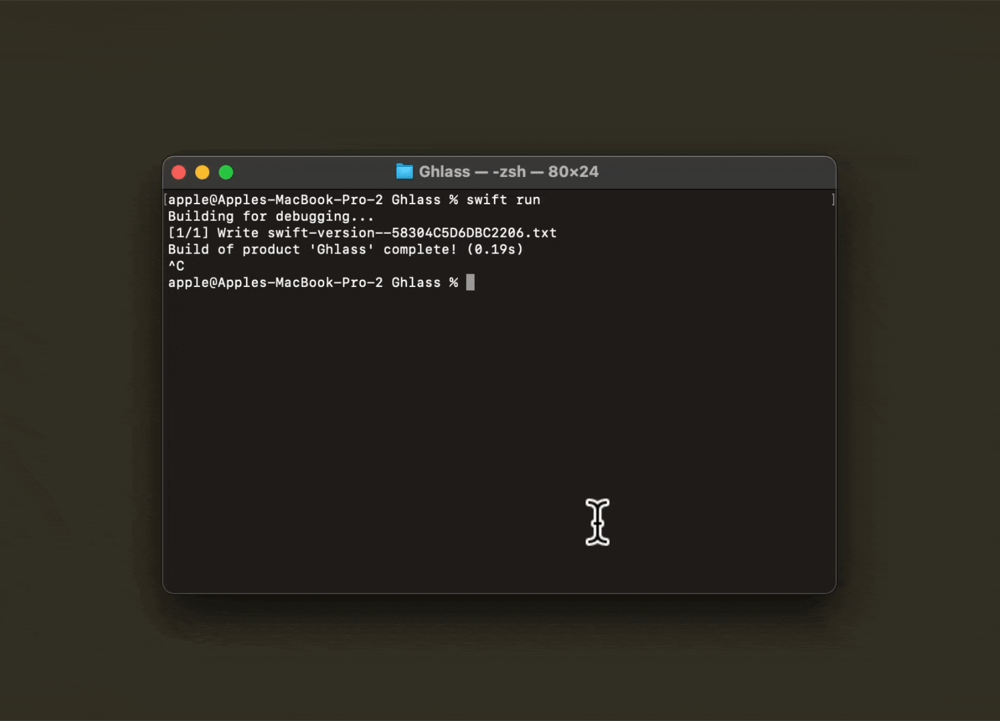
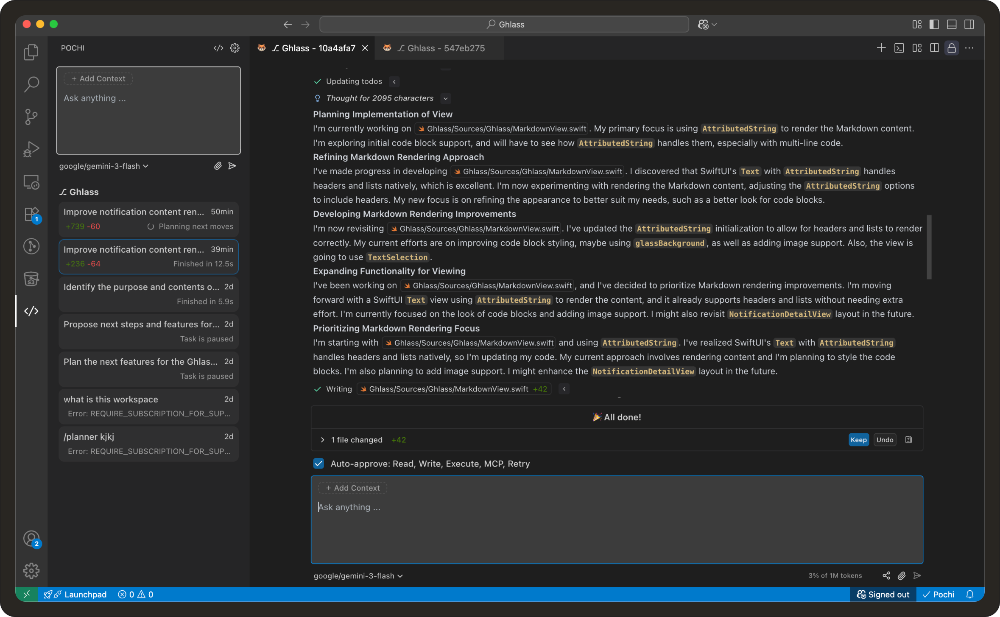
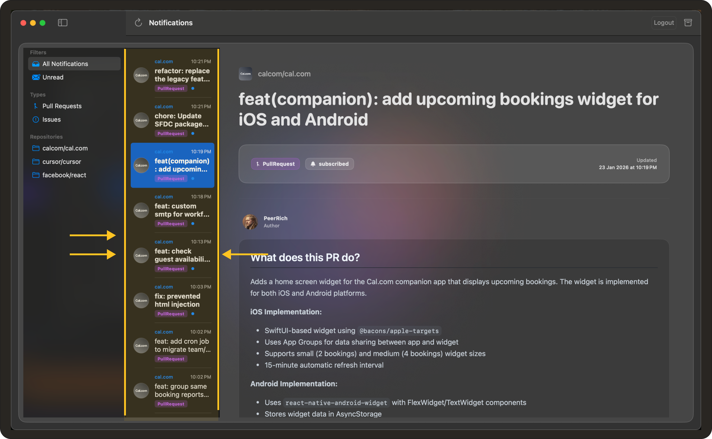
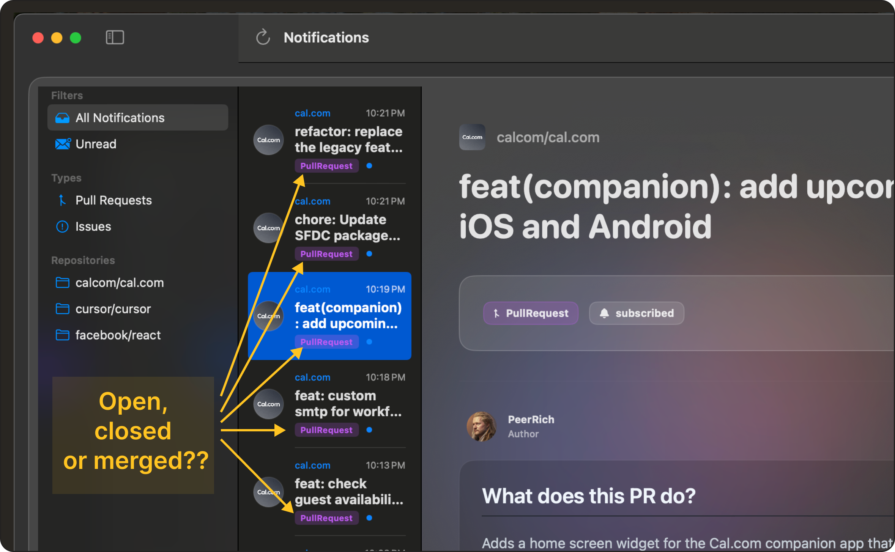
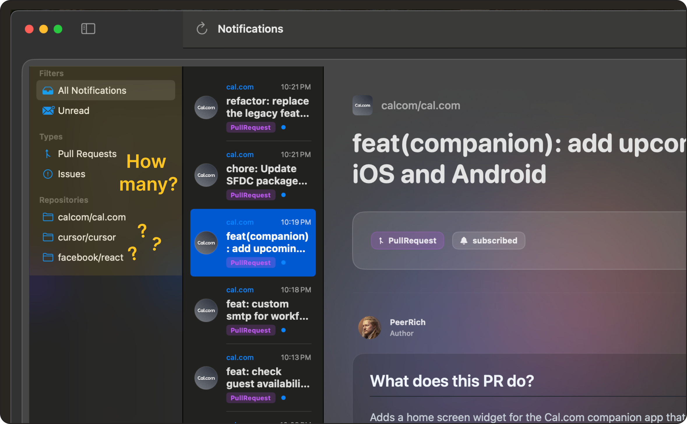

# Vibe Coding a macOS GitHub Client in Pochi 


<Callout title="TL;DR">
   This app was built entirely through a single Pochi task. You can view the full prompt history and agent actions **[here](https://app.getpochi.com/share/p-3b6489af950746878703552dc5842561)**.
</Callout>

I deal with a lot of GitHub notifications every day - issue activities, PR reviews, mentions/tags, and administrative notifications. Viewing this on GitHub leaves me with an interface that becomes messy real fast, with slow network requests any time I try to filter or group notifications.

I wanted a faster way to deal with this on macOS. Ideally, something closer to a mailbox - you just fetch once, filter locally, and archive easily while only opening the browser when necessary.

Instead of setting up a project manually, I went straight to **[Pochi](https://www.tabbyml.com/agent)** and described the app I wanted to build.

What followed was less about generating more UI code and more about dealing with the kinds of problems real desktop apps tend to run into.

Here’s a walkthrough of five prompt phases I went through to build a working macOS app, all without touching a single line of code.

## Phase 1: Describe the product, not the code

I started by describing the behavior I expected from the app:

```bash
Prompt: Help me create a new macOS app using SwiftUI with the new latest liquid glass design. It should let me log in using a GitHub Personal Access Token, fetch my GitHub notifications, and show them in a table. 

I should be able to filter notifications by repository and by type, and filters should combine using AND logic. Changing filters should not refetch data from the network.
```

Given that description, Pochi generated a Swift Package Manager project using a fairly standard MVVM structure. 

There was a service responsible for talking to the GitHub API and handling token storage, with a view model that owned both the notification list and the filtering logic. The UI would have a main content area, a column to display the list of notifications, and a sidebar for filters.

 <video
        controls
        style={{
        width: "100%",
        borderRadius: "8px",
        boxShadow: "0 4px 12px rgba(0, 0, 0, 0.15)",
        }}
    >
        <source src="https://assets.docs.getpochi.com/initial-prompt-macos-client-app.mp4" type="video/mp4" />
        Your browser does not support the video tag.
    </video>


It's quite impressive to see that the performance constraint was respected: filtering happened entirely in memory, and the network layer was fetched once and stayed out of the UI loop.

## Phase 2: The app launches, but no window appears

Following the initial implementation, the code compiled successfully. But no window appeared.




I checked for errors or crashes, but found none. Though it felt like a UI bug, I did what was left as the easiest thing to do: I described the problem back to Pochi.

```bash
Prompt: The app launches, but no application window appears.
```

After this, Pochi started inspecting the app entry point and build configuration. The problem turned out not to be a SwiftUI issue at all. There was a missing embedded `Info.plist` and no proper bundle identifier, which led to the application not activating itself when launched. That meant, even though the process existed, the app never came to the front.

To fix this, Pochi generated an `Info.plist` file, embedded it via linker settings in `Package.swift`, and added activation logic in the AppDelegate.swift so the application would finally present a window.

 <video
        controls
        style={{
        width: "100%",
        borderRadius: "8px",
        boxShadow: "0 4px 12px rgba(0, 0, 0, 0.15)",
        }}
    >
        <source src="https://assets.docs.getpochi.com/fixing-missing-window.mp4" type="video/mp4" />
        Your browser does not support the video tag.
    </video>


These are not things most people think about while writing SwiftUI code. On macOS, SwiftUI views are hosted inside an application process that has several system-level requirements. 

This includes bundle metadata, activation policy, and lifecycle hooks. Xcode templates set all of this up automatically. But when you build a macOS app using Swift Package Manager directly, these details become your responsibility.

The macOS platform constraints still apply, but I no longer had to hunt through configuration files or lifecycle hooks myself. I described the problem to Pochi, and the agent traced the issue through the app’s entry point and build configuration to find and fix the root cause autonomously.

## Phase 3: API indirection and permission boundaries

Now that the window finally appeared, notifications started loading. However, clicking on them did not show much useful information.

When I tried to open some issues, the app started failing with an `invalidResponse` error. The URLs looked correct, and the code path was the same as for issues that worked, so it wasn’t obvious where the failure was coming from. My first assumption was that this was a parsing or decoding bug.

 <video
        controls
        style={{
        width: "100%",
        borderRadius: "8px",
        boxShadow: "0 4px 12px rgba(0, 0, 0, 0.15)",
        }}
    >
        <source src="https://assets.docs.getpochi.com/invalidResponse-error-macos.mp4" type="video/mp4" />
        Your browser does not support the video tag.
    </video>


At this point, it’s worth noting that GitHub’s notifications API does not return issue or pull request content. It only returns lightweight objects that contain URLs pointing to the actual resources. To render the discussion, the app must follow that link, fetch the issue or PR, and then fetch comments from yet another endpoint.

This also means that notification access and repository access are not the same thing. An API token may have permission to read notifications, while still lacking permission to read the underlying resource.

Instead of manually tracing the networking stack, I described the error back to Pochi and asked it to investigate. 

```bash
Prompt: Opening some notifications fails with invalidResponse, but the URLs look correct. Can you check what’s going wrong?
``` 
Pochi did not start rewriting decoding logic. Instead, it treated the API as a black box and validated assumptions around the request itself. It tested the same URLs independently and found that the failing requests were returning `404`.

That immediately ruled out JSON parsing issues and pointed to access control. The token had `notifications` scope, which allows reading notifications, but not `repo` scope, which is required to fetch issue and pull request details, especially for private repositories.


In other words, the fix was not in code at all. The token needed additional scopes. You usually don't encounter problems like these when dealing with isolated API examples, but in my case, it became apparent once authentication scopes and real user flows merged. 

Moreover, the interesting part was how the agent did not assume the error was a decoding bug that required rewriting networking code. Instead, it took a fresh approach and treated the API as a black box, validating the assumptions across access and permissions first.  

## Phase 4: This technically works, but it’s not usable yet
Now that issues and pull requests were loading correctly, another limitation became obvious. The content was being rendered as plain text. In hindsight, this was expected, since GitHub content is Markdown.

 <video
        controls
        style={{
        width: "100%",
        borderRadius: "8px",
        boxShadow: "0 4px 12px rgba(0, 0, 0, 0.15)",
        }}
    >
        <source src="https://assets.docs.getpochi.com/macos-client-github-rendering.mp4" type="video/mp4" />
        Your browser does not support the video tag.
    </video>


But a plain text view of issues and pull requests is not very appealing. On all fronts, SwiftUI generated something readable, but it lost meaning once the returned data involved large chunks of text.

I'm throwing this problem back to Pochi again:

```bash
Prompt: The content returned when clicking on a notification shows up as plain text. Can we improve how this is rendered?
```

I could observe the thought process as the agent tried to reason through possible approaches.



The first attempt was to use a Markdown rendering library to display the raw Markdown returned by the API. That was a reasonable first take, but it quickly ran into GitHub-specific quirks. GitHub doesn’t handle Markdown the same way most standard renderers do, largely because it allows embedded HTML, media links, and a number of formatting extensions.

I followed up with another prompt describing these issues:

```bash
Prompt: This still doesn’t render properly. Images and some formatting are broken. Is there a better way to render GitHub content?
```

Following this, Pochi tried a second approach. It clearly wanted to avoid replicating GitHub’s rendering pipeline locally. Since GitHub can return rendered HTML for body content, this provided a way around dealing with all of GitHub’s Markdown extensions on the client. All the agent had to do was request the pre-rendered HTML and display it directly.

This switch improved things significantly and made the detail view look much closer to what users expect from the GitHub website.

 <video
        controls
        style={{
        width: "100%",
        borderRadius: "8px",
        boxShadow: "0 4px 12px rgba(0, 0, 0, 0.15)",
        }}
    >
        <source src="https://assets.docs.getpochi.com/proper-rendering-in-markdown.mp4" type="video/mp4" />
        Your browser does not support the video tag.
    </video>


Looking back, none of this was part of the original prompt. It came from keeping the agent’s options open while trying to make the notifications view more useful. Presenting a strict solution up front would likely have taken much longer to reach the same outcome.

After this change, the app started to look more and more like a lightweight GitHub client. It became possible to go through entire comment threads without leaving the app.

## Phase 5: Product-level feedback instead of UI code

Once the app was visibly functional, the issues that remained were no longer technical. Instead, I started noticing what felt off from a UX perspective.

- The list felt too narrow.
  
- Icons did not distinguish between open, closed, and merged pull requests. 
  
- Filters did not indicate how many items they would return. 
  
- Archiving required selecting items and using a toolbar button, even when I already knew exactly which notifications I wanted to dismiss.
  

Each of these was easy to describe in words, but implementing them manually would have required non-trivial view model changes, state handling, and layout adjustments.

I never had to sit through and review the code. I just expressed product-level concerns about expected behavior and what didn't sit well after a few rounds of real use. The agent automatically translated the feedback into SwiftUI and view model updates. 

For example, I told Pochi:

```bash
Prompt:

 - The list feels too narrow, I can’t easily scan titles.
 - Also, merged and closed pull requests look the same, can we use different icons?
 - And when I already know which notifications I want to dismiss, I shouldn’t have to select them and then use a toolbar button. I just want to archive them directly from the list.
```

From that description, the agent widened the list column, added state-aware icons for issues and pull requests, and introduced per-row archive actions. It also handled the necessary view model changes to support these interactions, without me touching any layout code or dealing with further prompting.

Here’s a look at the final demo:

 <video
        controls
        style={{
        width: "100%",
        borderRadius: "8px",
        boxShadow: "0 4px 12px rgba(0, 0, 0, 0.15)",
        }}
    >
        <source src="https://assets.docs.getpochi.com/ghlass-macos-demo.mp4" type="video/mp4" />
        Your browser does not support the video tag.
    </video>


## Some ending thoughts

Most of the work on this project was not about inventing algorithms or designing architecture. It was about navigating constraints that already exist and wiring together pieces that do not quite fit by default. In that sense, the agent was not replacing development work so much as changing its shape. 

The code still had to satisfy macOS. The API still had to satisfy GitHub. Those requirements did not go away. They just became more apparent through conversation rather than through stack traces and breakpoints. And instead of sitting, editing these files, I was describing problems and desired behavior. It was quite surprising, how little of this felt like coding. 


If nothing else, building this app convinced me that evaluating coding agents only on greenfield generation misses most of the hard parts of software - permissions, lifecycle management, data modeling, and user-facing edge cases. The real test begins once the first version works and you start asking whether it actually fits into the world it is supposed to run in.

Feel free to check out the full repository **[here](https://github.com/zwpaper/Ghlass)**. 

You can also see the full trajectory of my interaction history with the agent **[here](https://app.getpochi.com/share/p-3b6489af950746878703552dc5842561)**.