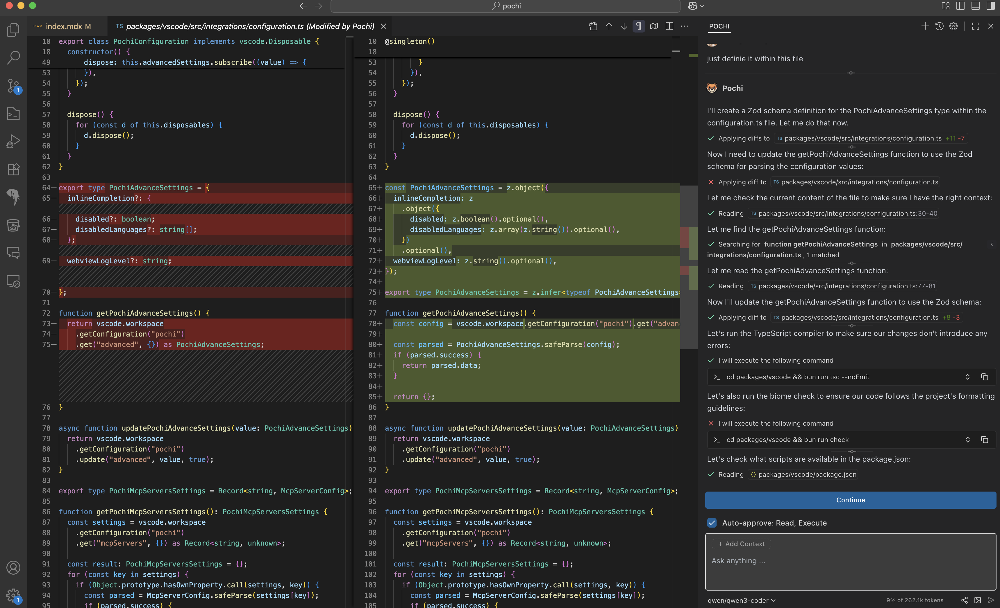
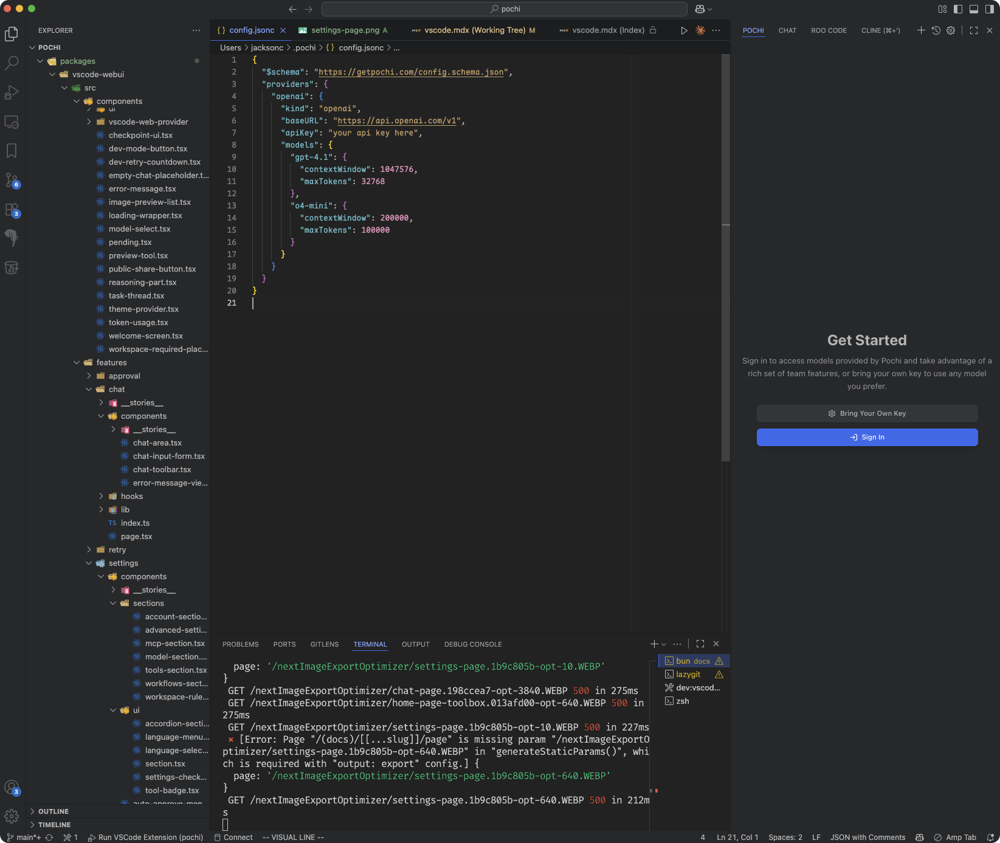
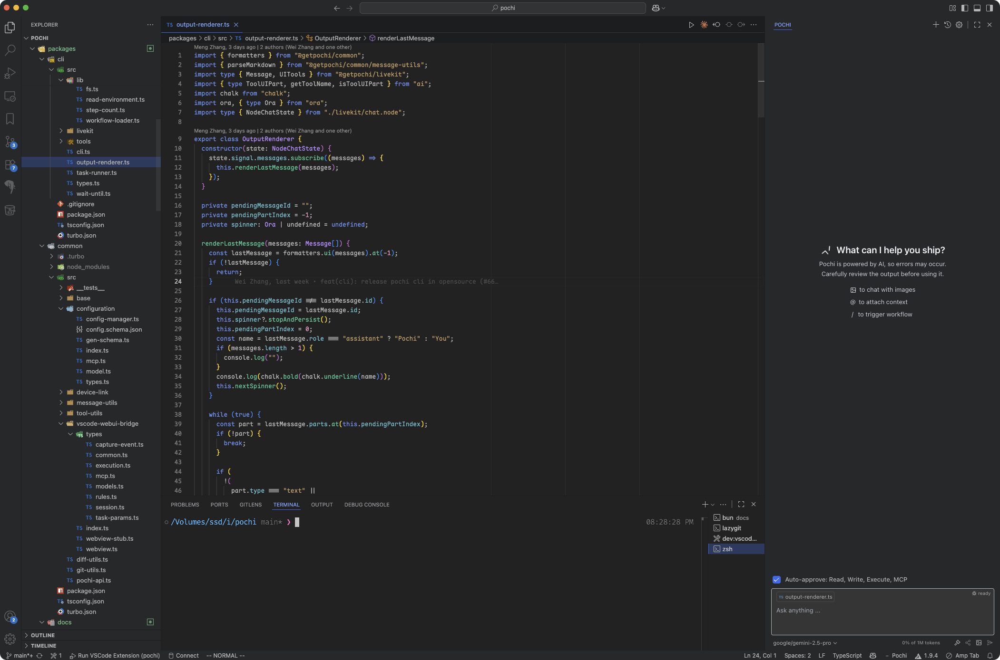
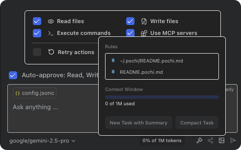
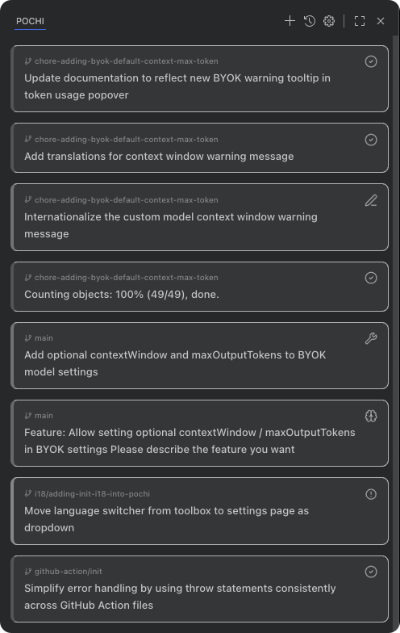

# VS Code

This page covers the core Pochi experience in VS Code, from installation and setup to the main chat and task management features.

## Installation

Install the Pochi extension from the [VS Code Marketplace](https://marketplace.visualstudio.com/items?itemName=TabbyML.pochi) or [OpenVSX](https://open-vsx.org/extension/TabbyML/pochi).

For the best experience, we recommend dragging the Pochi view to the right sidebar to use it side-by-side with your editor.

## Welcome

Upon first launch, Pochi's Welcome page offers two ways to get started:

- **Sign in to Pochi:** Click "Sign In" and authorize in your browser to use Pochi subscriptions, models, and cloud features.
- **Bring Your Own Key (BYOK):** Use your own models by running `Pochi: Open Custom Model Settings` from the Command Palette. This opens `~/.pochi/config.jsonc` for you to add API keys. See [Models](/models) for details.

## Chat

Access the Pochi chat panel via the Activity Bar icon or shortcut (macOS: `Cmd+L`, Win/Linux: `Ctrl+L`). This is your main interface for interacting with Pochi.

The panel's title bar includes actions for starting a new task and viewing all tasks.

### Toolbox

The toolbox below the chat provides key features:

- **Top:** Auto-approve menu for autonomous tool use.
- **Middle:** Chat input supporting text and images.
- **Bottom:** Model selector, token usage, sharing, and image uploads.

  

## Tasks

Task history is stored locally by default. Signing in to a Pochi account enables cloud storage, sharing, and team collaboration features. Be aware that clearing VS Code's extension data may erase local history.

## Troubleshooting

Having issues? Check [Troubleshooting](/troubleshooting), or verify that your sign-in status and model configuration are valid.

