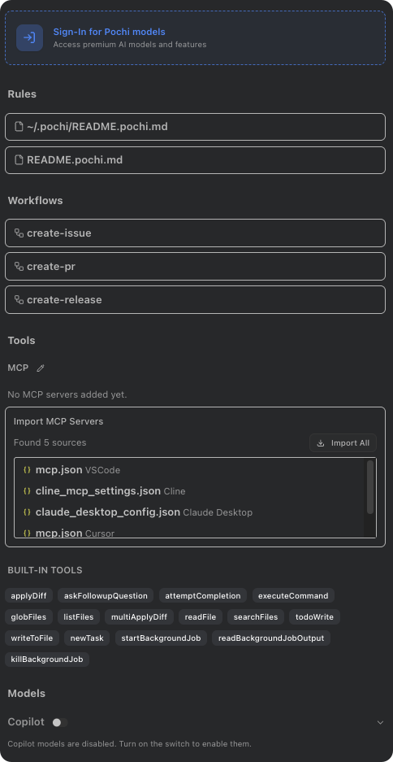

# VS Code

This page covers the core Pochi experience in VS Code: the Home Chat after installation, the locally stored Task List, and Settings including sign-in and BYOK.

## Installation (Recap)

Please refer to the installation section in “Getting Started”: see the [Installation Guide](/#installation).

- Install the extension from VS Code Marketplace or OpenVSX:
  - Marketplace: https://marketplace.visualstudio.com/items?itemName=TabbyML.pochi
  - OpenVSX: https://open-vsx.org/extension/TabbyML/pochi
- We recommend dragging the Pochi view to the right sidebar to use it side by side with the editor.

## Welcome

On first install or the first time you open the extension, a Welcome (Get Started) page appears. You can start in two ways:

- Bring Your Own Key (BYOK): Go to Settings to configure your model keys, or run “Pochi: Open Custom Model Settings” from the Command Palette to open `~/.pochi/config.jsonc`. Fill in provider API keys and model configurations. See [Models](/models) for details.
- Sign in to Pochi: Click Sign In, complete authorization in your browser, and you'll be brought back to VS Code. After signing in, you can use Pochi subscriptions and Pochi models, plus cloud/team features (see the “Settings Page” below).

## Chat

After installation, you'll find the “Pochi” icon in the Activity Bar. Open it to access the Home Chat panel, where you can chat with Pochi and plan/execute tasks.

The panel title bar provides quick actions:

- New Task: Start from a natural-language goal; Pochi will plan and execute steps.
- Show All Tasks: View and switch between historical task sessions.
- Settings: Manage account, models, and preferences.

Tip: You can also open the Pochi view via shortcut or the Command Palette (default on macOS: Cmd+L; Windows/Linux: Ctrl+L).

### Toolbox

- Top: Auto Approve menu for autonomous tools.
- Middle: Chat Input, supports pasting/dragging images.
- Bottom: Model selector, token usage, share, image upload, send button.

  

## Tasks

- By default, task history and content are stored locally (the extension's local DB/storage) and are not uploaded to the cloud.
- Uninstalling the extension or clearing VS Code's extension data may erase your local task history.
- If you sign in to your Pochi account and opt to use cloud services, tasks can be associated with your account, shared within your team, and viewed on the web (see “Settings Page” below and the Getting Started page for cloud features).

## Settings

The Settings page includes two common items:

1. Account Sign-in (optional)

- Click “Sign in” in Settings; VS Code will open your browser to the Pochi site for authorization.
- After authorization, you'll return to VS Code and the extension will show as signed in; you can sign out in Settings.
- After signing in, you can use Pochi-hosted cloud capabilities such as team collaboration, shared task history, and GitHub/Slack integrations (subject to your account and permissions).

2. Bring Your Own Key (BYOK) and Custom Models (optional)

- Run “Pochi: Open Custom Model Settings” from the Command Palette to open `~/.pochi/config.jsonc`.
- Fill in provider API keys and model configurations to use your own models and credits.
- See [Models](/models) for format and examples. The file is JSONC (comments allowed).

Note: You can also use “Pochi: Edit Workspace Rules” to add workflow/rule files for the current project, helping Pochi better understand your conventions (see “Rules” in the sidebar).

### Sections

1. Account

- Sign in/out of your Pochi account; after signing in you can use Pochi subscriptions and Pochi models.

2. Workspace Rules

- Show and open workspace rule files (`README.pochi.md` or `AGENTS.md`).
- If third-party rules are detected (e.g., Cursor rules), you can import them into this repo with one click.
- See [Rules](/rules) for syntax and search paths.

3. Workflows

- Automatically lists `.pochi/workflows/*.md`; click to open and edit.
- Type `/` in the chat box to select and run a workflow. See [Workflows](/workflows).

4. Tools & MCP

- Built-in tools: read/write, search, command execution, and more.
- MCP: start/stop local MCP servers, view tool lists and errors; discover third-party MCP configs and import with one click, or jump to VS Code commands to edit configuration.
- See [MCP](/mcp) for concepts and usage.

5. Models

- Enable Pochi-hosted models after signing in.
- BYOK custom models are read from `~/.pochi/config.jsonc`; see [Models](/models).
- You can enable VS Code's Copilot (Language Model API) models and view their availability.

6. Advanced

- Developer Mode toggle (shows extra debug/experimental options).
- Control whether to show Pochi-hosted models.
- Clear local storage and other developer helpers.

## Troubleshooting

Having issues? Check [Troubleshooting](/troubleshooting), or verify in Settings that your sign-in status and model configuration are valid.
