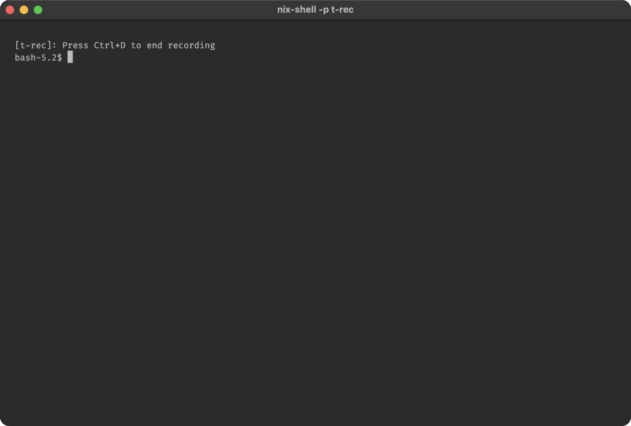

# ink-storybook

A storybook-like library for Ink terminal applications.



> [!NOTE]  
> Calling this repo via `npx` does not work as documented.
> The complexity of getting React hooks to work in the same
> context (after going into the black-hole of tsx) is beyond
> me at this point. Any assistance would be appreciated!
>
> To use `ink-storybook`, you MUST install it as a dep.

> [!TIP]
> If you get `ERROR: Top-level await is currently not supported with the "cjs" output format`
> Your package must be `"type": "module"`

## Features

- 📚 Browse and view your components in a storybook interface
- 🔍 Automatic discovery of `.story.tsx` files
- 📝 Section-based organization with a file navigator sidebar
- ⌨️ Intuitive keyboard controls for navigation
- 🎨 Customizable themes and layouts
- 🛠️ Simple and flexible API

## Installation

```bash
npm install --save-dev @expelledboy/ink-storybook
```

```bash
yarn add --dev @expelledboy/ink-storybook
```

```bash
bun add -D @expelledboy/ink-storybook
```

> [!IMPORTANT]  
> This does not work at present.

```bash
npx @expelledboy/ink-storybook
```


## Quick Start

### 1. Create Story Files

Create files with the `.story.tsx` extension anywhere in your project:

```tsx
// src/components/Button.story.tsx
import React from 'react';
import { Box, Text } from 'ink';
import { Button } from './Button';
import type { StoryExport } from '@expelledboy/ink-storybook';

const storyExport: StoryExport = {
  stories: [
    {
      id: 'default',
      title: 'Default Button',
      component: <Button>Click me</Button>,
      description: 'The default button style'
    },
    {
      id: 'primary',
      title: 'Primary Button',
      component: <Button primary>Click me</Button>,
      description: 'A primary button style'
    }
  ],
  meta: {
    group: 'Components',
    order: 1
  }
};

export default storyExport;
```

### 2. Run the Storybook

Run the storybook CLI to discover and display your stories:

```bash
npx @expelledboy/ink-storybook
```

Or add it to your package.json scripts:

```jsonc
{
  "scripts": {
    // installed
    "storybook": "ink-storybook",
    // Using npx
    "storybook": "npx @expelledboy/ink-storybook"
  }
}
```

## Configuration

### Custom Configuration

Create a `storybook/config.js` file in your project:

```js
module.exports = {
  title: 'My Project Storybook',
  sidebarWidth: 35,
  theme: {
    primary: 'green',
    secondary: 'magenta',
    text: 'white',
    background: 'black',
  },
  keyBindings: {
    next: ['shift+down'],
    previous: ['shift+up'],
    nextFile: ['down'],
    prevFile: ['up'],
  },
  showControls: true,
};
```

### Custom Preview Component

Create a `storybook/Preview.tsx` file to customize how stories are displayed:

```tsx
import React from 'react';
import { Box, Text } from 'ink';

export function Preview({ children, title, description }) {
  return (
    <Box flexDirection="column">
      <Text bold color="green">{title}</Text>
      {description && <Text color="gray">{description}</Text>}
      <Box borderStyle="double" padding={1}>
        {children}
      </Box>
    </Box>
  );
}
```

## CLI Options

```
ink-storybook [options]

Options:
  --stories, -s  Directory to search for story files (default: "src")
  --config, -c   Path to config file (default: "storybook/config.js")
  --help, -h     Show help
```

## Navigation

Navigate through your storybook with keyboard controls:

- **Shift+Down**: Next story
- **Shift+Up**: Previous story
- **Shift+Right**: Next file
- **Shift+Left**: Previous file
- **Ctrl+C**: Exit

You can customize these key bindings in your configuration file.

## API Reference

### StoryExport

```ts
interface StoryExport {
  // Array of stories to display
  stories: Array<{
    id: string;           // Unique identifier
    title: string;        // Display name
    component: React.ReactNode;  // Component to render
    description?: string; // Optional description
  }>;

  // Optional metadata for grouping and ordering
  meta?: {
    group?: string;  // Group name for sidebar organization
    order?: number;  // Display order in the sidebar
  };
}
```

### Configuration

```ts
interface StorybookConfig {
  // App title displayed in the header
  title: string;  // default: "Ink Storybook"
  
  // Width of the sidebar in characters
  sidebarWidth: number;  // default: 30
  
  // Path to custom Preview component
  previewPath: string;  // default: undefined, eg: "storybook/Preview.tsx"
  
  // Theme colors for UI elements
  theme: {
    primary: string;    // default: "blue"
    secondary: string;  // default: "yellow"
    text: string;       // default: "white"
    background: string; // default: "black"
  };
  
  // Show keyboard navigation help
  showControls: boolean;  // default: true
  
  // Keyboard shortcuts for navigation
  keyBindings: {
    next: string[];      // default: ["shift+down"]
    previous: string[];  // default: ["shift+up"]
    nextFile: string[];  // default: ["shift+right"]
    prevFile: string[];  // default: ["shift+left"]
  };
}
```

## Usage Tips

### Interactive Components

You can include interactive components in your stories. These components can handle keyboard input and maintain their own state:

```tsx
// src/components/Counter.story.tsx
import React, { useState } from 'react';
import { Box, Text, useInput } from 'ink';
import type { StoryExport } from 'ink-storybook';

const Counter = () => {
  const [count, setCount] = useState(0);
  
  useInput((input, key) => {
    if (input === '+') {
      setCount(prev => prev + 1);
    } else if (input === '-') {
      setCount(prev => Math.max(0, prev - 1));
    }
  });

  return (
    <Box flexDirection="column">
      <Text>Counter: {count}</Text>
      <Text color="gray">Press + to increment, - to decrement</Text>
    </Box>
  );
};

const storyExport: StoryExport = {
  stories: [
    {
      id: 'counter',
      title: 'Interactive Counter',
      component: <Counter />,
      description: 'An interactive counter that responds to keyboard input'
    }
  ]
};

export default storyExport;
```

### Organization

Organize your stories into logical groups using the `meta` property:

```tsx
const storyExport: StoryExport = {
  stories: [...],
  meta: {
    group: 'UI Components', // For sidebar organization
    order: 2 // Controls display order in the sidebar
  }
};
```

This creates a structured navigation experience when you have multiple story files.

## License

MIT
