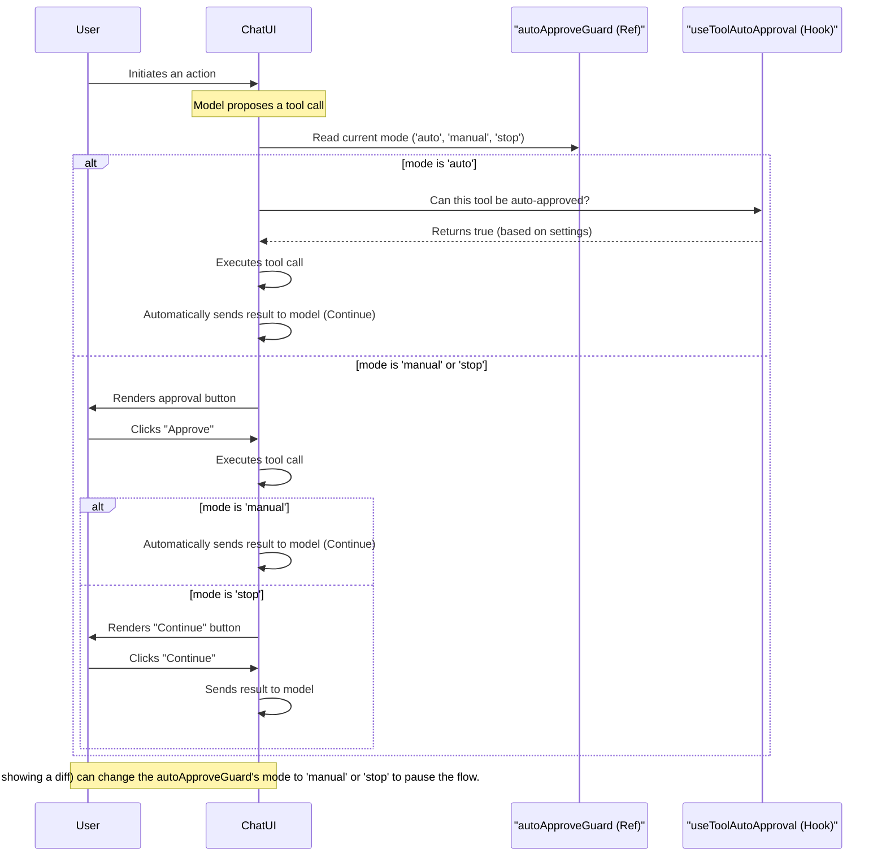

## `autoApproveGuard` Deep Dive

`autoApproveGuard` is a crucial mechanism within the Pochi VS Code extension's web UI that provides fine-grained, real-time control over the agent's execution flow, particularly concerning tool calls. It acts as a gatekeeper, allowing the system to override the user's saved auto-approval settings and control the continuation of the task.

### Core Components

1.  **`useSettingsStore` (`packages/vscode-webui/src/features/settings/store.ts`):** A Zustand store that persists the user's global auto-approval preferences, such as which categories of tools to auto-approve (`read`, `write`, `execute`) and whether the feature is active at all (`autoApproveActive`).

2.  **`autoApproveGuard` Ref (`packages/vscode-webui/src/features/chat/lib/chat-state/chat.tsx`):** A `useRef` object within the main chat state that holds the current execution mode.

3.  **`useAutoApprove` Hook (`packages/vscode-webui/src/features/settings/hooks/use-auto-approve.ts`):** This hook bridges the gap between the global settings and the real-time guard. It fetches settings from the store and combines them with the current state of the `autoApproveGuard`.

4.  **`useToolAutoApproval` Hook (`packages/vscode-webui/src/features/settings/hooks/use-tool-auto-approval.ts`):** This is the final decision-maker for the *initial execution* of a tool. It takes a pending tool call, checks its permission level, and uses the `useAutoApprove` hook to determine if it can be executed automatically.

### Execution Modes

As defined in `packages/vscode-webui/src/features/chat/lib/chat-state/types.ts`, the `autoApproveGuard` has three distinct modes that control both tool execution and task continuation:

-   **`"auto"`**:
    -   **Tool Execution**: Automatically approves and runs tool calls based on the user's settings.
    -   **Next Step**: Automatically sends the results back to the model to continue the task.

-   **`"manual"`**:
    -   **Tool Execution**: Requires the user to manually approve each tool call before it runs.
    -   **Next Step**: Automatically sends the results back to the model to continue the task *after* the user has approved the tool call.

-   **`"stop"`**:
    -   **Tool Execution**: Requires the user to manually approve each tool call before it runs.
    -   **Next Step**: Pauses execution after the tool call is complete. The user must manually trigger the continuation of the task (e.g., by clicking a "Continue" button), effectively overriding any `sendAutomaticWhen` flag.

### Approval and Continuation Flow Diagram

The following Mermaid diagram illustrates the updated understanding of the decision-making process.

